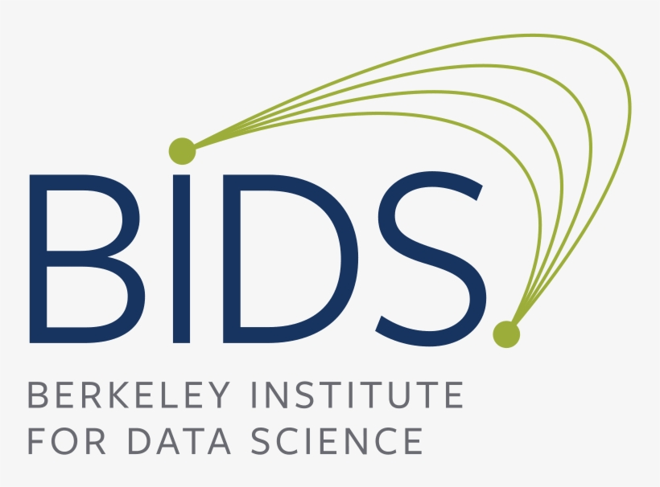

### About DSxD

We are a grant funded project aimed at celebrating the fundamental creativity of data science. Please read more about why we started DSxD [here](../blog/dsxd-announce) and our plans for 2021 [here](../blog/dsxd-overview). 

### People

**Leadership Team**: Ciera Martinez ([@cierareports](https://twitter.com/CieraReports)), Sara Stoudt ([@sastoudt](https://twitter.com/sastoudt)), Valeri Vasquez ([@valeri_vasquez](https://twitter.com/valeri_vasquez)), Tim Schoof, Lauren Renaud, and Natalie O'Shea ([@_natalie_oshea](https://twitter.com/_natalie_oshea)). 

Previous members: Rebecca Barter ([@rlbarter](https://twitter.com/rlbarter)), Allison Horst ([@allison_horst](https://twitter.com/allison_horst)), Ijeamaka Anyene ([@ijeamaka_a](https://twitter.com/ijeamaka_a)), and Sharla Gelfand ([@sharlagelfand](https://twitter.com/sharlagelfand)).


There will be oppurtunities to help organize different aspects of this project in the near future. 

## Contact

Have ideas to share? Let us know [here](https://docs.google.com/forms/d/e/1FAIpQLSdprP0oGESh9bMnL9WSQZqSKAwcNHOT0z2Gjljz23U-2okJhA/viewform).

Want to be kept informed? Join our listserv [here](https://groups.google.com/u/0/g/datasciencebydesign?pli=1).

## Who supports us?

We are thrilled to have received funding for Data Science by Design from [Code for Science and Society](https://codeforscience.org/) and an [Academic Data Science Alliance](https://academicdatascience.org/) Career Development Network (CDN) [Seed Grant](https://academicdatascience.org/cdn/seed-grants). We have additional support from the [Berkeley Institute for Data Science (BIDS)](https://bids.berkeley.edu/), part of the [Computing, Data Science, and Society (CDSS)](https://data.berkeley.edu/) at UC Berkeley.

Do you or your company or organization want to help support these efforts? Donation options [here](https://opencollective.com/data-science-by-design).





<!-- 
 -->
---

<!--  -->

<!-- ---
```components/teams/team-carousel-3.html ```


---
```components/teams/team-carousel-4.html ```


---
```components/teams/team-carousel-5.html ```
 -->