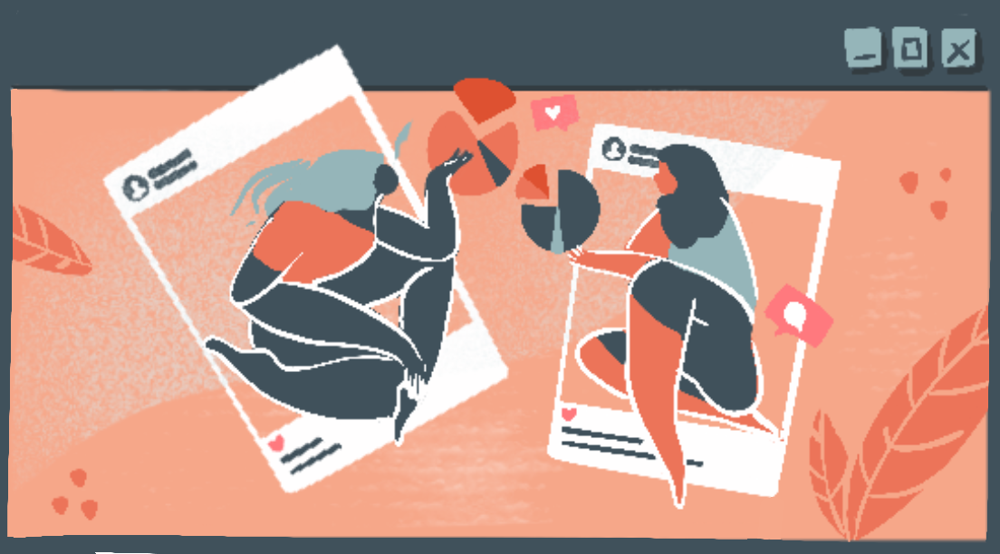

<H4>Important Dates </H4>

<b><a href = "https://forms.gle/y3Xdb2GTPUxYazcSA">Pitch Ideas & Mini Grants</a></b>: by October 14, 2022

<b><a href = "https://forms.gle/38SF2xPbws2gZqcV6">Submit full submission</a></b>: by December 1, 2022

<H2>Upcoming Book</H2>
**What worlds do we occupy? How does data affect these worlds?** 

Volume 2 of our anthology series is themed "Our Environment".  We all exist within a multitude of environments, whether our natural environment or our ever expanding virtual worlds - data exists in them all. We are looking for essays, art, craft, interviews, and other creative projects that explore the many environments we occupy. 

We want to highlight the many different voices in data - data workers, scientists, designers, and artists - to amplify how you are thinking about data and the world around us.  

<H2>Submit</H2>

Just as in our [previous book](https://datasciencebydesign.org/book), we want to emphasize process, inclusion, community, and creative approaches to working with data. We hope the readers of our anthology will find something that resonates with them and helps them find their place in data science. 

You can 
-  **Submit a piece directly** - all submissions are due December 1, please see below for what we are looking for in our final pieces. Use [this form](https://forms.gle/38SF2xPbws2gZqcV6) to submit your full piece.  
-  **Need Help?**
	-  **Pitch us!**:Do you have an idea, but not sure it fits?  Do you want help refining your idea for the book? Follow [this form](https://forms.gle/y3Xdb2GTPUxYazcSA) and we will try to get back to you within two weeks with an email with feedback. The last date to submit pitch is October 14, 2022. 
	-  **Mini Grants**: Need extra funding to execute your idea? Apply for a mini grant $250 - $400 by pitching us an idea and specifying your interest in a mini grant.  See more details and apply using the pitch form [here](https://forms.gle/y3Xdb2GTPUxYazcSA).

<H2>Submission Requirements and Ideas</H2>

We are open to whatever is important to you! We want this book to be a chance to share your data work and ideas that may not fit into traditional venues. The design of the book will be very similar to the first book, with each piece being about 3 pages, for example, around ~1000 words to 2000 words.  The size will be 7.44 x 9.68 in (189 x 246 mm) (<a href="/assets/pdfs/DSxD-interior-book-template.pdf" download>download layout here</a>) and there will be side margins to put text or images. Think about how you want your work to be presented, there will be room for these thoughts when you submit. 

Here are some ideas that worked well in our last book. 

**Essays**: We welcome all writings that highlight a unique perspective on how data and environments interact.  We love personal pieces that help audiences understand your thinking process or explorations into an interesting topic.  See examples [Hicks](https://datasciencebydesign.org/blog/when-we-miss-missingness) and [Eitzel](https://datasciencebydesign.org/blog/writing-a-modelers-manifesto-for-more-transparent-ethical-data-science). 

**Data Visualizations**: We obviously love data visualizations! That being said, we are interested in your perspective and process for creating the visualization as much as the piece itself. Each data visualization must have accompanying text explaining how you approached the project, your process, and how the piece fits with the theme "Our Environment". See examples [Woo](https://datasciencebydesign.org/blog/visualizing-our-daily-realities) and [Aworanti & Deji Dabiri](https://datasciencebydesign.org/blog/the-process-of-making-the-count).

**Art & Craft Pieces**: So many options! We just need to have you think about how you would like the piece / pieces to be presented.  Each piece will need a short description and ideally an artist statement on your process and/or why you created the work. See examples [Roizman](Roizman), [Bremer](https://datasciencebydesign.org/blog/a-conversation-with-nadieh-bremer), and [Schoof](https://datasciencebydesign.org/blog/the-future-of-data-science-includes-slow-data-science).

**Interviews / Conversations**: Interviews should be from 1000 to 200 words in length. There are several strategies for interviewing and we can help you! Please reach out through the Pitch Us section, if you want to try this with someone you want to learn more about. See examples [Bremer](https://datasciencebydesign.org/blog/a-conversation-with-nadieh-bremer) and [Ọnụọha](https://datasciencebydesign.org/blog/conversation-with-mimi)

**How I work / Process**:  Maybe you created a software package and want to showcase it, or maybe you work with a community and you want to share your experience.  

**Zine**: We love zines! Please make a zine! Its best to work within the page dimensions (7.44 x 9.68 in / 189 x 246 mm) of the work to ensure your work is communicated best. You can even use our page templates (download here). Whether submitting to this book or not - please, everyone, make more zines! 

<H2>FAQ</H2>

**Will there be help with editing?** Yes! Your work will go through two rounds of editing. The **first round** will start after acceptance and will center around 1. ensuring scope and readability 2. fitting with the theme of book  and 3. storytelling and communication of your ideas. The **second round** will be proofreading, including correct punctuation, spelling, subject-verb agreement, etc.

**Do the submissions need to be in English?** No, we have allocated some funding for translation services. That being said, the book content will be in English. If english is your second language, and you are unsure of your English writing capabilities - no problem! We will help you through the editing process. 

**Can I include photos and my own Illustrations / Art to accompany my written pieces?** Yes! We actually encourage it. We do not expect "professional" illustrations. We love sketches, doodles, and hand drawn everything! The only thing we ask is that you get us high resolution digital images.  If you have an artist in mind to help you with your piece - [pitch us and apply for a mini-grant](https://forms.gle/y3Xdb2GTPUxYazcSA)! We may have some extra funds to help compensate for the art /design work.

**Can I include digital aspects that can't be printed in a paper book?** Yes and no.  Your main piece of work must be capable of being presented in a printed paper book.  Unfortunately, we are limited by the format of presenting material that can actually be printed on the page. That being said, we also will be publishing all pieces online, so if you would like to include something to accompany your piece that is better suited for the web - we can include those parts on the online version.

**Is there compensation $$?** We offer $50 for each submitted piece that is included in the book. If you need extra funds, please apply for a submission grant. Unfortunately, we don't have the capacity to donate your fee, unless the donation is to Data Science by Design.  

Have more questions?  Please reach out to us at datasciencebydesign@gmail.com.

