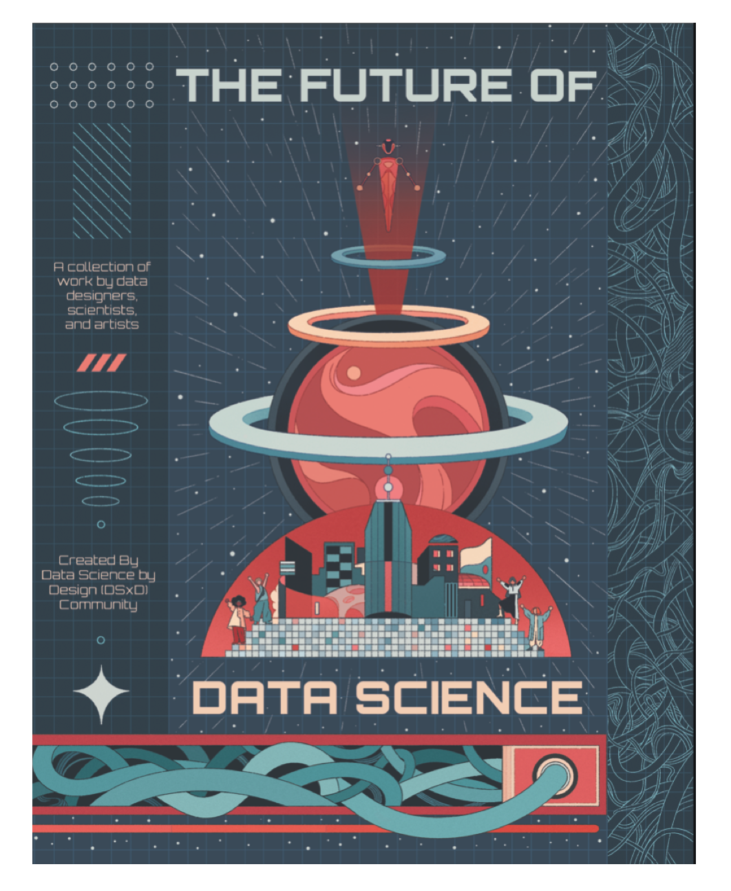

## **DSxD's Future of Data Science Book**

  

    <a href="http://tinyurl.com/FutureDS" class="btn btn-primary">
      Buy Book Here
    </a>
  

 

One part of the Data Science by Design (DSxD) initiative that we are especially excited about is showcasing the work created by the newly established DSxD community. The theme for this printed anthology is “The Future of Data Science.” We named this project to intentionally reflect our desire to design for a future in data science: a future with more of a focus on creativity, yes, but also a future with more transparency, inclusiveness, and personal responsibility.

This Anthology is a collaboration featuring data designers, scientists, and artists. It is a work curated by the Data Science by Design community to establish both a call to action and vision for what data science can be. The anthology brings together the voices of the Data Science by Design community and other contributors who inspire that community. The Anthology has 19 sections full of original color illustrations and photos, including essays, zines, data visualizations, interviews, and more. Inside you will find an emphasis on inclusion, strong community, and creative approaches to working with data. We hope each reader will find something that resonates with them and helps them find their place in data science.

We may not know what the future holds but we do know that the future of data science can be what we design it to be!

## Book Contents

To give each piece time to shine, we will release two chapters a week on our website. By August, the whole Anthology will be freely available online.

|                                                                                                | **Online Release** |
|------------------------------------------------------------------------------------------------|--------------------|
| [**A Conversation with Mimi Ọnụọha**](https://datasciencebydesign.org/blog/conversation-with-mimi) Natalie O’Shea                                             |             June 1 |
| [**The Process of Making “the Count”**](https://datasciencebydesign.org/blog/the-process-of-making-the-count) Deji Dabiri and Bunmi Aworanti                           |             June 1 |
| [**A Zine to Show Scientists How to Make Their Data More Accessible**](https://datasciencebydesign.org/blog/a-zine-to-show-scientists-how-to-make-their-data-more-accessible) Leonore Reiser            |             June 8 |
| [**Sweeping Untufted Charts Under the Rug**](https://datasciencebydesign.org/blog/sweeping-untufted-charts-under-the-rug) Violeta Roizman                                     |             June 8 |
| [**A Conversation with Danielle Navarro**](https://datasciencebydesign.org/blog/a-conversation-danielle-navarro) Sharla Gelfand                                        |            June 15 |
| [**Twelve Quick Tips for Software Design**](https://datasciencebydesign.org/blog/twelve-quick-tips-for-software-design) Greg Wilson                                          |            June 15 |
| [**Writing A “modeler’s MaNifesto” for More Transparent, Ethical Data Science**](https://datasciencebydesign.org/blog/writing-a-modelers-manifesto-for-more-transparent-ethical-data-science) M.V. Eitzel     |            June 22 |
| [**A Conversation with Saskia Freeke**](https://datasciencebydesign.org/blog/a-conversation-with-saskia-freeke) Natalie O’Shea                                           |            June 22 |
| **[Livestreaming My Coding Mistakes to the World](https://datasciencebydesign.org/blog/livestreaming-my-coding-mistakes-to-the-world)** Jesse Mostipak                               |            June 29 |
| **[Distilltools: Creating a Curated, Collaborative Community Package](https://datasciencebydesign.org/blog/distilltools-creating-a-curated-collaborative-community-package)** Ella Kaye                |            June 29 |
| [**Visualizing our Daily Realities**](https://datasciencebydesign.org/blog/visualizing-our-daily-realities) Danne Woo                                                  |             July 6 |
| [**The Making of the Do No Harm Guide**](https://datasciencebydesign.org/blog/the-making-of-the-do-no-harm-guide) Alice Feng                                              |             July 6 |
| [**Beyond Binaries**](https://datasciencebydesign.org/blog/beyond-binaries) Madeline Arnold                                                            |            July 13 |
| [**The Future of Data Science Includes Slow Data Science**](https://datasciencebydesign.org/blog/the-future-of-data-science-includes-slow-data-science) Tim Schoof                           |            July 13 |
| [**Encoding Fermentation: A Multisensory Approach to Understanding Fermentation Data**](https://datasciencebydesign.org/blog/encoding-fermentation-a-multisensory-approach-to-understanding-fermentation-data) Maxene Graze |            July 20 |
| [**Seeing Harmony, Hearing Color**](https://datasciencebydesign.org/blog/seeing-harmony-hearing-color) Justin Lind                                                  |            July 20 |
| [**A Conversation with Nadieh Bremer**](https://datasciencebydesign.org/blog/a-conversation-with-nadieh-bremer) Sharla Gelfand                                           |            July 27 |
| [**A Personal Response to “datafication”**](https://datasciencebydesign.org/blog/a-personal-response-to-datafication) Alexandra Khoo                                       |            July 27 |
| [**When We Miss Missingness**](https://datasciencebydesign.org/blog/when-we-miss-missingness) Cat Hicks                                                         |            July 27 |

<!-- ## Contributors

<b> 
Alexandra Khoo &#183;
Alice Feng &#183;
Ayodeji Dabiri &#183;
Cat Hicks &#183;
Danielle Navarro &#183;
Danne Woo &#183;
Ella Kaye &#183;
Greg Wilson &#183;
Jesse Mostipak &#183;
Justin Lind &#183;
Leonore Reiser &#183;
M.V. Eitzel &#183;
Madeline Arnold &#183;
Maxene Graze &#183;
Mimi Ọnụọha &#183;
Nadieh Bremer &#183;
Natalie O'Shea &#183;
Saskia Freeke &#183;
Sharla Gelfand &#183;
Tim Schoof &#183; 
</b>
 -->

