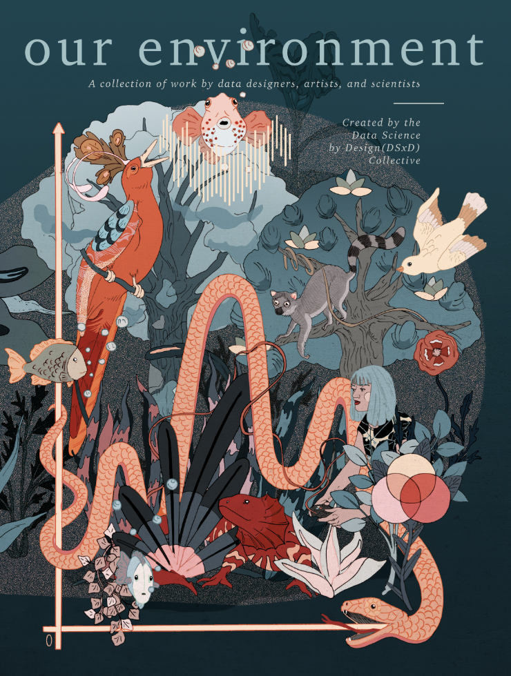
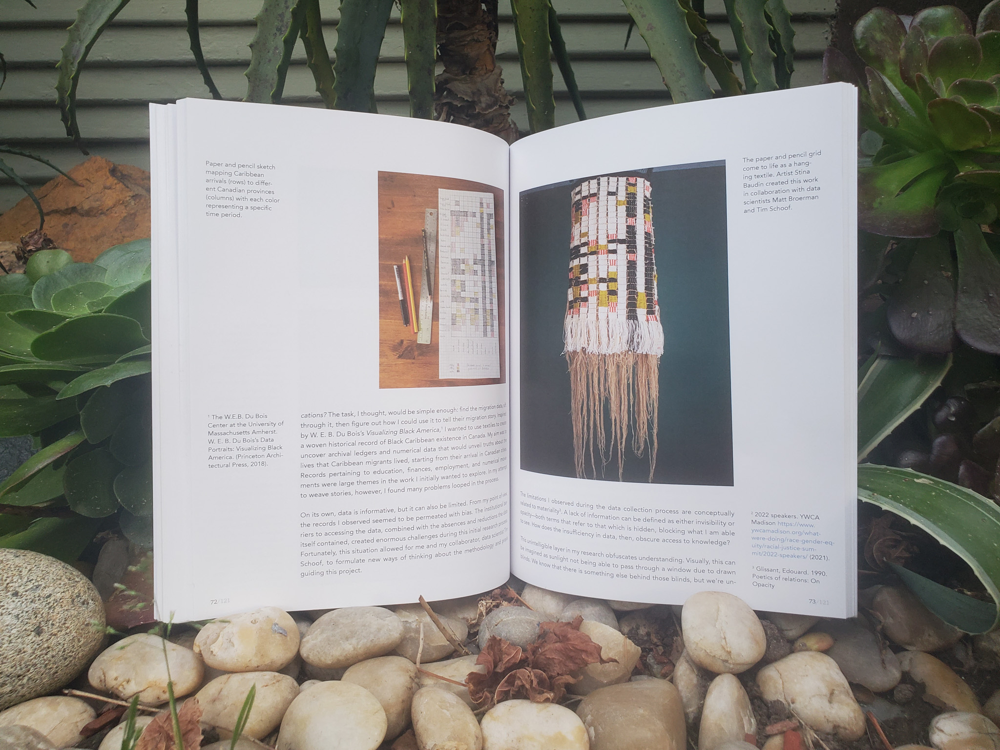
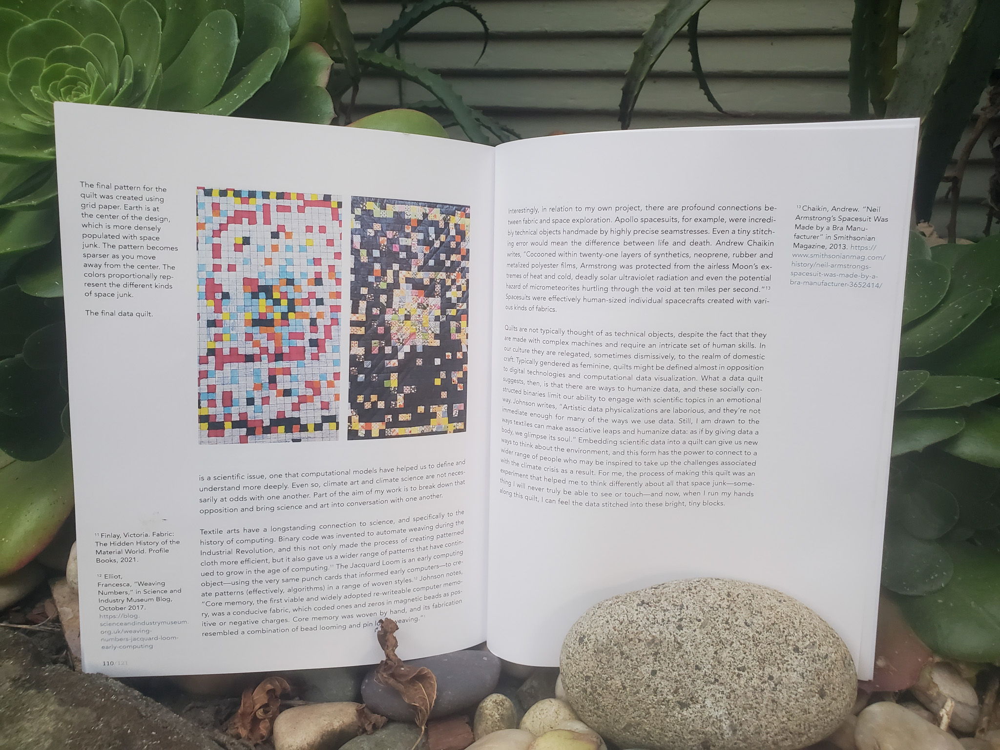
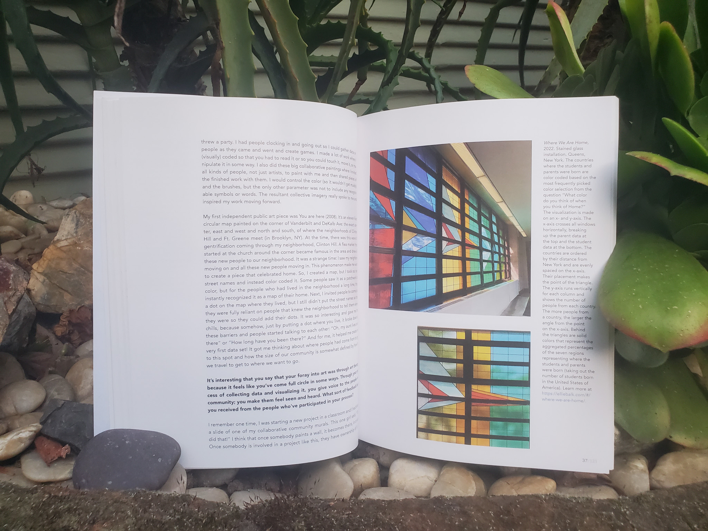

## **DSxD Anthology Vol. 2: Our Environment**
#### A collection of work by data designers, artists, and scientists

  

    <a href="https://www.lulu.com/shop/kelsey-campbell-and-cathryn-ploehn-and-nancy-smith-and-julia-evans/our-environment/paperback/product-z6dgkz.html?page=1&pageSize=4" class="btn btn-primary">
      Buy Book Here
    </a>
  

 

We loved showcasing the work created by the DSxD collective in our first anthology, The Future of Data Science, so much that we decided to do it again, this time with a theme of “Our Environment”. We picked this theme to explore a variety of worlds and to consider how data shapes those worlds.

This anthology is a work curated by the Data Science by Design collective to broaden the idea of what data is and what “doing” data science means. The anthology brings together the voices of the Data Science by Design collective and other contributors who inspire our community. **The Anthology has 20 sections full of original color illustrations and photos, including essays, zines, data visualizations, interviews, and more.** Inside you will find an emphasis on inclusion, world-building, and creative approaches to working with data. We hope each reader will find something that resonates with them and helps them find their own data science environment.

We may not be able to completely choose our environment but we are hopeful that we can work together to design future environments to be what we want them to be, welcoming, and just. 

## Book Contents

To give each piece time to shine, we will release two chapters a week on our website. By August, the whole Anthology will be freely available online.

|                                                                                                                                 |   Online Release |   |
|---------------------------------------------------------------------------------------------------------------------------------|------------------|---|
| **[A Timely Opportunity: Advancing the Role of Climate and Environmental Data in Collaborative Governance](./blog/role-of-climate-and-environmental-data-in-collaborative-governance)** Shannon Dosemagen        | June 7           |   |
| **[Distilling Topographies](./blog/distilling-topographies)** Ijeamaka Anyene Fumagalli                                                                               | June 7           |   |
| **[What Worlds Do We Occupy and How Does Data Affect These Worlds?](./blog/what-worlds-do-we-occupy-and-how-does-data-affect-these-worlds)** Melissa Kagen                                                   | June 14          |   |
| **[Lessons on Data, Environment, and Life Contained in Reusables](./blog/lessons-on-data-environment-and-life-contained-in-reusables)** Alyssa Melody Frias Paglumotan                                    | June 14          |   |
| **[Fire Zine: Ecosystems and Human Scales](./blog/fire-zine-ecosystems-and-human-scales)** Cody Markelz and Jackie Dean                                                             | June 21          |   |
| **[A Conversation with Ellie Balk](./blog/a-conversation-with-ellie-balk)** Interviewed by Sujata Bhattacharyya                                                            | June 21          |   |
| **[Antecedent Technology: Don’t Colonize Our Future](./blog/antecedent-technology-dont-colonize-our-future)** Amelia Winger-Bearskin                                                         | June 28          |   |
| **[“Dry at low water”: From Coastlines to Coast Traces](./blog/from-coastlines-to-coast-traces)** Clancy Wilmott                                                              | June 28          |   |
| **[Our History: Global Queer Rights Through a Historical Colonial Lens](./blog/our-history-global-queer-rights-through-a-historical-colonial-lens)** EB Dickinson                                                | July 5           |   |
| **[The Cube](./blog/the-cube)** Midori Yajima and Cecilia De Sanctis                                                                                   | July 5           |   |
| **[Visiting Tuyshtak](./blog/visiting-tuyshtak)** M. V. Eitzel                                                                                                  | July 12          |   |
| **[Irony Creek](./blog/irony-creek)** Sharla Gelfand                                                                                                      | July 12          |   |
| **[On archiving (data)](./blog/on-archiving-data)** Stina Baudin                                                                                                | July 19          |   |
| **[Data & Organizing are about PEOPLE and POWER](./blog/data-organizing-are-about-people-and-power)** Lauren Renaud                                                                      | July 19          |   |
| **Decolonizing Land Tenure Systems in Cameroon: An Inclusive Data Science Approach** Jacques Wilfried Kenfack Kenjio                | July 26          |   |
| **Multilingual Data Science: Ten Tips to Translate Science and Tech Content** Yanina Bellini Saibene and Natalia Soledad Morandeira | July 26          |   |
| **A Conversation with Allison Horst** Interviewed by Jenn Schilling                                                                 | August 2         |   |
| **How Do You Document a Tech Project with Comics?** Julia Evans                                                                     | August 2         |   |
| **Data Quilts: Exploring Environmental Data Through Textile Art**  Nancy Smith                                                      | August 9         |   |
| **Transgender Day of Remembrance Visualizing the Queer and Embodied with Ecological Kin** Cathryn Ploehn and Kelsey Campbell        | August 9         |   |

