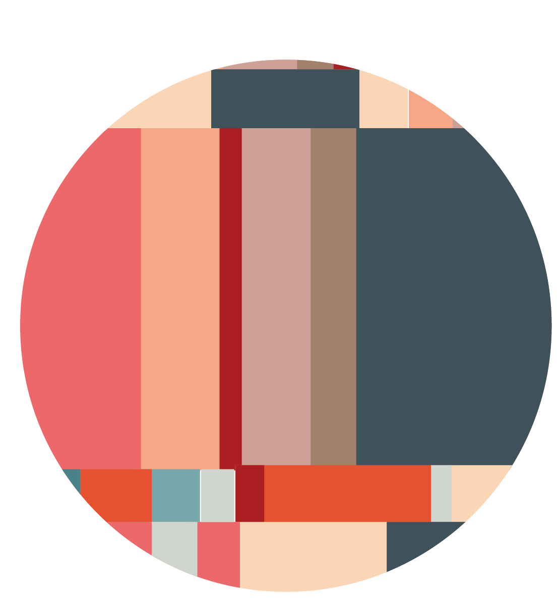

<H2> DSxD Creator Conference </H2>

<H4> Took place on May 27 & 28, 2021 </H4>

Applications now closed. Read about the event <a href = "https://datasciencebydesign.org/blog/creator-conf"> here</a>.

 

 

### About

Do you have a data story to tell but need help broadening your audience? Do you wish you had some time and support to exercise the creative side of your data-loving brain?

On May 27 and 28th, we are hosting a a conference spread over two half days (5 hours each day), where we will come together to get over that activation energy to start (or finish) creative data-related projects. We’ll learn about others’ creative processes and storytelling techniques and work through design exercises that will push us to get creating. 

We’ll hear from expert storytellers, creators, and designers about how they:

-  brainstorm and find inspiration, 
-  get started bringing an idea to life,
-  continue to make progress and refine an idea,
-  pitch ideas to get buy-in from others, and
-  share their final products with a broad audience.

As we learn, we’ll be coming up with our own ideas and thinking about what resources and support we need from this creator community to bring them to fruition. And we’ll be doodling all the while. 

This conference is part of our [Data Science by Design (DSxD) initiative](http://datasciencebydesign.org/blog/dsxd-overview)  aimed to bring together data enthusiasts of all kinds to use creative mediums to communicate data-related work and establish new collaborations across domains. The Creator Conference’s role is to kick off the eventual creation of personal essays, drawings, explainers, or how-to guides on research best practices, findings, methodology, or even work culture. 

---



---

## We Want You to Attend!

Maybe you identify as a student, an educator, a researcher, a designer, an artist, an analyst, an engineer, or as something else entirely. All career stages - everyone is welcome! 

As organizers of Data Science by Design, we are committed to fostering a supportive community among participants. One of our priorities for this event is to increase the amount of people who see themselves in data-related fields. Therefore, we strongly encourage applications from women and other underrepresented genders, people of color, people who are LGBTQ, people with disabilities or any other underrepresented minorities in data-related fields. To ensure an inclusive experience for everyone who participates, we will follow a [code of conduct](http://datasciencebydesign.org/coc).

### Apply to Attend

Apply here: [https://forms.gle/kECLXC9zACLyt2Js9](https://forms.gle/kECLXC9zACLyt2Js9) Apply by <b>May 10</b> to ensure your application is reviewed.

We want attendees to come with ideas.  Each applicant is asked to submit a short application that responds to *at least two* of the following. The application can feature creative mediums (e.g., a page of illustrations) but we ask that you do write out in English (1) your full name (2) your email address and (3) what items below you are focusing on: 

-  **Pitch us.** What project are you already working on OR would you love to work on, given the time and resources, at the intersection of data science and the creative arts? See examples below!
-  **Share with us.** Are there two examples of work at the intersection of data science and the creative arts that inspire/motivate/excite you? Please include links or references, where applicable. 
-  **Think with us.** What would your goals be coming out of this experience? What are the contributions you feel you’re best placed to make to enrich the experience of other participants?

#### Application Help: Project Examples and Scope

The scope for the Creator Conf application includes anything relevant to communicating about data or working with data (e.g., best practices) using creative mediums. We are looking for people who want to work on projects that they are passionate about, including (but definitely not limited to!) data visualizations. Below are some examples of project ideas that are within scope:
 
**Format Examples**

-  short essays or stories
-  interviews
-  websites
-  tutorials
-  data story/presentations (data viz, sonification, sculpture, etc.)
-  zine
-  software library or package
-  or something else! 
 
**Topic Examples**

-  exploration of a dataset
-  how to create community in data, computer science or related fields
-  personal narratives about working in or wanting to work in data, computer science or related fields
-  data science workflows
-  concepts explained/taught
-  diversity and inclusion
-  computing challenges
-  algorithmic bias
-  accessibility
-  burn out
-  best practices
-  or something else!

Questions? Contact us at datasciencebydesign@gmail.com

## Schedule 



