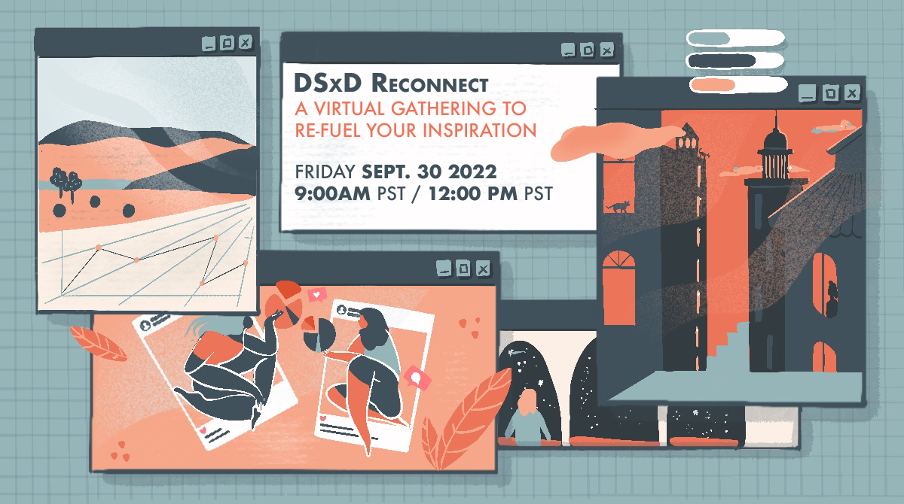

<H1> DSxD Reconnect</H1>

<H4> September 29, 2022 </H4>

    <a href="https://forms.gle/JSSrf1wbfbSYNNtW9" class="btn btn-primary">
      Apply to Attend
    </a>

 

### About

This half day event will bring together people who want to create, connect, and inspire. DSxD is gearing up for a second book, an anthology themed “Our Environment” where we ask: What worlds do we occupy? and how does data shape this landscape? At this virtual event we will hear from makers on the process of creating, draw and connect through an activity on world building, and discuss how to work together in the DSxD community.  

Let’s work together to design and build the world we want!

### We Want You to Attend!

Maybe you identify as a student, an educator, a researcher, a designer, an artist, an analyst, an engineer, or as something else entirely. All career stages - everyone is welcome! Apply here: [https://tinyurl.com/dsxdReconnect](https://forms.gle/JSSrf1wbfbSYNNtW9). 

As organizers of Data Science by Design, we are committed to fostering a supportive community among participants. One of our priorities for this event is to increase the amount of people who see themselves in data-related fields. Therefore, we strongly encourage applications from women and other underrepresented genders, people of color, people who are LGBTQ, people with disabilities or any other underrepresented minorities in data-related fields. To ensure an inclusive experience for everyone who participates, we will follow a [code of conduct](http://datasciencebydesign.org/coc).

Questions? Contact us at datasciencebydesign@gmail.com

