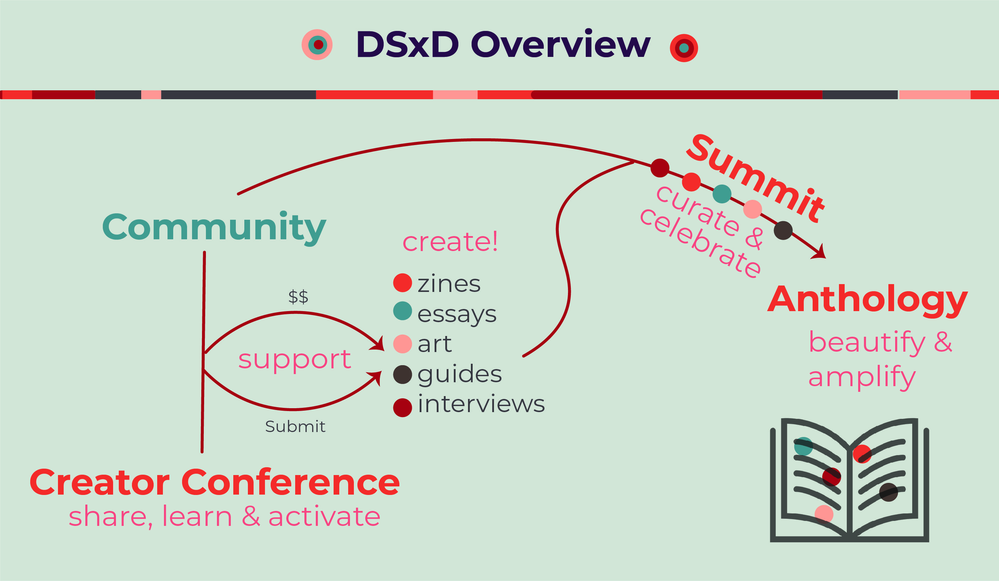
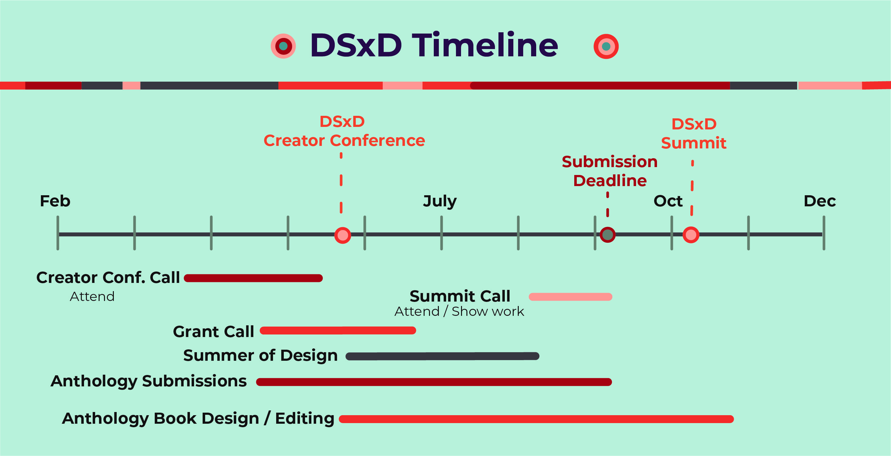

DSxD’s mission is to celebrate the fundamental creativity of data science. We support those who leverage creative mediums to convey the insights brought by data, and the practice of data science. We are establishing a community dedicated to developing a more open, ethical, and inclusive future for the field. Our [first blog post]() explains a bit more about who we are.

So if you love data and identify as a student, an educator, a researcher, data scientist, a designer, an artist, an analyst, an engineer, or as something else entirely, this project is for you. Everyone is welcome! 

## Plans for 2021

### Share, Learn & Activate

**Creator Conference**: Our first event is a hands-on conference: it’s part workshops and part talks, all aimed to bring together data enthusiasts of all kinds. We will have experts in design, storytelling, research, and data journalism share their creative processes and help activate our own creation energies.

### Support and Create

**Summer of Design**: Once we have the ideas flowing from the spring “Creator Conference”, we’ll use the summer to iterate on products. These could include a personal essay, a drawing, a zine, an explainer, or a how-to guide on your best practices for research, communicating a methodology, or even examining work culture. As a community of creators we’ll share strategies for iteration and provide accountability and support. 

**Creator Grants**: We understand that for many people taking the time to create is hard because of time and financial constraints. Please apply for a Creator Grant to support your efforts, whether they are individual or team-based. Coming Soon!

### Beautify, Curate, and Amplify 

**DSxD Summit**: The fall “Summit” is an event for presenting our work and ideas to each other.
    
Anthology: Inspired by zines,magazines, and anthologies that bring multiple voices together, the community’s efforts will be brought together in the form of a printed anthology to share with the world following the Summit in the fall of 2021.  

## Stay Tuned! 

We’ll be posting more specific information about the spring “Creator Conference” very soon including dates, speakers, and workshop details. Keep an eye out for the application to attend as a participant on [our website](http://datasciencebydesign.org/) soon! 

