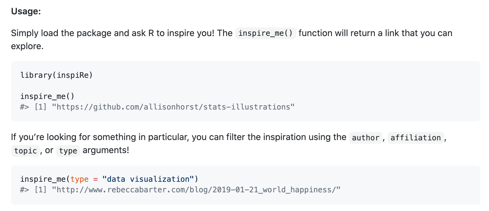
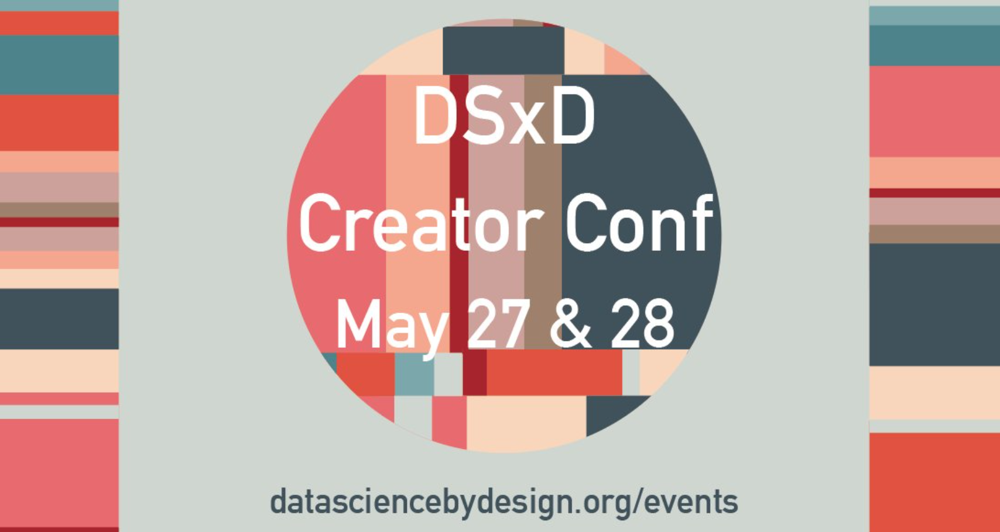

Do you ever read or see something that just kicks you into gear? You go from the work doldrums to the gears turning and suddenly the ideas are rushing. You have to write this stuff down! 

Those materials that spark a flurry of inspiration are exactly what we want to collect in an inspiration list: the things that energize you, the things that get you dreaming. Even better, we want you to be able to access that inspiration list serendipitously. Just as the [praise](https://cran.r-project.org/web/packages/praise/index.html) R package helps pick you back up with a random compliment when you are in the weeds of coding or debugging, we want the [inspiRe](https://github.com/sastoudt/inspiRe) package to boost you out of a funk by providing you with a random source of inspiration.

We’ve all been in need of inspiration from time to time.  In fact, our Data Science by Design (DSxD) initiative, which brings together data enthusiasts of all kinds to use creative mediums to communicate data-related work, was partially inspired by our own experiences with funks. 

But for this to work, we need your help! Contribute your own sources of inspiration or help us make this package fancier and more user friendly. And a note to the educators out there: if you need a place for students to practice their GitHub skills, reach out! This GitHub repository is the perfect one to test out making pull requests; students can contribute by adding rows to our inspiration list. 

And if you are looking for a creative outlet for all of those ideas that inspire YOU, consider applying to participate in our [Creator Conference](http://datasciencebydesign.org/events). We’ll hear from expert storytellers, creators, and designers about how they brainstorm and find inspiration to get started bringing an idea to life, among other creative process tips.

Header design by: [Ijeamaka Anyene](https://ijeamaka-anyene.netlify.app/)