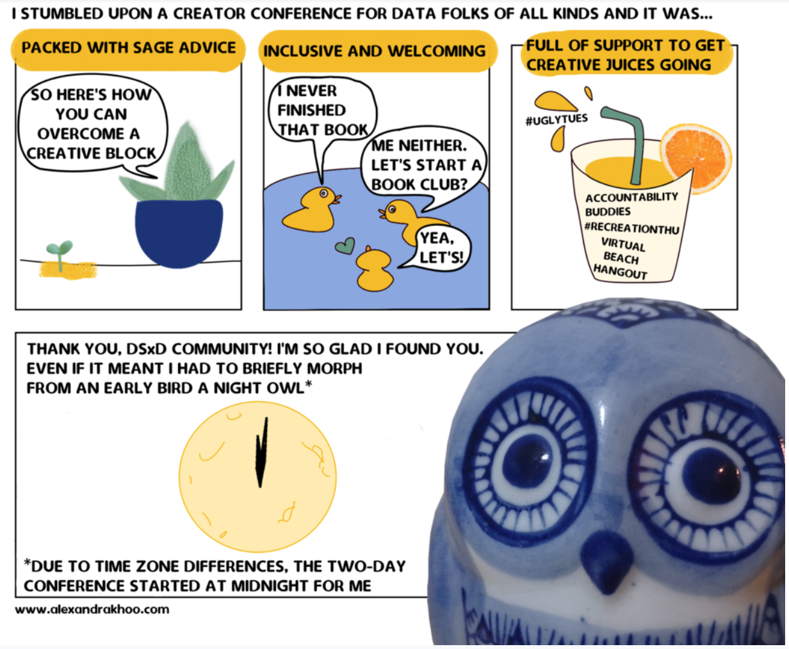
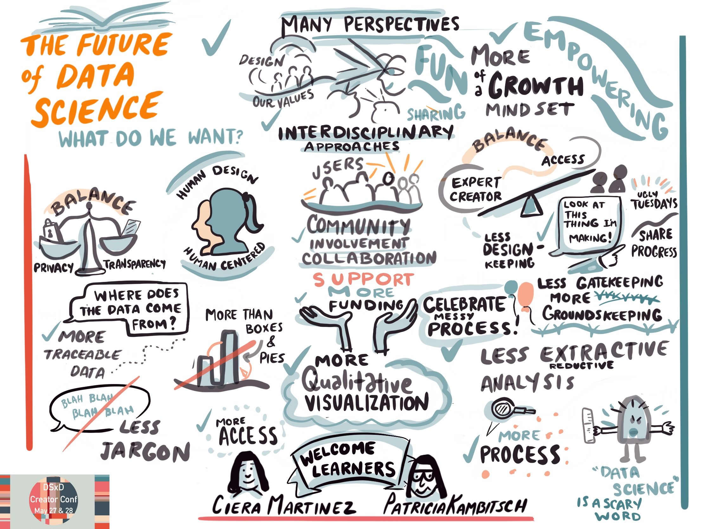
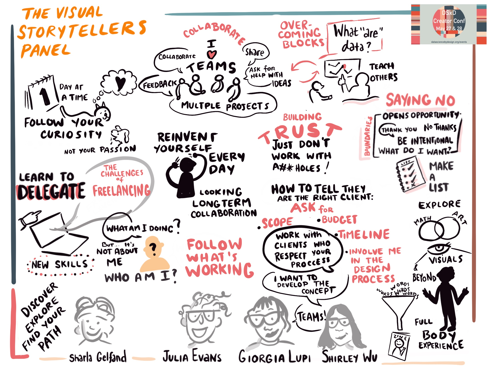
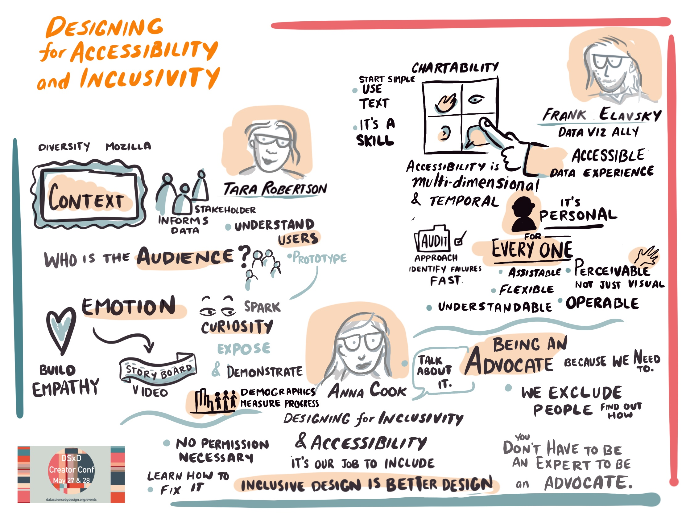

---
title: An ode to the summer camp vibes of &#35CreatorConf
date: 2021-05-24 00:00:00
description: Overview of DSxD hosted virtual conference that brought together creative data enthusiast across all fields. 
featured_image: /assets/img/lines/asset_2.png
--- 

On May 27 and 28 DSxD held its first event - Creator Conf.  The goal of this event was to get data enthusiasts to come together to get over that activation energy to start (or finish) creative data-related projects. This event was part of our [DSxD initiative](http://datasciencebydesign.org/blog/dsxd-overview) aimed to bring together folks to use creative mediums to communicate data-related work and establish new collaborations across domains. We hope Creator Conf has already kicked off the eventual creation of personal essays, drawings, explainers, or how-to guides on research best practices, findings, methodology, or even work culture.

Every session was designed to activate ideas and showcase process over end results. The organizers wanted to ensure each session varied enough and the days were paced to include a  mix of active participation, socializing, listening and plenty of breaks. The sessions ranged in format, discussion, panel, activities, and talks. 

<figure>
	
	<figcaption>Image by Alexandra Khoo (www.alexandrakoo.com) </figcaption>
</figure>

### We heard from...

**Designing for the Future of Data Science Discussion**: As our name implies, Data Science by Design is heavily inspired by design, not only design as in aesthetic design, but design as a process.  Often when we think about design we think of how to design for aesthetic values, but design is also the process of solving problems and creating functionality.  We started off Creator Conf with a conversation about how to design for the future of data science as a field, by identifying what aspects of the field we want to change or consider when working with data. 

Aided by the sketching of [Patricia Kambitch](https://playthink.com/), we identified what we as a group think Data Science needs more and less of. Underlying the conversation were themes and principles of transparency, both in how we do the work, but also in how we teach the work. Empathy was also a major theme: data science with empathy towards the creators and users of data, empathy with how data science is communicated, and with accessibility and inclusivity as guiding principles. These guiding design principles were re-iterated and refined throughout the rest of the event.

**Visual Storytellers Panel** Our first contributed session was a Visual Storytellers panel with [Giorgia Lupi](http://giorgialupi.com/), [Shirley Wu](https://shirleywu.studio/), and [Julia Evans](https://wizardzines.com/) - all legends in their own right. Sharla Gelfand moderated the panel, leading us through the creative process and styles of how all three navigate their practice and work. There was a lot of conversation around how to decide what to work on, including the importance of following your curiosty and working with good people. In addition, talks about how to form your path as a freelancer in a creative field. This panel surely could have gone on longer, and everyone left inspired as we went into break - with a lot of conversation.

**Creativity to Learn, Creativity to Teach**: [Alison Horst](https://www.allisonhorst.com/), [Sean Kross](https://seankross.com/), and [Sara Stoudt](https://sastoudt.github.io/) walked us through two hands-on activities, visual metaphors and storyboards, to help us learn about data-related topics and tools. We learned about the power of metaphor for teaching complex topics. Hopefully these will inspire activities in our own classrooms in the fall.  

**Designing for Accessibility and Inclusivity**: We heard from [Anna Cook](https://annaecook.com/links), [Frank Elavsky](https://chartability.fizz.studio/), and [Tara Robertson](https://tararobertson.ca/). In theseshort talks they discussed how to instill inclusion and accessibility practices into how we work.  We learned the need for quantification of change we want to happen, specifics about where and how to get started making our data work accessible and most importantly inspired to design and make change in the work we produce.

**The Pitching Process**: We heard from pitching extraordinaire [Erin Davis](https://erdavis.com/) who walked us through the stages of pitching: from thinking about thinking about it, to thinking about it, to doing it. This session included pro-tips about pitching to specific outlets with concrete examples of drafts and feedback from her own past work. Evaluate where you are in the process and brainstorm ways to move to the next phase using Erin’s reflection guide. 

**Self Publishing and the Power of Zines**: Sarah Mirk made us all obsessed with zines as a compact yet powerful means of communication. Everyone made a zine based on a statistics in some way and in the end we shared zines on incarcerations rates, penguins, types of bears, and dream datasets.  

<blockquote class="twitter-tweet">
My highlight of <a href="https://twitter.com/DataScixDesign?ref_src=twsrc%5Etfw">@DataScixDesign</a> conference has been the zine making session - here&#39;s my first zine on the &quot;Contributions International students make to the Canadian economy&quot;  A huge shoutout to <a href="https://twitter.com/sarahmirk?ref_src=twsrc%5Etfw">@sarahmirk</a> for breaking down the steps to making this!<a href="https://twitter.com/hashtag/creatorconf?src=hash&amp;ref_src=twsrc%5Etfw">#creatorconf</a> <a href="https://t.co/k3wvnrnOwk">pic.twitter.com/k3wvnrnOwk</a>
&mdash; Rue (@rue_glitch) <a href="https://twitter.com/rue_glitch/status/1398387150803013634?ref_src=twsrc%5Etfw">May 28, 2021</a></blockquote> 

### The key to Creator Conf was the active and engaged community of attendees
 
To attend the events, attendees applied and answered questions about who they are and what types of data work they are interested in pursuing. At minimum, all attendees prepared by thinking about their intentions for what type of work they would like to pursue in the future. There was a wide spectrum of who was accepted into the event, spanning many disciplines and career stages. Still not sure how - but everyone who attended was open, honest and engaged.  We were surprised that we felt like a community immediately even though most of us have never met.   

While there are always ways to improve, especially as we all try to navigate creating a welcoming, safe, and engaging space virtually, it was clear the key to any success of the Creator Conf was the people who showed up.  At the end of the conference we all felt like we were leaving Summer Camp. We can't wait to see what everyone does this summer.

<blockquote class="twitter-tweet">
Wrapping up the incredible <a href="https://twitter.com/hashtag/CreatorConf?src=hash&amp;ref_src=twsrc%5Etfw">#CreatorConf</a>...   “It feels like saying goodbye to your friends at the end of summer camp” 💯😭💕 <a href="https://t.co/mZnR0Yh7OU">pic.twitter.com/mZnR0Yh7OU</a>
&mdash; Natalie O&#39;Shea (@_natalie_oshea) <a href="https://twitter.com/_natalie_oshea/status/1398395223445757952?ref_src=twsrc%5Etfw">May 28, 2021</a></blockquote> 

