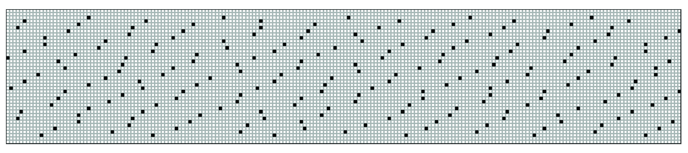

As data consumers, we often don’t spend a lot of time digesting a piece of data. We’ll see a cool graph in our Twitter feed, like it, and continue scrolling. Or we might read a journal article, inspect the figure for a few minutes, pass a quick judgment on the authors, and skip to the conclusions. Unless we work closely with the data day in, day out, it is not very often that we really sit with the data and let its stories, context, and wider implications really sink in.

I believe that the future of data science should include “slow data science.” Just like “slow TV,” data can be consumed as a marathon event at the pace at which it naturally unfolds. Slow TV typically covers an ordinary event, such as a train journey across Norway<sup>1</sup> or the knitting of a sweater<sup>2</sup>. Similarly, slow data science may be particularly well suited to help us reflect on everyday events that happen all around us.

The idea of slow data science ties in with the concept of “data visceralization”<sup>3</sup>. Visceralizations are representations of data that rely on all our senses to create an emotional as well as physical experience. A great example of data visceralization is A Sort of Joy (Thousands of Exhausted Things)<sup>4</sup>, a performance of New York’s Museum of Modern Art’s (MoMA) 123,951 object collection database.

As an example of data visceralization in the context of slow data science, I have created a data-driven knitting pattern. The idea behind using a knitting pattern – not the knitted end product – to represent data is that it really allows you to slow down and experience the data in real time. It is as much about the process, the experience, as it is about the end product. The end product, by the way, is an infinity scarf.

This knitting pattern is designed to visceralize how often mothers still die in childbirth around the world. The pattern is based on data from Our World in Data<sup>5</sup>. In 2017, 295,000 people died in childbirth around the world. That comes down to one human life lost approximately every two minutes. While maternal mortality rates have certainly declined over the last century, too many people still lose their lives. As Our World in Data points out, “If we can make maternal deaths as rare as they are in the healthiest countries, we can save almost 300,000 mothers each year.” Maternal deaths are represented in this pattern by bobbles<sup>6</sup> that are spaced roughly 2 minutes of knitting apart.

The pattern assumes an average knitting pace of 20 stitches per minute<sup>7</sup>. The infinity scarf covers about 6 hours and 45 minutes of data (8,000 stitches at 20 stitches per minute). However, the bobbles will take longer to knit than the regular stitches, slowing you down, forcing you to reflect on the fact that every data point, every bobble, represents a real human being that lost their life in childbirth. Expect the total knitting time to be around 9 hours. This pattern was specifically designed as an infinity scarf, stressing the fact that the events continue to unfold, even when you are not knitting.

<center>
<figure>
	
	<figcaption>Scarf knit by Tim Schoof following the pattern on page 67.</figcaption>
</figure>
</center>

### Slow Data scarf Pattern

**Materials**
- Medium or worsted weight yarn
- US size 9 (5.5 mm) circular knitting needles
- Stitch marker

**Gauge**

16 sts / 21 rows = 4” (10 cm)

Use any size needles to obtain gauge.

**Scarf dimensions**

48” (122 cm) by 8” (20 cm)

**Stitches**
- k: knit
- p: purl
- mb (make bobble): k1, p1, k1, p1, k1 into next stitch, turn, p5, turn, k5, pass the 4 stitches one at a time over the knit stitch and off the needle to finish bobble

**Pattern**

Cast on 200 stitches. Be careful not to twist any stitches when joining knitting in the round. Place a marker at the beginning of the round.

<center>
<figure>
	
	<figcaption>Abstract representation of the scarf on page 66, with the circular knobs representing the bobbles on the scarf.</figcaption>
</figure>
</center>

```
Row 1-2: k200
Row 3: k10, mb, k32, mb, k37, mb, k38, mb, k35, mb, k32, mb, k10 
Row 4: k25, mb, k34, mb, k38, mb, k30, mb, k37, mb, k31
Row 5: k6, mb, k33, mb, k34, mb, k35, mb, k37, mb, k35, mb, k14 
Row 6: k23, mb, k33, mb, k35, mb, k34, mb, k34, mb, k36
Row 7: k2, mb, k32, mb, k36, mb, k39, mb, k32, mb, k32, mb, k21 
Row 8: k18, mb, k33, mb, k33, mb, k36, mb, k38, mb, k33, mb, k3 
Row 9: k36, mb, k31, mb, k37, mb, k35, mb, k35, mb, k21
Row 10: k14, mb, k36, mb, k30, mb, k41, mb, k34, mb, k35, mb, k4 
Row 11: k30, mb, k35, mb, k37, mb, k31, mb, k38, mb, k24
Row 12: k8, mb, k36, mb, k34, mb, k33, mb, k40, mb, k30, mb, k13 
Row 13: k22, mb, k35, mb, k37, mb, k34, mb, k37, mb, k30
Row 14: k4, mb, k36, mb, k34, mb, k35, mb, k36, mb, k34, mb, k15 
Row 15: k18, mb, k37, mb, k38, mb, k34, mb, k34, mb, k34
Row 16: mb, k39, mb, k35, mb, k29, mb, k40, mb, k34, mb, k17 
Row 17: k14, mb, k41, mb, k34, mb, k33, mb, k33, mb, k38, mb, k1 
Row 18: k33, mb, k35, mb, k35, mb, k37, mb, k31, mb, k24
Row 19: k13, mb, k37, mb, k34, mb, k33, mb, k39, mb, k33, mb, k5 
Row 20: k30, mb, k34, mb, k37, mb, k35, mb, k30, mb, k29
Row 21: k7, mb, k37, mb, k38, mb, k33, mb, k34, mb, k36, mb, k9 
Row 22: k27, mb, k32, mb, k34, mb, k34, mb, k35, mb, k33
Row 23: k7, mb, k36, mb, k32, mb, k35, mb, k36, mb, k31, mb, k17 
Row 24: k20, mb, k34, mb, k40, mb, k34, mb, k33, mb, k34
Row 25: k3, mb, k30, mb, k36, mb, k40, mb, k31, mb, k39, mb, k15 
Row 26: k19, mb, k34, mb, k33, mb, k37, mb, k37, mb, k34
Row 27: k32, mb, k37, mb, k36, mb, k35, mb, k35, mb, k20
Row 28: k10, mb, k39, mb, k35, mb, k33, mb, k35, mb, k37, mb, k5 
Row 29: k30, mb, k36, mb, k34, mb, k31, mb, k37, mb, k27
Row 30: k10, mb, k37, mb, k33, mb, k34, mb, k37, mb, k32, mb, k11 
Row 31: k25, mb, k37, mb, k30, mb, k40, mb, k34, mb, k29
Row 32: k4, mb, k35, mb, k34, mb, k36, mb, k37, mb, k37, mb, k11 
Row 33: k21, mb, k34, mb, k39, mb, k29, mb, k36, mb, k36
Row 34: mb, k38, mb, k33, mb, k36, mb, k36, mb, k33, mb, k18 
Row 35: k20, mb, k31, mb, k36, mb, k34, mb, k37, mb, k33, mb, k3 
Row 36: k32, mb, k34, mb, k40, mb, k35, mb, k33, mb, k21
Row 37: k15, mb, k33, mb, k33, mb, k40, mb, k33, mb, k35, mb, k5 
Row 38: k26, mb, k35, mb, k35, mb, k36, mb, k39, mb, k24
Row 39-40: k200
```

You can personalize this pattern based on your knitting speed using the app available here: [https://timschoof.shinyapps.io/knittingapp/](https://timschoof.shinyapps.io/knittingapp/){:target="_blank"}{:rel="noopener noreferrer"}.


*Tim Schoof is a research scientist at Advanced Bionics where she works with data to help improve the clinical outcomes of cochlear implant recipients. Since her PhD days, she has been particularly interested in the challenges faced by people when trying to understand speech in noisy environments. As an industry scientist, she is driven to address these challenges. Tim has a slight hobby obsession and was very excited to bring together two fun activities, programming and knitting, into one little side project for this anthology.*


<sup>1</sup> Relax&Background, S. [9:56 Hours] Train Journey to the Norwegian Arctic Circle, WINTER [1080HD] SlowTV. [https://www.youtube.com/watch?v=3rDjPLvOShM](https://www.youtube.com/watch?v=3rDjPLvOShM){:target="_blank"}{:rel="noopener noreferrer"} (2016).

<sup>2</sup> NRK (2013, November 1). National knitting eve. [https://tv.nrk.no/serie/national-knitting-eve/2013/DVNR30004613/avspiller](https://tv.nrk.no/serie/national-knitting-eve/2013/DVNR30004613/avspiller){:target="_blank"}{:rel="noopener noreferrer"}

<sup>4</sup> Rubin, B. A Sort of Joy at MoMA (excerpts). [https://vimeo.com/133815147](https://vimeo.com/133815147){:target="_blank"}{:rel="noopener noreferrer"} (2015). 

<sup>5</sup> Roser, M. & Ritchie, H. Maternal Mortality. Our World in Data. [https://ourworldindata.org/maternal-mortality](https://ourworldindata.org/maternal-mortality){:target="_blank"}{:rel="noopener noreferrer"} (2013).

<sup>6</sup> Johanson, M. Bobble stitch knitting tutorial. The Spruce Crafts [https://www.thesprucecrafts.com/three-dimensional-texture-by-making-bobbles-2116336](https://www.thesprucecrafts.com/three-dimensional-texture-by-making-bobbles-2116336){:target="_blank"}{:rel="noopener noreferrer"}.

<sup>7</sup> Schoof, T. (2021). Knitting maternal mortality rates: an infinity scarf pattern. [https://timschoof.shinyapps.io/knittingapp](https://timschoof.shinyapps.io/knittingapp){:target="_blank"}{:rel="noopener noreferrer"}