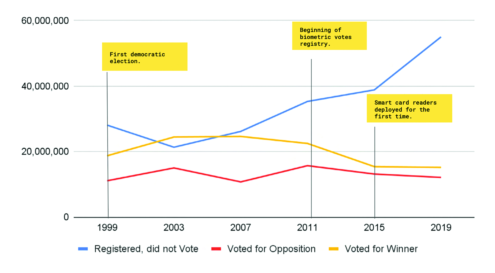

*This article follows the process of the development of “The Count”, an analysis of the 2019 Nigerian elections. It was developed by Bunmi Aworanti & Deji Dabiri1.*

The Independent National Electoral Commission (INEC) was established by the 1999 Constitution of the Federal Republic of Nigeria to organise elections into various political offices in the country. Through a series of legislative actions culminating in the Electoral Act of 2015, biometric voting registers and electronic voting via smart card readers were implemented in time for the 2015 Nigerian elections, making it much easier to collect, store, and distribute election statistics. It marked the first time that election data was electronically available to the general public, and this was continued for the 2019 elections. We were excited to explore the 2019 election data to see what we could learn. Here we present the process we went through, highlight problems we encountered, and discuss our vision for public data in Africa.

### Process

The goal was to have DataFrames and CSV files that had all the information of each type of election in a file, but the 2019 election results are stored on the INEC website2 as PDF files. We programmatically accessed the data by using web scraping tools such as Beautiful Soup3. We wrote a function that identified all the links on each web page, created a list of links, and then wrote a method that allowed us to download all the identified PDF files, which had already been grouped in folders according to their sources, having now downloaded all the necessary files and converted our PDFs into DataFrames.

Once we had done this for the different election types, we then began to perform analysis on the information to present what eventually became “The Count”.

### Problems

We faced a myriad of problems while creating this tool which can be summarised as follows:

**Data Completeness**: On a number of occasions, it was clear that some data was missing, without any given explanations. The total number of expected PDF files was less than expected. Sometimes, when election results are subject to legal dispute, the election results are removed from the website. However, these results are not updated even after the case has been fully litigated. Runoff elections also suffer from this issue, so the results of supplementary elections had to be manually entered. We were able to find the missing information through news articles from reputable sources.

**Data Inconsistency**: There were some small but serious inconsistencies in the way the data was presented. Sometimes, an errant punctuation mark or varied casing systems in the field title was enough to prevent concatenating the data into specific fields in a DataFrame. Some columns were not always labelled exactly the same way. We resolved these issues by identifying the files with the errant columns. We then enhanced the code to fix some of these data issues we manually identified. In some cases, we had to save the data as a CSV file and manually edit the inconsistencies in the files before merging them. There were also issues where some election results were put in wrong sections, which was also difficult to spot.

**Machine Readability**: PDFs are not very machine readable for the purpose of the analyses we wanted to perform. There are much better file formats to use, such as CSV. We had to use Tabula and Camelot, which are Python libraries created for the purpose of extracting tables from PDFs to DataFrames. These libraries were extremely helpful, but both have their shortcomings on PDFs with multiple pages, page orientation, different column and row sizes, merged cells, and more.

**Website Outages**: Sometimes, while running through our code, we experienced outages on the main INEC website. There were some issues with the website SSL certificate (this authenticates a website’s identity and enables an encrypted connection). In order for our code to work, we had to allow the code to request information from the website insecurely. This is not recommended and generally frowned upon, but it was a necessary work-around.

### The Future of Data Science:
### An African Perspective

Many of the challenges we faced have really helped shape our views of what the future of data science should look like from an African perspective. There needs to be a systemic change to our relationship with data, the way we collect, distribute, analyse, and protect it. We need to start building good data habits from the ground up. This is especially important for the public sector, as a lot of our shortcomings are apparent here.

Being specific to Nigeria, we should celebrate the recent progress that has been made but be mindful that we are still a long way from where we should be. Essential processes and reporting are not fully digitised yet, and even when they are, it is not done in ways that allow you to focus on unlocking insights from the data. It is also generally difficult to access information across organisations, departments, and stakeholders. The information is infrequently updated and is not always actively used for decision-making and service delivery.

We desperately need to improve and strengthen our digital readiness in order to fully benefit from the huge advancements in technology and properly unlock the potential of our data. There have been immense successes registered in industries like agriculture, finance, and telecommunications, but these have been spurred by the private sector. Our public sector has not always shown the enthusiasm to digitise. We need to advocate and push for open data that is available, accessible, reliable, easy to use, and transparent.

<figure>
	
	<figcaption>Voter activity across election cycles. From “The Count”.</figcaption>
</figure>

*Deji Dabiri is a marketing and technology entrepreneur and a cofounder of Swift Digital Motions. He is passionate about renewable energy and climate change. He is interested in how data science can be used for better decision-making in governance and its role is creating a more equitable, fairer society.*

*Bunmi Aworanti is a data scientist working in the applied AI field with past experience as a software engineer. She is also passionate about how data science and technology can be used in art, storytelling, and the Internet of Things to create interactive and immersive experiences.*

1 Future of Data Science Supplemental Material. [http://datasciencebydesign.org/book](http://datasciencebydesign.org/book){:target="_blank"}{:rel="noopener noreferrer"}

2 INEC Nigeria – Independent National Electoral Commission. [www.inecnigeria.org/](https://www.inecnigeria.org/){:target="_blank"}{:rel="noopener noreferrer"}

3 Richardson, L. Beautiful Soup. [https://www.crummy.com/software/BeautifulSoup/](https://www.crummy.com/software/BeautifulSoup/){:target="_blank"}{:rel="noopener noreferrer"}