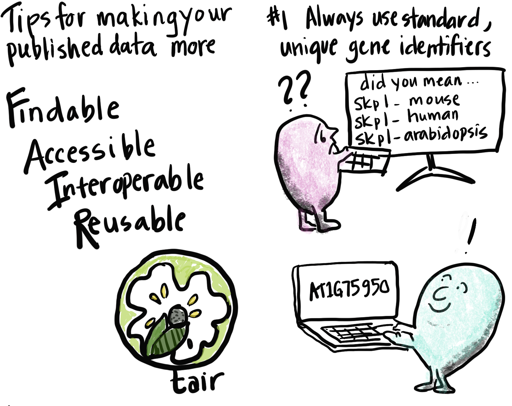
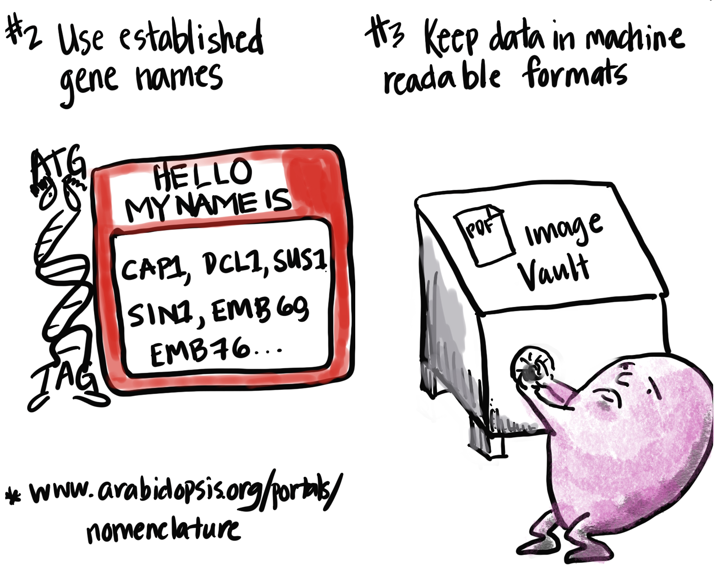
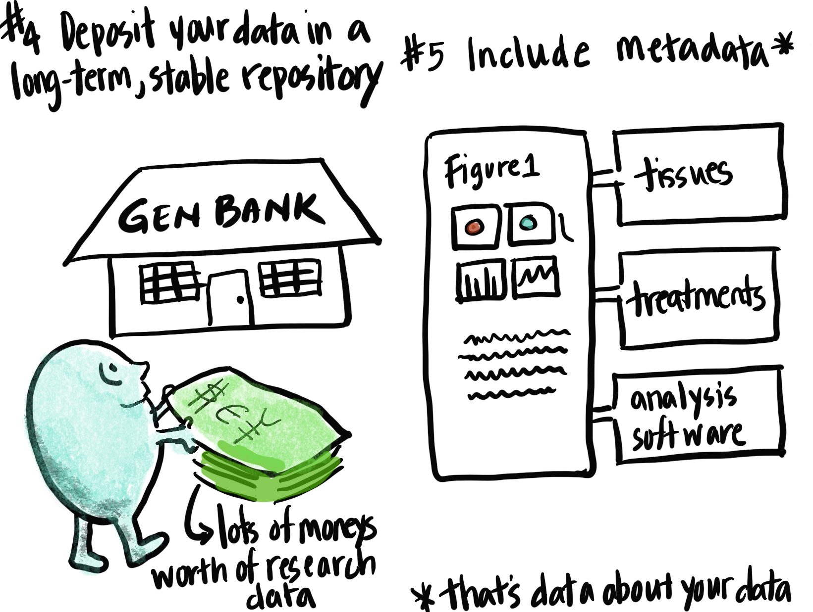
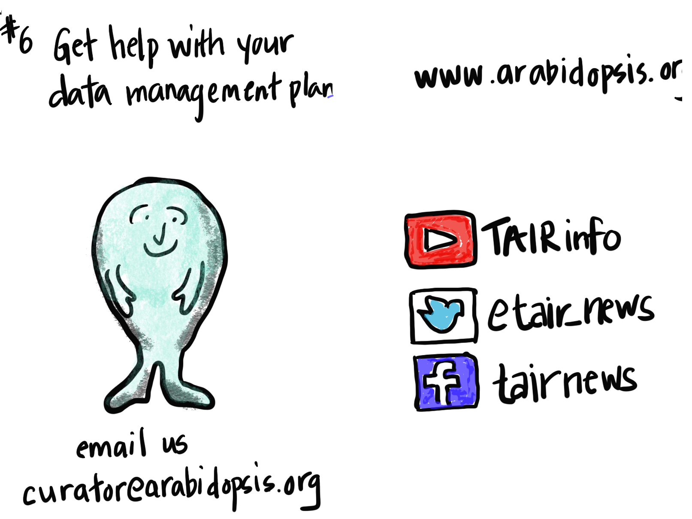

Modern biology generates enormous amounts of data that needs to be made computationally accessible in order for researchers to be able to access, manipulate, analyze, and interpret it. The FAIR (Findable, Accessible, Interoperable, and Reusable) principles1 are a set of guidelines for making scientific data more reusable. This zine is intended to provide some basic, practical instruction on how those standards can be applied to published research data. The intended audience is research scientists who are preparing manuscripts for publication. It was created for The Arabidopsis Information Resource (TAIR)2, a genome database that provides curated data for the plant Arabidopsis thaliana to tens of thousands of scientists around the globe.

 

 

 

 

*Leonore Reiser is a Biocurator at TAIR, where she helps researchers access, understand, and reuse data. She wishes she had a resource like TAIR when she was obtaining her PhD in Plant Biology at UC Berkeley because researchers should be able to spend less time digging for information and more time being able to use data to make new discoveries. She believes that equitable access to agricultural data is essential for solving the problem of global food insecurity.*

### References

1 Wilkinson, M. D. et al. The FAIR Guiding Principles for scientific data management and stewardship. Sci Data 3, 160018 (2016). 

2 TAIR - home page: [www.arabidopsis.org](https://www.arabidopsis.org/){:target="_blank"}{:rel="noopener noreferrer"}.