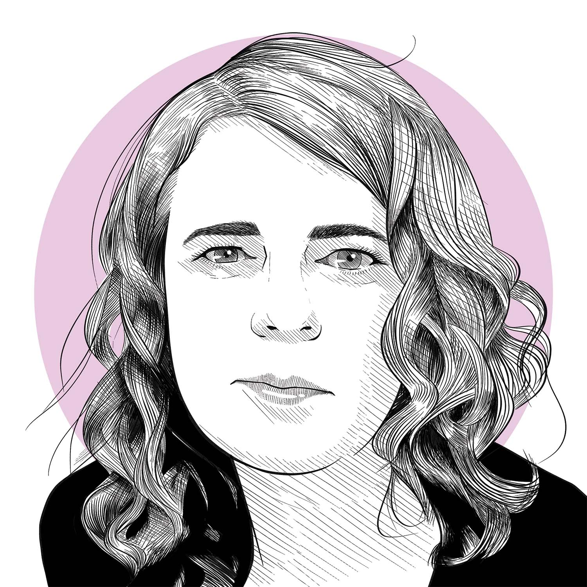

  

**How do you start, and finish, a series of pieces?**

Usually the mood prompts me to start coding. I pick up an old system, something I’ve coded before, and carve it into pieces or pull pieces from it. I take old functions and try to recombine them in different ways or work with different parameters. From there, it’s iterative. The initial phase is extremely intense, because usually I’m getting no output because the code doesn’t work! So that has no cathartic value. But once I start getting output, that’s when I feel the expressiveness.

A metaphor that’s stuck in my head for it is that it’s like the Metropolis Hastings algorithm for sampling from a posterior distribution. When I’m coding, I tweak the code, run it, see what it produces, and see how that resonates with the emotional response or modifies the way I’m feeling. That emotional response becomes the basis for the accept/reject decision. I rarely make the decision on technical grounds. So something that has the same underlying mechanics can go in completely different directions based on the mood, because I make different choices as I reuse the same tools.

My collections are usually strongly tied to an emotional experience – what I was feeling and remembering at the time that I was coding. Sometimes they look like the emotional experience in question, sometimes they don’t. The experience is sustained while I’m processing it, and I’ll keep making art associated with it until I get bored of the generative system or the emotional processing finally does its job. Then, sometimes, I don’t need it anymore – I’m done, it’s cathartic, I’ve gotten past it, and I’m letting it go.

**How often do you return to previous work?**

Some collections I never want to look at, or anything like it, again! And that’s not always because of the emotions – I sometimes get bored of the code. But for most systems I eventually come back around again after a long absence. At that point I come back and rebuild and keep fixing it. It happened with my Water Colours series, which started out with a halftone representation of other preexisting images. I used that before in a system but discarded it because it didn’t bring joy. Eventually I picked it back up and recombined with other thoughts I had, and it resonated. And now I have one of my favourite recent series!

<figure>
	
	<figcaption>Bursts: Geometry in a Hurricane</figcaption>
</figure>

<figure>
	
	<figcaption>Grid Graphics: Seed 1038</figcaption>
</figure>

<figure>
	
	<figcaption>Water Colours: Gods of Salt, Stone, and Storm</figcaption>
</figure>

**What’s your process like in the mechanics of choosing pieces?**

I often let a system just generate whatever it wants to do and see what it comes up with. Some series come up with really crazy things. For some of the series on my website I’ve posted, say, a hundred consecutive draws from the system with no censoring whatsoever. Sometimes the colours are choices I wouldn’t make myself, but I’m learning to live with some of the chaos that goes into this!

Other collections, I cull as they’re produced. Typically I keep somewhere between ten percent and a third of the generated pieces. It depends on how good the system is, and on my patience! Some systems are so slow that I won’t generate many pieces. Some are so quick that I’ll happily set it running and manually say, ‘No, no, no, oh cool yes, no, no’, and so those systems have a very low acceptance rate.

**Are these common threads between using R for data analysis and for art?**

The underlying process of making art is so similar to data analysis in a lot of ways. I end up doing a lot of probabilistic processes for data generation, which is such a statistical toolkit, right? When it comes to creating the art from it, I need to wrangle the data in a new format, and then visualize it. So it’s the same underlying tools that we use with data analysis. What I love about the R generative art community is that so often we end up using the same tools that we would use for data analysis.

*This interview has been shorted and edited for clarity and readability.*

*Danielle Navarro is a data scientist, computational artist, and recovering academic. She makes generative art using the R programming language and typically works in series, creating dozens of art pieces from a single underlying generative art system. She lives in Syd- ney on Gadigal land.*

*Her art can be found at: [https://art.djnavarro.net](https://art.djnavarro.net){:target="_blank"}{:rel="noopener noreferrer"}.*