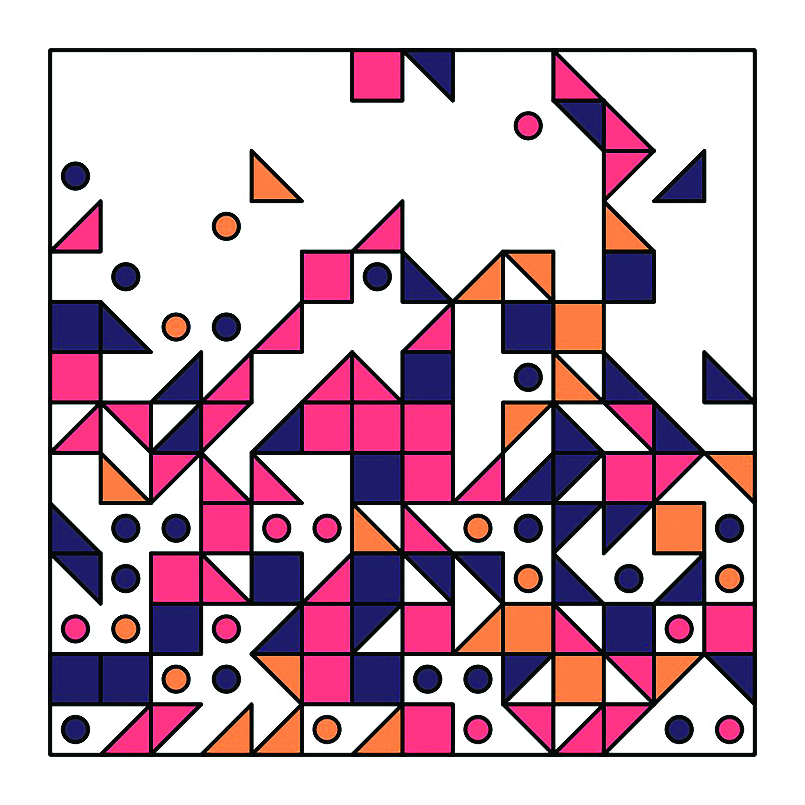

### You have been engaged in daily art practice for more than six years now. Looking back, how was your style changed and evolved over the years?

Over the years my work has gradually become more simplistic, especially the shapes I use to generate compositions. An important part of my ongoing practice is researching and practicing the use of code as a means of creating visual patterns.

When I was first starting out in this process I was using Hexels, a geometric drawing software that would allow me to draw shapes I could use as SVGs in my code. Later I experimented with self-made, code-generated shapes, which resulted in me using more straightforward, simplified geometry.

I guess the process of “sophistication” of my style evolved alongside the upgrowth of my knowledge and understanding of the tools I managed to master. For instance, certain algorithms used to be a mystery, for starting out, I didn’t quite fully understand how they worked. By playing and eventually creating so many sketches over time, I found out how to use the algorithms and fit them to my artistic needs.

In the first years I would try out different styles each day, but over time I altered my approach into working within the context of weekly themes. These enable me to focus on iterating according to a specific directive during the extent of a full week, allowing for more room to go in-depth using a given set of similar structures or generative rules. I have found that doing so increases the chances of a certain coherence arising from the process, helping me to better understand the “unspoken” narrative I’m trying to convey or simply deduce more effectively the direction I am trying to take it in.

<figure>
	
	<figcaption>Geometric Shapes / 190830</figcaption>
</figure>

<figure>
	
	<figcaption>Geometric Shapes / 210917</figcaption>
</figure>

### What advice do you have for others interested in starting a daily art practice?

My daily project started out from a quest to exert myself artistically and proactively show my work output to others. Having the constraints of that daily deadline really pushed me to work towards that goal without the impediment of playing at perfectionism every step of the way.

Despite the fact that at times it infused me with feelings of conflict and antilogy, nowadays I really enjoy the daily time exploring creating new work.

Another notion I’d like to point out is that you don’t need to understand everything before you can create something. It has taken me quite some time to understand specific algorithms, but by using them and creating varying types of work with them, I slowly learned to understand the tools I ended up working with. Iteration is the key to exploring; even the slightest little change can give you new ideas. Reuse your work when you can, and try to combine elements of other earlier sketches as well.

Don’t aim for creating your masterpiece daily. Play! Explore! Find the beauty in small things! By constraining yourself to a short-term deadline, you might just free yourself from the chains of perfectionism.

### You are also involved in the live coding community, which combines sound and visual components in a live performance. What is that experience like? Do you ever play around with music-making code or do you leave that to your collaborators?

Live coding feels almost similar to the making of a daily artwork, a slight difference being the presence of an audience and someone who’s creating the music. Often I haven’t the faintest clue what music the live coder musician will be creating, but I’ll try to adequately respond to their input, however arbitrary. There are techniques I use that will take impulses of sound and have them adjust specific parameters that I use within the code, having my visuals move to the beats. The sound also triggers my artistic output, forcing me to question aesthetics in realtime: Do the visuals need more colour? Do the movements need to go slower?

<figure>
	
	<figcaption>Geometric Shapes / 210329</figcaption>
</figure>

<figure>
	
	<figcaption>Geometric Shapes / 210120</figcaption>
</figure>

One of my first live coding performances, I started out with slow movement and black-and-white patterns. However, early into the performance I was already surprised by joyful music from my collaborator and ended up changing my visuals quickly by adding more colours.

The unanticipated input from your collaborator and the in-real-time response from the audience makes live coding an amazing experience.

Visuals are definitely my way to express, and I leave the music to my collaborator. I still try to experiment and follow workshops around live coding music. Having some under standing allows me to understand the music from my collaborator better. Who knows if I ever will perform live-code music in the future!

### How do you see the code art community evolving moving forward? What direction do you hope it moves in?

Over the years I have been involved in local communities such as Creative Coding Amsterdam and Creative Coding Utrecht in the Netherlands. During my times abroad, I often visit other local communities and meetups. Having events, meetups, and get-togethers, small or large, is a great way to be exposed to new insights and share your experiences.

In the recent years I have seen online communities bloom, most prevalently in the form of collaborative instant messaging clients such as Discord. Platforms like these create a variety of ways to meet, interact, and share thoughts, work, and ideas with one another.

Especially during the pandemic times, this has proven to be a great alternative to IRL meetups and even traditional code art forums, as environments like these allow for more means of interaction with each other.

Inclusivity and diversity have become stronger and more ubiquitous. I hope this will continue to evolve both in offline and online communities. Different individuals and their backgrounds bring wider varieties of perspectives and insights to the table, which are often complementary and add to the self-reinforcing nature of an inclusive communal stance.

*Saskia Freeke brings code into play to create geometric artworks on a daily basis. Doing so, she fuses her graphic design and interaction design background into her artistic practice. Specifically, her works and her practice stand out through their distinctive, playful characteristics.*