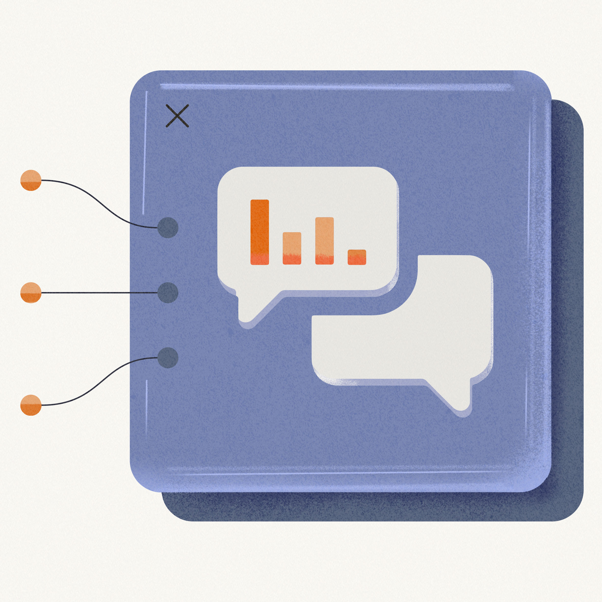

I’m 40 now, which means I am almost ready to stop worrying about what other people think of me. Almost being the key word here, because a few months ago the thought of getting on Twitch and livestreaming my coding mistakes to the world filled me with a core-shattering panic. Which may seem odd, because if you’ve stopped by one of my recent streams I’m likely learning something new by aggressively making mistakes in front of hundreds of people, all while having the absolute time of my life.

#### So how did I get here, and why I think you should also find some way to make mistakes and learn in public?

In early 2021, I was staring down the realization that the technical career I wanted for myself was slipping away, and it was entirely my fault. I don‘t have a formal education in programming, computer science, or data science, and my career history is filled with management positions. Data-related management positions, yes, but that means my strengths are in strategic planning, OKR development, and KPI tracking at the expense of the technical skills and domain knowledge I’ve been so desperate to develop.

In evaluating how to push into a more technical role, I knew that a public portfolio of my work would be the most direct path. But what do you put in your public portfolio when all you have is a patchwork knowledge of R, a diverse set of interests in technical content ranging from machine learning to web development, and the conviction that you can learn anything you set your mind to? My friends, this is when the act of learning in public becomes your portfolio. The way I saw it, I could either put my head down and try to learn in isolation, a situation in which the best possible outcome was that I would disappear for six months or six years or six decades until I felt like I had sufficient expertise to finally create something for my portfolio, and in which the worst – and most likely – scenario was that I would lose interest and motivation within a month and find myself back in the uncomfortably familiar position of starting over, having learned nothing. I know myself well enough to know that while I would love the drama of swooping in out of nowhere and stunning everyone with my newfound technical brilliance, this isn’t how I learn. My best, most efficient learning happens when I have a deadline and friends.

In my younger days this took the shape of a school assignment and a study group, but I couldn’t quite figure out how to make this happen as an adult with a job until I was asked if I would participate in a livestreamed machine learning competition called SLICED. Knowing that I couldn’t code my way through a machine learning problem if my life depended on it didn’t stop me from enthusiastically accepting the offer. Having procured my machine learning deadline, I set out in pursuit of friends and found myself on Twitch.

I had been quietly livestreaming video games for a couple of weeks before committing to SLICED, and even though I didn’t speak or use a webcam, I found myself choking down an incredible amount of anxiety every time my mouse hovered over the “Go Live!” button. But I kept going through with it both because I enjoyed it and because no one watched my streams. These gaming streams felt like a low-stakes way to test out Twitch while building a habit of streaming without any formal commitments or pressure.

And I didn’t immediately switch to streaming machine learning! Instead I started with a gaming stream but with the notable additions of both a webcam and microphone. Once I was comfortable speaking and showing my face, it was relatively easy to add in a #TidyTuesday stream. While I knew my data wrangling and visualization skills could use some work, I wasn’t too worried about making mistakes because when I first started I wrote most of the code beforehand. This felt like a great way to shield myself and avoid the horror of being vulnerable and admitting that I didn’t know something.

But then came the Machine Learning Silent Study stream. I figured I would position this stream as an opportunity for everyone to bring whatever project they were working on and we’d each work alone, together. I don’t know why I thought this would mean no one would watch the stream, but it felt safe enough to try. As I was working through a tutorial there’d be an occasional message from someone in chat pointing out an additional resource, code snippet, or solution to a bug I was grappling with, and suddenly it seemed like a silent stream was simply another way for me to learn in isolation. What would happen if instead of trying to hide my learning mistakes I embraced the risk of failing in front of others and made the stream interactive?

And so the following week, against all my better judgement, I fully invited everyone along on my learning journey by asking questions as they occurred to me, working on concepts until I understood them, and collaboratively refining my strategy for SLICED. Deciding to be that vulnerable was challenging. I didn’t have the programming or content knowledge to feel confident in what I was doing, and I was literally showing up and telling strangers on the internet, “I don’t know anything about machine learning but I’m determined to figure it out, and I would greatly appreciate your help.”

I didn’t immediately become a machine learning practitioner, but I did make it to the semifinals of SLICED, learned the foundations of the {tidymodels} framework, and, by making my learning journey public, was offered a technical role and with it the opportunity to push my career in the direction I would like to go. But these successes are not mine alone. They are the direct result of a learning community that invests in its members, learns from one another, and supports everyone in their learning journey. After all, we learn better when we learn together.

*Jesse is a Shiny Developer Advocate with RStudio, where they collaborate with the team to create engaging educational content ranging from tweetorials to illustrations, animations, and videos. Jesse thrives at the intersection of art, education, and technology and interweaves each of these domains in an effort to produce accessible and intuitive materials that lower the barrier of entry for all data science learners.*