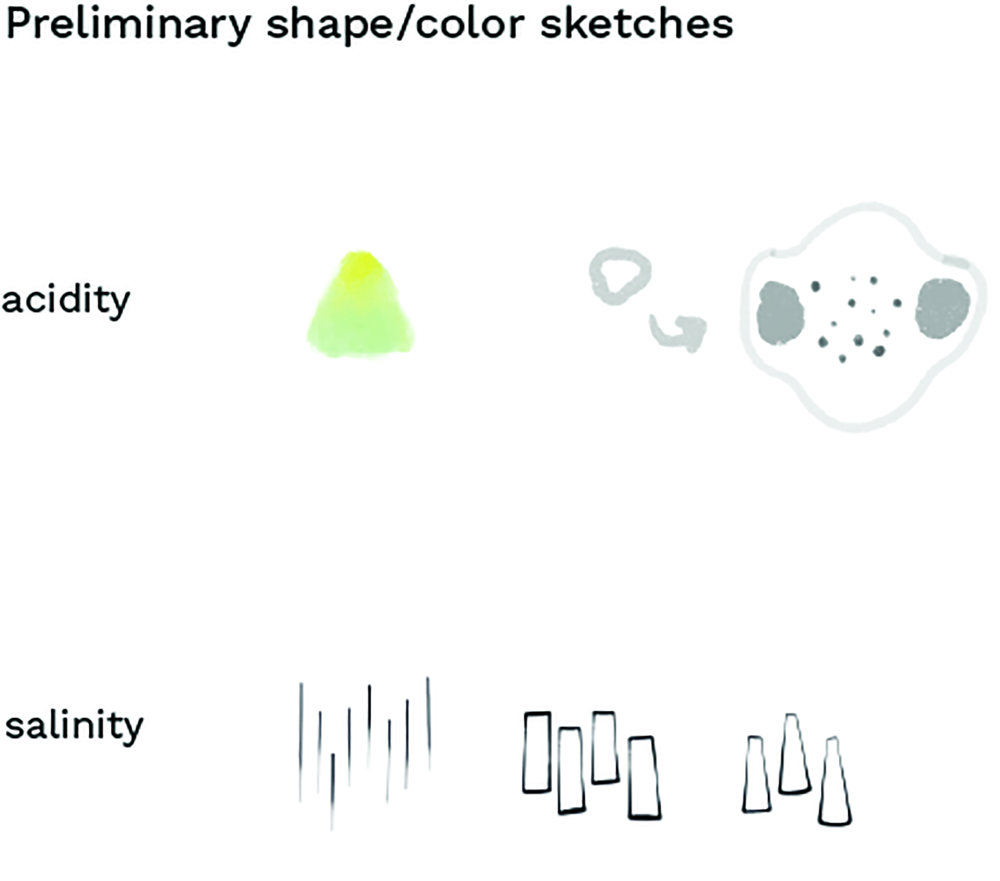
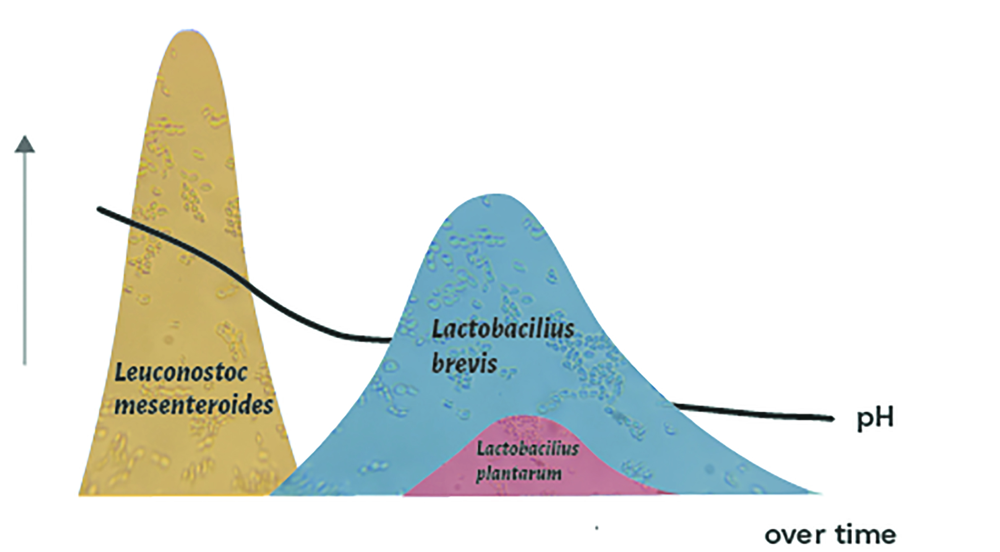
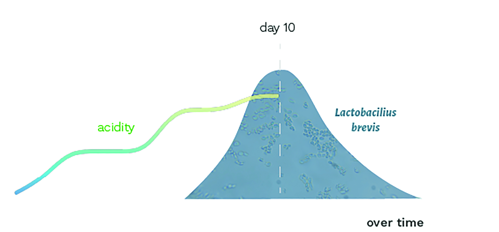
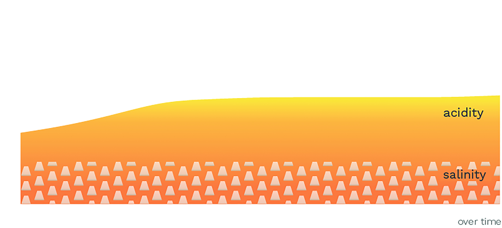
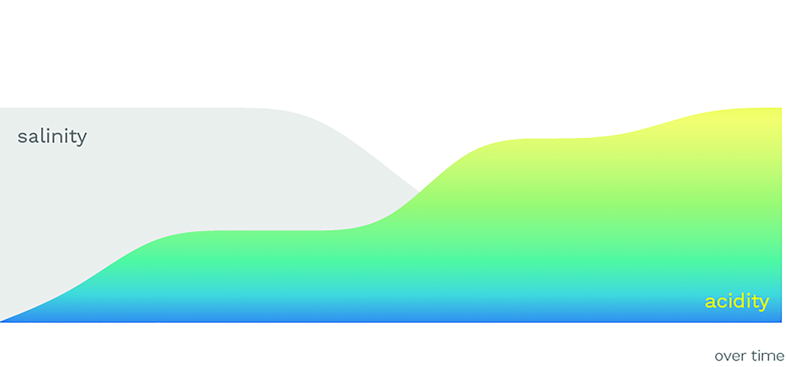

Like most people living on the West Coast, I grew up around fermented foods, from the more “Western” varieties including cheese, salami, yogurt, and sauerkraut to the more “Eastern” kimchi and miso. The latter, I only knew as the main ingredient in miso soup until a college boyfriend introduced me to alternative ways of consuming miso, such as on bread with butter or in tortillas with avocado. Though the romance with this boy was brief, the passion I developed for miso intensified, and with it, a passion for fermented food in general. Studying biology at that time, I approached the task as a biologist might: both with experimentation and research. While scientific articles explained the chemical and biological processes of fermentation, they didn’t connect it to the taste or actual experience of making miso and ultimately the lack of context made the science difficult for me to absorb. It was only when I used the most “basic” ferment that I could think of, sauerkraut, and explored various ways of representing its variables visually in conjunction with collecting my own data that the science clicked and I could understand fermentation at a more intuitive level.

This project uses fermentation as a case study to explore encodings between the senses by working with big and small data alike: From my own data collection, I was able to monitor and collect the pH, temperature, and salinity of sauerkraut and combine my small data with larger datasets from research papers. These included not only pH measurements but also information on the microbes involved and the days they appear, which was beyond my data collection skill set. I thus explored the perception of acidity (sourness) and salinity (saltiness) in two parts: how the scientific data shapes up to my evolving perception of the salinity and acidity level throughout the sauerkraut’s fermentation, and how I approached encoding, or translating, these two variables into sound, gesture, and visual-experiential formats.

Encoding is an important concept when designing a data visualization. The goal is to translate data into a visual element using intuitive features that have been well documented and researched (see Ware 2008). Hue could denote something “different”; enclosure, where there is more spacing between points, could similarly group points, whereas size and saturation could denote a greater or lesser number. Beyond visuals, however, we are lacking these shared “rules” to abide by. For instance, what is a thick line in sound, or the taste of a timeline? More specific to this project, how can we encode more abstract concepts such as the personal experiences of sourness (acidity) and saltiness (salinity) in a multisensory fashion?

Starting with a basic sauerkraut recipe, I fermented a cabbage over a period of 10 days at 19 22°C and 2.5% weight in salt. Each day I measured the pH, tasted the sauerkraut to gauge my perception of its saltiness and sourness, and invited the two friends I was with to participate with me. Throughout this experiment, I prompted myself with questions and exercises to explore multisensory perceptions and encodings of sourness (acidity) and saltiness (salinity), the two most forefront flavors in sauerkraut. I’ve included the latter exercises for you to follow along, as well as a few prompts to ignite your own creativity and guide reflection (see Box 1).

Following the lemon/salt exercise and prompts, I first set out to describe the sensation in words:

**Salinity**: Prickly and sharp, mostly on the tongue.

**Acidity**: Creeps up and then BAM! So much going on, different sensations all over the mouth; the tongue starts to dry, but it’s complex and fascinating. I envision a blobby, knobby shape that has varying levels of density.

As a data visualization engineer, I am most comfortable working and thinking in visuals. I thus began my exploration in sketches before expanding to sound, gestures, and circling back to data visualizations, which will be used as a basis for a future trans-sensory encoding project.

Based on the above descriptions, I started to sketch whatever came to mind (Figure 1). For example, in the leftmost sketch of salinity, I try to capture the sensation of “sharpness.” The middle sketch reflects my visual image of salt (Maldon flakes), while the rightmost sketch attempts to consolidate these two views by making the flakes a little more pointy.

Before finding sounds, I did sound “sketches,” where I tried to describe and produce a sound with my own voice that I felt matched acidity and salinity. My linguistic upbringing has made me sensitive to the combination of letters and the sounds they make, so I couldn’t help but imagine the English IPA chart in my head as I searched for my sounds. From these sound sketches, I hunted for more “complete” sounds that best represented my vision.

<figure>
	
	<figcaption>Figure 1: Preliminary shape/color sketches.</figcaption>
</figure>

Salinity is prickly – short, but grabs your attention. I think of chocolate chip cookies with salt flakes. When I bite into one, I immediately get a salty shot, and then it disappears into the buttery chocolate sweetness. When salt is well integrated into a dish, however, it goes unnoticed – almost like a static background. With that in mind, I knew the sound would be aspirated (where breath comes out as you release the consonant), which I perceive as staticky, with a high-pitched front vowel. Finding samples for salinity was rather easy; choosing between them was more challenging.

In my experience of acidity, it is a round sensation that creeps up on you, comes in with a BAM!, and lingers for a while before disappearing discreetly. The /b/ seemed immediately apparent to me as the onset letter, as it is round and unaspirated and more discreet than /p/. In order to keep with this notion of a round sound that slowly becomes more apparent, I opted for an open, back vowel in the English language, as in ‘but’, which evolves into /ɑ/ as in ‘spa. How does that feel?

As the flavor hits, the pitch intensifies and the lips come back together as /m/ naturally closes it. Acidity or “sour” was quite challenging to translate to sound. My experience was more complex than salt, and so finding a sample to match the acidic burst and lingering sensation wasn’t as straightforward. I ended up manipulating and combining two samples.

Combining the scientific data (Figure 2) and my self-collected data (Figure 3) allowed for a more holistic view of fermentation. Comparing the data I collected on taste with the scientific data, illustrating the peaks and falls of the lactic acid bacteria and the evolution of the pH, not only helped me understand players in sauerkraut fermentation (bacteria, pH, salinity) but also how taste perceptions (in this case saltiness and sourness) don’t necessarily reflect the actual data. For example, in Figure 4 the salinity stays consistent throughout fermentation, but in my experience (Figure 5) the ferment becomes less salty as its sourness increases. The goals of these data visualizations aren’t to attain precision and discern specific values, but instead to focus on the pattern and understand the interactions at a more intuitive level. The data thus provided a backbone to make a more abstract visual, as in data art.

<figure>
	
	<figcaption>Figure 2: The drop in pH (acidity) aligns with an increase in L. brevis.</figcaption>
</figure>

This first chart (Figure 2) contains the scientific data of the evolution of bacteria and pH of the fermenting cabbage. No matter how hard I tried to memorize and understand the data, it was lacking a fundamental how question: How does visualization reflect the evolutions of the sauerkraut’s taste?

Almost from one day to the next, the sourness of the cabbage seemed to double. As I tasted it, I imagined lactobacillus brevis overcoming the previous bacteria, as it is l. brevis that we attribute to the sour flavor of sauerkraut. In Figure 3 acidity is colored with a gradient where blue is less acidic and yellow is more acidic, while l. brevis is filled with a microscopic image that I took of the sauerkraut.

In Figure 4 I represented acidity with pH (that I inverted as a lower pH = more acidic), which is colored by the Universal Indicator pH colors, such as you would find on pH strips. In terms of the salinity, I filled the area (at 2.5, the salt content in the sauerkraut ferment) with a pattern I designed that reminds me of Maldon salt flakes, my image of salt.

<figure>
	
	<figcaption>Figure 3: A spike in acidity aligned with the appearance of L. brevis.</figcaption>
</figure>

In Figure 5, although the salinity levels stayed constant, my tasters and I noticed that the sauerkraut seemed less salty as it became more sour, no matter our “base level” for salinity (for example, what is perfectly salted for a French chef might be undersalted to my senses). While the pH drops considerably over the first few days, the acidity bursts around day 5, just when the lactobacillus comes into play. One day to the next, the salty cabbage starts tasting like sauerkraut. By combining the taste and data, the variables and processes finally clicked. In this visualization, salinity is represented by a color I associate with it, made slightly grayer for color contrast, and acidity by the same gradient used in Figure 3.

Exploring and sketching across the senses aided me in digesting the inner workings and science of fermentation, which was much richer than just using one sense, such as visuals. The colors, shapes, and sounds that I attributed to the acidity and salinity made me more aware of how I experience and conceptualize taste and increased the memorability and tactile aspect of the data and science.

<figure>
	
	<figcaption>Figure 4: Actual acidity and salinity levels over sauerkraut fermentation.</figcaption>
</figure>

<figure>
	
	<figcaption>Figure 5: Perceived inverse relationship between salinity and acidity levels during fermentation.</figcaption>
</figure>

Furthermore, the act of collecting my own data gave me intimacy with my subject and more time to reflect. It led me down a rabbit hole of possibilities on the sensory proportions that make up activities such as eating a meal, culminating in a deeper reflection about how we experience taste and how individualistic it is. Nevertheless, these exercises were initial explorations that opened me up to a new universe of expression and the many challenges of encoding data using all of the senses. I invite each one of you to explore your own passion in a multisensory fashion; if you love music, think how you might encode it in taste, smell, or gesture, taking inspiration from the prompts that I included in this piece. Who knows, you might come away with a more intimate understanding and a fresh musical experience.

### Box 1: Warm-Up

#### Follow along!

Before embarking on visualizing fermentation, I cooked up prompts to get me thinking about sourness and saltiness more abstractly. Below you will find an exercise.

**Materials**

1. Slice of lemon or lime
2. Salt

To get the most out of these prompts, I invite you to first read through them and then sprinkle salt on your tongue while you ponder the answers. Repeat with a lemon or lime.

**Describing the Sensations**

- How would you describe this experience? Where did you notice the sensations in your mouth?
- How long does the sensation last?
- Where is the sensation located in your mouth?
- What is the intensity of the sensation? Is it strong? Weak? How does it change?

**Abstracting the Sensations**

- What does acidity/salinity sound like? Is it soft and slow? Sharp and quick? Low- or high-pitched?
- What does acidity/salinity look like? Is it round or square? Spikey or smooth? What color(s) would you attribute to it?
- What does acidity/salinity feel like? Is it soft or sharp? Furry or glossy?

*With a background in biological and linguistic academic research, Max Graze is interdisciplinary to the core. By day she’s a data visualization engineer at MURAL, and by night she explores multisensory data representations and uses data as a means to engage in her many passions, which include linguistics and fermentation. In any data-related task, she pulls from her intimate experiences in fieldwork and data collection to humanize the data that she works with.*

1 Mitchell, W. (2005). There are no Visual Media. Journal of Visual Culture. 4. 257-266.

2 Ray, B., & Bhunia, A. (2013). Fundamental Food Microbiology, Fifth Edition. (Fundamental food microbiology.) Hoboken: CRC Press.

3 Ware, C. (2008). Visual thinking: For design. Amsterdam: Morgan Kaufmann.

4 Zabat, M. A., Sano, W. H., Wurster, J. I., Cabral, D. J., & Belenky, P. (2018). Microbial Community Analysis of Sauerkraut Fermentation Reveals a Stable and Rapidly Established Community. Foods (Basel, Switzerland), 7(5), 77. [https://doi.org/10.3390/foods7050077](https://doi.org/10.3390/foods7050077){:target="_blank"}{:rel="noopener noreferrer"}