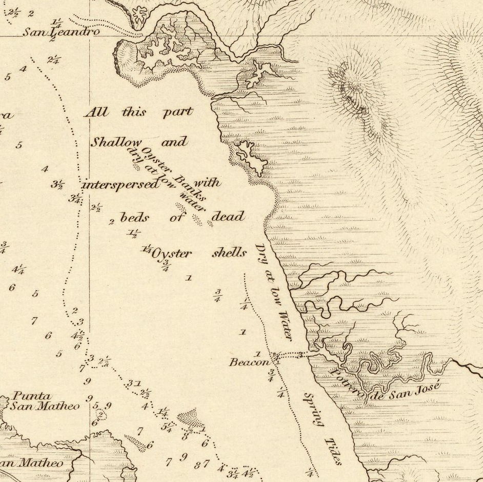
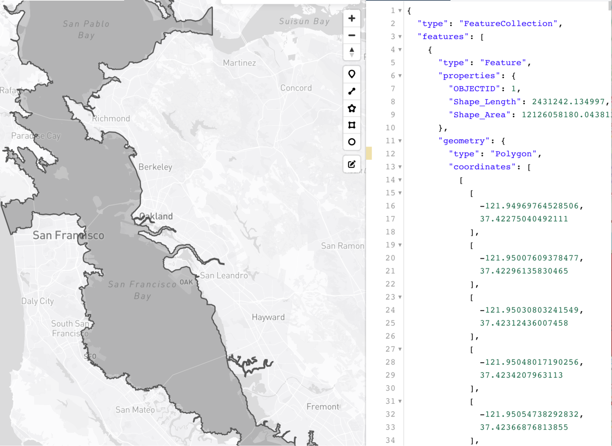

How long is a coast? This is a question we routinely pose to our students of geography. We use it largely as a polemic, since there is no answer—a starting point to discuss the fractal edges that form between water and sand, an endless line that becomes longer and more complex with each step closer. Still, Mandelbrot (1975)¹ felt that despite this, there was still value in trying to measure between the materiality of the water’s edge and the mathematics of geometry. He argued that even coastlines with infinite variability of atoms could still be subject to a stochastic model as fractals, but that these were generalizations at the level of infinity.

However, the problem starts well before Mandelbrot’s fractals. It starts with the problem of classification itself: that there is the earth, there is the sea, and between them, a coastline, a divider. Olsson, in *Lines of Power (1995)*² describes the slash (/) as dialectical, a creator of binary opposition—this/not that, this/also that, and this/and that, but most importantly, this/not this. Unlike the dash (-), which joins, the slash separates at the fundamentals of language, creating a hard relation between objects whose existence, then, becomes reified. Sea/not sea, land/not land, and sea/land—the line in between, the coast*line*.

As Carter³ writes:

<q>“The word coast has the sense of side. It is what most geographical objects present to the eye when they are first seen. Coasts are elevations in the earth’s surface whose other sides have yet to be mapped. But coastlines are different. Far from dissolving into rounded or graduated three-dimensional objects, they grow in importance and definition with the advance of the survey. A coastline is a generalization of geographical particulars.”</q>

Geographers know coastlines are fictions. Cartography, it seems, is yet to catch up, but I cannot seem to determine if it is a problem with limitations on our tools or our ontologies. Eighteen months ago, I started a project to make a map of the Bay Area from one of many viewpoints of the Ohlone with the Sogorea Te Land Trust, an urban Indigenous women-led organization based in Oakland focused on “rematriating” the land through a number of sites across the East Bay. Part of this map was, and still is, the project of redrawing the original coastlines of the various bays (San Francisco, San Pablo) before significant land reclamation, before the silt came down from the gold mines and raised the seabed by three feet, and before the natural erosion that comes with time. We triangulated against a series of archival maps—Beechey 1832, Ringgold 1852, and US Coast Survey 1859, layering the lines over each other. Each was slightly different, stretching the distance of the coast in ways only a fractal can.

Doing this type of archival work invokes strange conceptions of space across time. What was where, when—this shore in 1852, this rock in 1832. The objects created by these cartographic devices of stillness are predetermined by the hand that draws them. For settler ships and merchants with a desire for conquest and extraction, the main goal is clear: get to where you need to go without sinking your ship. And so, the Bay is contained by thin, straggly lines that sketch out a shore at high water and rivulets where the creeks meet the bays. Even in the sea, the land speaks loudly; dotted with sounding depths, the seabed is mapped for depth against an imagined flat sea at high water.

_What is where, when?_

Yet, really, it is the invisible conceptions of time across space that trouble our classifications here.

_What is when, where?_

For instance, along the edges of Beechey’s coast “lines” are sometimes a dotted edge (with a darker denser pattern at the water’s edge), a description, or a faint pattern of grassy shores. These swampy, marshy tidal lands contain the suggestion of time, “spring tides,” and “dry at low Water,” the oyster banks that emerge and submerge mapped out in a dotted texture. Where empty space is water and the line marks out land, there is a visual ambiguity that this technique affords—a “sort-of land” approach to classification.

<figure>
	
    Close-up of J. Beechey’s 1852 The Harbour of San Francisco. Hydrological Office of the Admiralty: London.
</figure>

But cartographic patterning is also still a symbolic side step from the original problem of classification. The datum for sea in this map is high spring tide, and so water stretches farther in this map than it would otherwise. For a sailor in 1852, where there is water is important. But for us now, water engulfs the map and the coast is articulated only at its farthest retreat—at the highest tide. If water can be here, now, then this place is water.

The coasts, for many Ohlone people, are important spaces. From salt production to collecting oysters and mussels and serving as a location for ceremonies and villages, the salty marshes that form the interface between the deep water of the Bay and the height of the hills are central to life and culture (**side column note**)¹. The hundreds of shellmounds that were built in these spaces are testament to the way in which the Chochenyo, the Ramaytush, the Karkin, and the Miwok inhabit the tidal areas and creek watersheds of the Bay and the Pacific Coast. In these shellmounds, archaeologists have found not only the shells of oysters, crabs, and mussels, but also the bones of Chinook salmon, deer antlers, ash from fires, utensils (like mortar and pestles), weapons (like spearheads), and buried human remains. This is a space, not a dialectic—a line with water on one side and land on the other. It is a series of constantly changing spatio-temporal landscapes, space-times across which Ohlone peoples make their lives.

 ¹See for instance, Milliken’s (1995) A Time of Little Choice; Akins and Bauer’s (2021) We Are the Lan; and Nelson’s (1906) Report on the Emeryville Shellmound.

To understand this issue, we have to turn our space defined by time into time defined by space: there is water, now, here. There will be land, later, here. No longer is the spatial subjugated to the temporal; time does not capture space and say, “This is simply what is here now,” but rather space captures time and says, “This changes”—that this space is both land and water, or neither. Better yet, “This is a space for gathering oysters, now, here; this is a space for ceremony, later, in fall”—a space for doing rather than a stagnant classification.

So, we have a problem of classification that results in a problem of understanding, a cartographic awkwardness that focuses on what space is rather than what it does. And this awkwardness has been transposed seamlessly into our geodata and our geospatial practices. The basis of geographic information systems, we tell our students, are points, lines, and polygons, and the world can be described on the basis of these three logics. In practice, on OpenStreetMap, this whole space can be reduced to the line data tag natural=coastline, or natural=wetland. To make sure we are all on the same page, the OSM guidelines give us a graphic that explains the difference between the classifications: Upland/Coastal Wetland/Lake; Swamp/Marsh; and Forest/Shrub/Meadow/Dense Emergent/Sparse Emergent/Submergent. ​​But we cannot truly all be on the same page, because in this instance, in this project, the page starts with Sogorea Té and the Ohlone people, not with the map—with what is done in the space, not the kind of space that the line encloses. To decide on a data classification system and then apply it to either side of the line is not the same as building spatial knowledge from the swampy marshes around us, to live in spaces, not slashes.

The problem here—at the start of an error of classification, whether intentional or simply hubristic—is that the line begins to reinforce itself. This is what Carter3 means when he argues “. . . the coastline is a theoretical construct with practical consequences; it is an idea with real-world effects. [ . . . ] There is no sharp line dividing the line in theory from the line in practice; one always bleeds into the other.”

The swamp lands, mudflats, tidal marshes, and salt ponds that once were plentiful before colonization have, over time, been engineered to be more productive, with canals and levees built, sea trenches for shipping dug, and land reclaimed. In one place, Alameda becomes an island; in another, a salt marsh is squared. The space of the coast is transformed into a line, and the edgelands gradually become harder and less permeable.

<figure>

	
    Alameda and Fremont. Alameda Island (top) was created from a peninsula in 1902 to clear the canal for shipping. Salt marshes (bottom) near Fremont. Source: Google Earth.
</figure>

In the same way, our tools for understanding these spaces gradually become more resolute, less permeable, as our data and data visualizations become more digital. Each line becomes rendered as a series of points (see Fig. 3). We do not draw a line; we code an equation.

<figure>

    The Bay then and now. A geojson polygon traced by Jocelyn Thao from an 1844 Map Port De San Francisco.
</figure>

Thus, as the line disintegrates into a series of points, so does the dialectic that it enforces. What we are left with is the assumption that it exists, but faded into the background (or buried in the code). And though the equation and number of points may change as we zoom in or out, and though we can repattern it so that it looks like Beechey’s dots, the fundamental assumption that there is a line, a clear dialectic, does not: the equation always remains. In digital mapping, Mandelbrot’s coastline breathes, stretching and subsiding as only an imagined line can.

The logic of the point becomes the logic of categorisation, but it inherits its cartographic dialectic: water precludes land and vice versa. What classification do we choose?

Our solution, for now, is multiplicity. A line separates and creates a dialectic. But many lines, layered over one another, call the line itself into question. There is water, now, here: no, there isn’t. If we do not yet have the digital technologies to work beyond the ontological assumption of separation—beyond points, lines, and polygons—then perhaps through excess, we might be able to destabilize the dialectic upon itself. As Thompson4 describes cinematic excess: “Excess is not only counternarrative; it is also counter-unity.” In some ways, this describes the coast itself, if not the coastline. The water churns the land and the land explodes into the water, a disunity of material composition that is resolutely founded on entanglements and encounters between objects that the map tries to separate: a counter-unity.

And so, if the coastline can be described as a mythological unification of the swirling, bubbling fractures as a land, sea, silt, swamp mix, then by tracing the traces, creating coast traces, we can begin to (if not finally) disassemble the dialectic.

**Bio:**

Clancy Wilmott is an assistant professor in Critical Cartography, Geovisualization, and Design in the Berkeley Center for New Media and the Department of Geography. She comes to UC Berkeley from the Department of Geography at the University of Manchester, where she received her PhD in human geography with a multisite study on the interaction between mobile phone maps, cartographic discourse, and postcolonial landscapes.

References

1. Mandelbrot, B. B. Stochastic models for the Earth’s relief, the shape and the fractal dimension of the coastlines, and the number-area rule for islands. Proc. Natl. Acad. Sci. U. S. A. 72, 3825–3828 (1975).
2. Olsson, G. Lines of Power - Limits of Language. (U of Minnesota Press, 1991).
3. Carter, P. Dark Writing: Geography, Performance, Design. (University of Hawaii Press, 2008).
4. Rosen, P. Narrative, Apparatus, Ideology: A Film Theory Reader. (Columbia University Press, 1986).
