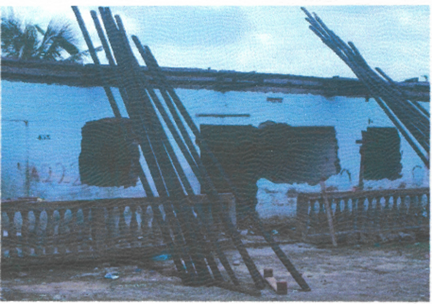

Who owns land in Africa? This is a big question, and one whose answer impacts many people, including my family in Cameroon, West Africa. We were impacted by a massive government land-grabbing incident in March 2014 in my childhood neighborhood of Mambanda, Douala, that rendered over three thousand people homeless and hopeless. During this event, thousands of people lost their homes and received no compensation or relocation assistance. The land seized from mostly low-income communities residing in this neighborhood was attributed to eminent domain and put to industrial development. With no prior eviction notice given, displaced residents recognized this incident as an oppressive act by the government to acquire their land forcefully. This experience motivated my doctoral research that examines the topics of decolonization, land tenure, and land reform, specifically the colonial and post-colonial era land ordinances that significantly reduced customary ownership rights for the vast majority of Cameroonians. I present my community’s experiences to help one appreciate the importance of inclusivity, power-sharing, representation, participation, and collective decision-making for shifting from colonial practices and policies to decolonized forms of land use and ownership.

Colonization had profound implications for land tenure systems (the legal structure by which land is owned and used by an entity) in Africa as many nations progressively lost their cultural identity and sovereignty over their own land. Hence, the term "decolonization," as I see it, refers to a shift from colonial practices and policies (especially around land tenure administration) to traditional, cultural, and community-centric land use and ownership practices. The colonial history of Africa since independence paints a rather distasteful picture of inexistent and lethargic government interventions to fairly redistribute land among the poor and historically disadvantaged populations.¹ The result of inaction in reforming land tenure systems to meet contemporary needs has generally resulted in land ownership disputes, land acquisitions, land grabbing, and population displacement in many African countries.²,⁵

<figure>
	
Our family house after all salvaged materials were removed before demolition. Photo credit: Yvan S. Kenjio.</figure>

Due to the various tensions and problems surrounding land tenure, the Cameroonian government engaged in a land reform process with the goal of facilitating investors’ access to land and inviting the civil society to participate.⁶ The vision articulated by the Cameroonian government spoke of a land tenure reform process that would be participatory and inclusive in nature. However, the stated goal appears to be paradoxical in that facilitating investment in agriculture constitutes an important manner in which local communities' land rights are alienated in Cameroon.7 In my current research, I seek to understand the experiences and perspectives of all interested parties (both included and not) about issues within the land tenure system in Cameroon as well as the current land reform agenda, with a focus on marginalized populations, like the Mambanda community I grew up in, that are often excluded from such processes.

Data plays a quintessential role in my work, as it is the primary way through which I understand the environmental, societal, and policy-based context that characterizes my area of study. In my current research in exploring land tenure and land law reform in Cameroon, I draw on a mixed-methods data collection process. By seeking both qualitative and quantitative information from my participants, I intend to provide not only breadth but also depth around my topic of investigation.⁸,⁹ By immersing myself in survey administrations (through questionnaires) with a large sample of the population, I can begin to see what story a large sample of the data tells. However, that story is not complete until I conduct in-depth interviews with subsets of participants to more fully understand the nuances around their perspectives on the topic and how they view their environment.

In my experience, while data generally serves as a form of storytelling, the unspoken and often most important parts of a story can sometimes be missed if not sought out by the researcher. For example, I believe that when participants and/or respondents are subjected to a data collection procedure, they might sometimes (whether voluntarily or involuntarily) omit and/or refuse to share a complete picture of the story the researcher seeks to uncover. While conducting research on land tenure and land reform in Cameroon, for instance, I often found that groups who are disempowered and discriminated against such as women will not speak freely in the presence of their spouses. This is a form of traditional respect (viewed as a societal bias today) that stems from deeply held cultural values practiced in many parts of Africa. Nonetheless, as the seeker of a complete story, I often supplement this by involving additional methods of data collection, such as participation observation. Through these observations, I am generally able to record changes in body language, voice tones, and facial expressions that allow me to either continue or stop the data collection process. Putting a participant in a place of discomfort or stress can only result in a distorted story, whether data-driven or not.

<figure>
	
    A landscape view of a section of the Mambanda neighborhood after demolition. Photo credit: Yvan S. Kenjio.
</figure>

In my view, inclusive data science research is a way of conducting research whereby all members of society—irrespective of gender, ethnicity, education, age, social status, and other forms of stigmatizations—contribute to the creation of knowledge. Such a process must be equitable, inclusive, and fundamentally rooted in the recognition of the human dimension of the world—all humans can contribute to research. Given Cameroon’s colonial past and questionable post-colonial precedents, it is critical to adopt an inclusive data science research approach in exploring the topics of land tenure and land reform.
To place this claim into context, the first post-colonial piece of land legislation in Cameroon (the 1974 land ordinances) was a product of non-inclusive and non-representative land law development by what many describe as an oppressive government. While still in use in the country, the 1974 land ordinances must be revised. There is also no evidence that an inclusive or participatory process was sought in the development and implementation of this law. Recent interest expressed by the Cameroonian government to make its revision of the land law participatory and inclusive provides an opportunity for more inclusive data science research. Through the research practices described above, I seek to uncover: a) what this participatory and inclusive process means in practice, b) the stakeholders involved (e.g., what criteria are used to select them), and c) how the decision-making process is achieved.

While there is no blueprint for what the decolonization process should look like, I suggest a four-step procedural framework.¹⁰ These steps include:

1. identification and thorough review of colonial land tenure systems by the population;
2. assessment of societal challenges around current land tenure regimes;
3. co-creation of a comprehensive, inclusive, feasible, and acceptable land tenure legislation (land policy reforms) that reflects current needs and aspirations of individual entities;
4. implementation of the newly co-created land reform in a strategic manner. This approach seeks to amplify the voices of disenfranchised and underrepresented groups, such as women, the urban poor, traditional authorities, and certain indigenous communities, who have historically been left out of crucial land reform processes.

The life experiences we gather on this planet shape how we see, occupy, and navigate life. As a researcher, data helps us uncover unique facets of the world that then enable knowledge creation and decision-making processes to be enhanced. However, how we choose to affect data (through collection procedures, analysis, and participant selection) can also affect the stories we produce about the world around us. As researchers, we have the ability to make the world a better place by learning from our lived experiences and using both quantitative and qualitative data to support more inclusive decision-making processes.

**Bio:**

Jacques is a PhD candidate in the Department of Environmental Studies at Antioch University New England with a focus on land tenure, land policy development, community empowerment, and social justice. Jacques is also a football fanatic and singer.

References:

1. Hansungule & Hansungule. Who Owns Land in Zimbabwe? In Africa? International Journal on Minority and Group Rights vol. 7 305–340 Preprint at [https://doi.org/10.1163/15718110020908070](https://doi.org/10.1163/15718110020908070) (2000).
2. Evers, S. J. T. M., Seagle, C., & Krijtenburg, F. Africa for Sale?: Positioning the State, Land and Society in Foreign Large-Scale Land Acquisitions in Africa. (BRILL, 2013).
3. Hunt, D. Unintended Consequences of Land Rights Reform: The Case of the 1998 Uganda Land Act. Dev. Policy Rev. 22, 173–191 (2004).
4. Demissie, F. Land Grabbing in Africa: The Race for Africa’s Rich Farmland. (Routledge, 2017).
5. Kalabamu, F. T. Land tenure reforms and persistence of land conflicts in Sub-Saharan Africa – The case of Botswana. Land Use Policy vol. 81 337–345 Preprint at [https://doi.org/10.1016/j.landusepol.2018.11.002](https://doi.org/10.1016/j.landusepol.2018.11.002) (2019).
6. Nguiffo, S. , & Wouri Consulting. Civil Society Proposals for Land Reform in Cameroon Assessment of the existing legislation. Preprint at [https://www.landcam.org/sites/landcam/files/resources/Civil%20Society%20Proposals%20for%20Land%20Reform%20in%20Cameroon.pdf](https://www.landcam.org/sites/landcam/files/resources/Civil%20Society%20Proposals%20for%20Land%20Reform%20in%20Cameroon.pdf) (2019).
7. Fonjong, L. Interrogating large-scale land acquisition and its implications for women’s land rights in Cameroon, Ghana and Uganda. (2017).
8. Creswell, J. W. & David Creswell, J. Research Design: Qualitative, Quantitative, and Mixed Methods Approaches. (SAGE Publications, 2017).
9. Rossman, G. B. & Rallis, S. F. An Introduction to Qualitative Research: Learning in the Field. (SAGE Publications, 2016).
10. Kenjio, J. W. K. Decolonizing land tenure systems in Sub-Saharan Africa: the path to modern land policy reforms. Journal of Land Management and Appraisal (2020).
