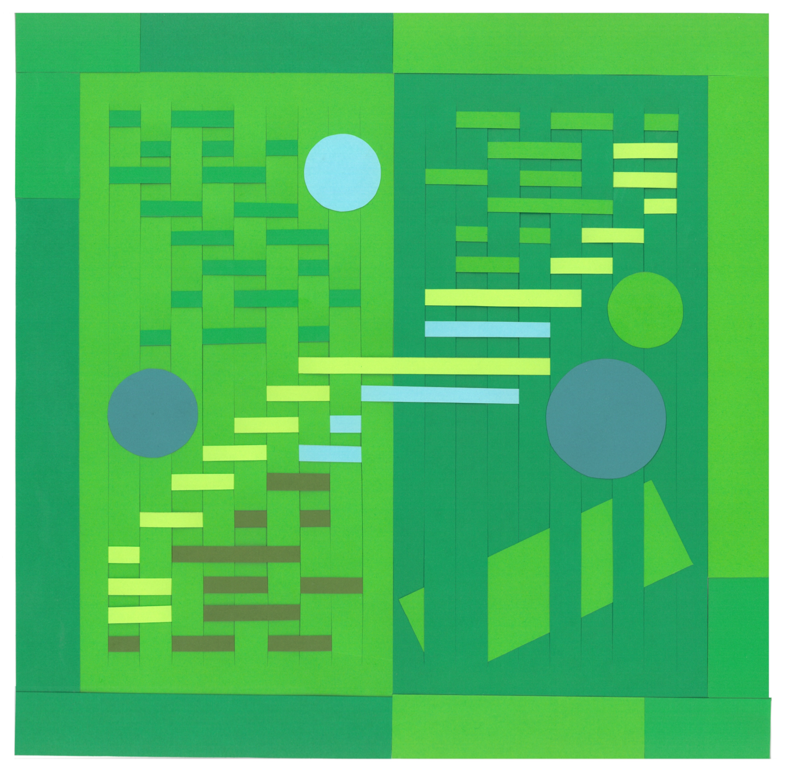

In late July 2022, I went on a backpacking trip with four people: two friends from Toronto, and two people I had never met (friends of one of my friends). Among us we had two artists, one arts worker, one frontline nurse, and a statistician (myself). We met up at my brother’s apartment in Victoria, BC, (where he had just moved a couple weeks prior) and borrowed some gear, left some things at the apartment, then spent too long buying camping food and supplies at overpriced island grocery stores before we began the long drive up to Port Hardy on the northern part of Vancouver Island to hike the North Coast Trail.

What proceeded next was both a whirlwind and an excruciatingly long six days of all-day hiking, exhaustedly setting up our campsite, cooking our meals, and cleaning up only to wake up the next day and do it all again—and again, and again. I had hiked before, but I was the only one in the group who’d never backpacked—and the North Coast Trail is not for the faint of heart! The first two days are mainly spent going up and down, up and down through a muddy bog, which can result in thigh-high mud or a face-plant if you’re not lucky or careful (and we were neither). The only relief from the bog is beach hiking, which sounds relaxing in theory but actually involves killing your knees by walking on rocks not quite small enough to be smooth but also not big enough to stay put. Instead, your weight shifts the rocks and makes them treacherous to walk on.

<figure>
	
    Fog, 2022. Woven paper. 
</figure>

It’s not all bad, though. After a seemingly never-ending day, ending up camping on the beach night after night makes it all worth it: hearing the sound of the ocean, the waves, having total and utter silence and isolation from the world (and from other hikers on the first couple of days). Dropping your fifty-litre pack and peeling off your clothes and running, screaming and joyful, into the ocean, letting the waves crash into your aching, sore body, grateful that your feet are too numb to feel the sharp rocks. Arriving at a campsite that feels like a dream, with fog shrouding the fact that the shore is two kilometres long when all you can see is a couple hundred feet in front of you. Wading into the water and feeling that it doesn’t get deeper, no matter how far you go. Finally ending your trek through the bog and discovering the lush trees, seeing a waterfall trickling through soaked moss. Mushrooms growing, life growing, signs of other life (just one bear cub!) and reminders of our own mark: a bit of garbage from hikers, a forgotten pair of sunglasses, colourful buoys marking the trail, and trash washed up on the shore.

Spending six days with four other people also leads to a lot of conversation, or a lot of eavesdropping when you’re low on energy. I learned what it’s like to be a working artist—how my friends got started, when they decided to go to school, how they earn their money, and about residencies all across the world. I learned about using honey on wounds, about all the hiking in my home province of Alberta that I never took advantage of. We cooked for each other, prepared coffee or matcha or hot chocolate, and discovered what kind of food these former strangers did and didn’t like. We gathered every evening to write notes from the day in my little notebook, documenting where we had started and ended, how long we had hiked for, inside jokes, who was in a bad mood and who was feeling silly. We wrote down questions to look up later, like why can you sometimes see your breath even when it’s warm out? We pored over maps, planned the following days, and never once stayed up late enough to actually see the starry sky.

If it sounds like I’m writing a love letter to my friends and to the trail, well, I guess I am. A trip like that is long and exhausting, and by the end of it I couldn’t wait for a break, for some alone time, or for the ability to use my phone and catch up with my friends, to look up every little thing that came to mind. I couldn’t wait to sleep on something besides a sleeping pad that deflated every night. But at the same time I also left it endlessly inspired, obsessed with the beautiful environment that I was so lucky to have hiked through and slept in for days, obsessed with making art.

<figure>
	
    Fern, 2022. Woven paper.
</figure>

Irony Creek is a set of three woven paper pieces representing both the natural and unnatural environments from the North Coast Trail, intended to envelop the viewer in the atmosphere of the trail. The work also explores how these environments affect us and, in turn, how we begin to affect them through the use of data, each from a different angle. Each piece uses data to determine its final appearance.
Fog (Figure 1) revisits the foggy, haunting dreamscape beach of the namesake Irony Creek campsite. It uses data on low and high tides, which determines when parts of the trail are impassible. The second day of our hike, we used a tide table to figure out when to cross Tripod Beach, where low tide was at 07:16 and high tide was at 13:57. The top half of Fog has seven woven lines and the bottom half has six, resulting in thirteen total. Needing to use this data during the trip was a reminder that even in a remote, unplugged environment, we still use data to make decisions.

Fern (Figure 2) represents the overwhelming lush of fern and moss along the trail. It uses data on the length of the trail itself and the data produced by ourselves: six clusters of lines to represent six days of hiking, and four circles to represent four nights camping on beaches (with the final fifth night spent in a forest campsite). As a data worker, I just can’t help but partake in self-quantification and I brought my fellow hikers along with me, from tracking how many hours we spent hiking or how many groups of people we saw each day.
Finally, Buoy (Figure 3) is a piece that leaves nature behind and explores our impact and our usage, representing the bright, colourful buoys used to mark the trail. It uses data that can only be accessed outside of the trip. This piece explores curiosity, the desire to research things, and the little notes written down that had to be explored later. The 2011 Tōhoku earthquake and tsunami resulted in much of the debris seen along the trail, including the buoys used to mark it, and this final piece contains six full circles for the six minutes that the earthquake lasted.

<figure>
	
    Buoy, 2022. Woven paper.
</figure>

**Bio:**

Sharla Gelfand is a nonbinary statistician, software developer, and artist with interests in web development, generative art, and textile arts. Their work explores the play between art created by a computer and by hand, creating generative art that looks like it could have been made by hand (like a textile, drawing, or painting), and making physical art based on data or outputs of a generative system, exploring the strengths and limitations of each. They live in Tkaronto (Toronto), Canada, on the traditional territory of many nations, including the Mississaugas of the Credit, the Anishnabeg, the Chippewa, the Haudenosaunee, and the Wendat peoples. Tkaronto is now home to many diverse First Nations, Inuit, and Métis peoples. Irony Creek is part of the North Coast Trail in British Columbia and is located within the traditional territory of the Kwakiutl and Quatsino First Nations.
