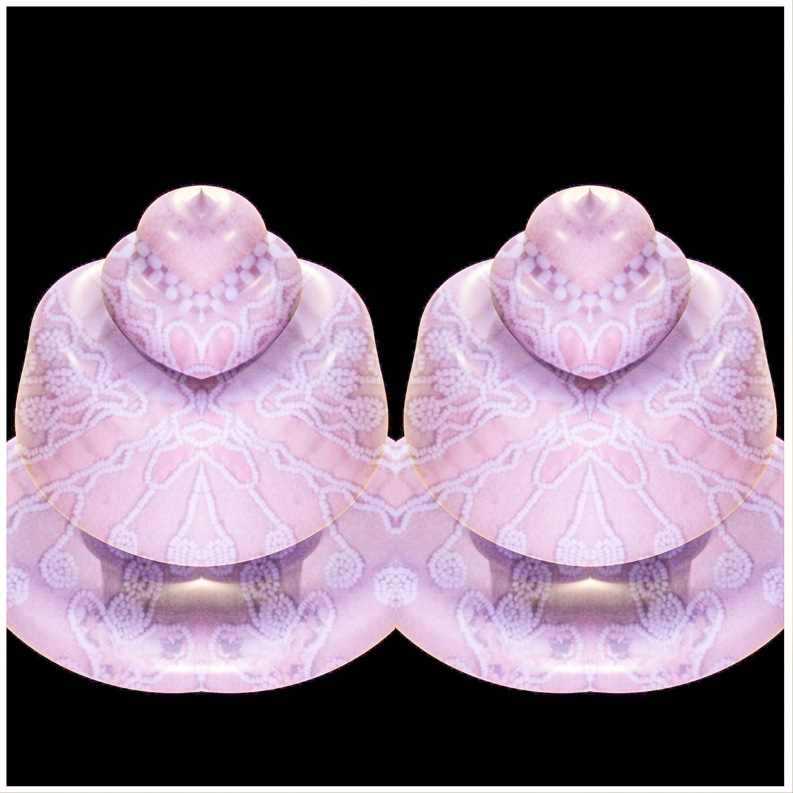

In data science, we talk about models suffering from either “overfitting” or “underfitting.” Overfitting is when a model exhibits a low degree of bias, but a high degree of variance. In other words, it accepts a multitude of differences within the data, but it doesn’t have very much predictive power. Underfitting is the inverse of this—high bias, low variance. This is what happens when you make a generalization without enough data, or with data that is not diverse enough to represent the real world.

It is said that those who fail to study history are doomed to repeat it. I would rephrase it as: those who ignore data have underfitted models.

When Thomas Jefferson and Benjamin Franklin were looking for a new model to serve as a basis for the United States government, they were very impressed by the Iroquois Confederacy. (We call ourselves the Haudenosaunee, aka People of the Longhouse, made up of the Six Nations: Seneca, Cayuga, Oneida, Onondaga, Mohawk, and Tuscarora. When looking through our country's laws and bills, you will see us referred to as the “Iroquois.”) Thomas Jefferson spent a year with the Haudenosaunee in Upstate New York, staying in one of their large cities of a very sizable portion of the US and Canada.

<figure>
	
    An image of beadwork from the Haudenosaunee Confederacy made in 3D software using images from museum collections of beadwork. Colors include silver, gold, pink, blue, and purple. It looks similar to a shell or a river clam.
</figure>

<figure>
	
    3D Bead 2, a 3D wampum beadwork made by Amelia Winger-Bearskin with 3D modeling software and photos of beadwork or beadwork patterns from museum collections of Haudenosaunee beadwork throughout the ages. 2019 
</figure>

<figure>
	
    3D Bead 3, a 3D wampum beadwork made by Amelia Winger-Bearskin with 3D modeling software and photos of beadwork or beadwork patterns from museum collections of Haudenosaunee beadwork throughout the ages. 2019 
</figure>

<figure>
	
    3D Bead 4, a 3D wampum beadwork made by Amelia Winger-Bearskin with 3D modeling software and photos of beadwork or beadwork patterns from museum collections of Haudenosaunee beadwork throughout the ages. 2019 
</figure>

Later, when drafting the Constitution, the founders cherry-picked the parts of Haudenosaunee statecraft that best aligned with Western Enlightenment-era ideology: representation, voting, checks and balances, etc. What they left out, however, were the social and cultural networks that sustained these practices in the actual Haudenosaunee Confederacy.

In the Haudenosaunee Constitution, women (clan mothers) from each tribe were the only ones who could vote for the representative, who was the chief. The words for “clan mother” and “chief” come from the same word; there was a balance of power, something that was hard to translate into a Western framework of understanding. Haudenosaunee farming also differed radically from the agricultural economy of European settlers, which was inextricably bound up with chattel slavery. In Haudenosaunee society, everyone in the community participated in planting and harvesting.

The founders’ selective pilfering of Haudenosaunee political practices is an example of a colonial mindset. _I see it; I like it; I want it; I’ll take it. I take what will benefit my own political or material interests, but I’m unconcerned with the effect that it will have on the people I take it from._

So, what’s wrong with “colonizing” a concept? It’s not like a natural resource or a piece of land; ideas are not a zero-sum game. We all have a colonial mindset, no matter who we are, simply because our culture has a colonial mindset. No need to beat ourselves up over it, though, right?

But taking an idea out of context is like plucking a plant out of its soil. You lose everything that made the thought work in the first place. What if it turns out that confederate democracy (or lasting peace and prosperity) is dependent upon a balance of power along gendered lines? Or upon a different economic model than the one practiced by European settlers in North America? Or what if it requires a system of agriculture where the environment is protected by maintaining sustainable practices?

In other words, the problem with the colonial mindset is one of underfitting. It encourages us to believe we know more than we do, to premise our thinking on bad analogies. It is like trying to run a program without checking its dependencies—the program will produce weird artifacts or potentially crash completely, and afterwards we will be left holding the bag and scratching our heads.

For instance, let’s say you want to lay the groundwork for a society run on the blockchain. What would that look like? How would that work? What kind of consequences should we expect? Silicon Valley orthodoxy would have us move fast and break stuff.—wing it, basically, and hope we learn enough from our failures to make incremental improvements in the next release.

But we have thousands of years of data about decentralized economies at our disposal. The use of wampum among the Haudenosaunee functioned as a decentralized distributed ledger of contracts, and it helped us govern our society for centuries.

<figure>
	
    My wampum shell I take with me to share during my talks. I took a photo of it on my desk.
</figure>

Wampum is an example of what I’ve termed “antecedent technologies,” and there are many more cases like this. Antecedent technologies are techniques or systems that preceded European contact (or, in Europe, ideas that preceded the Enlightenment). In short, these old-school technologists advanced sciences before the Western world “invented” the very same things. When cultures share and trade, they trade technology as well—but it is important to not conflate when they were invented with the first time a Western person encountered it or remixed it.

The Incan knot language of quipu, for instance, has been shown to be Turing-complete, meaning the system is logically robust enough to support any computational operation with a modern programming language. Quipu inspires modern storytellers as well; one example is the expanded media documentary The Quipu Project¹.

When we want to use powerful new technologies such as artificial intelligence or blockchain, we want as much data as we can to help us imagine and enact positive change in the world. We do not need to throw out thousands of years of data that can fuel the next giant leaps our communities will make with technology. To proceed forward with a colonial mindset is to colonize the future.

Our plans for the future need to include more data from diverse cultures and societies, not only those ideas that can serve our narrow interests or flatter what we already believe. A future that includes us all must be grounded in a thorough understanding of where we already are, and where we have come from.

**Bio:**

Amelia Winger-Bearskin is a Banks Family Preeminence endowed chair and associate professor of artificial intelligence and the arts at the Digital Worlds Institute at the University of Florida. She is also the founder of the AI Climate Justice Lab, the Talk To Me About Water Collective, and the Stupid Hackathon. Her work is part of the permanent collections of the Whitney Museum of American Art, the Guggenheim Museum, and the McCord Museum. Most recently, she was awarded a MacArthur Foundation Award, a fellow at Stanford University as their artist and technologist in residence, and a Mozilla Fellow at the MIT Co-Creation Studio. Amelia is an enrolled member of the Seneca-Cayuga Nation of Oklahoma—Deer Clan on her mother’s side, and Jewish/Baha’i on her late father’s side.

References:

1. Quipu Project. MIT - Docubase [https://docubase.mit.edu/project/quipu-project/](https://docubase.mit.edu/project/quipu-project/).
