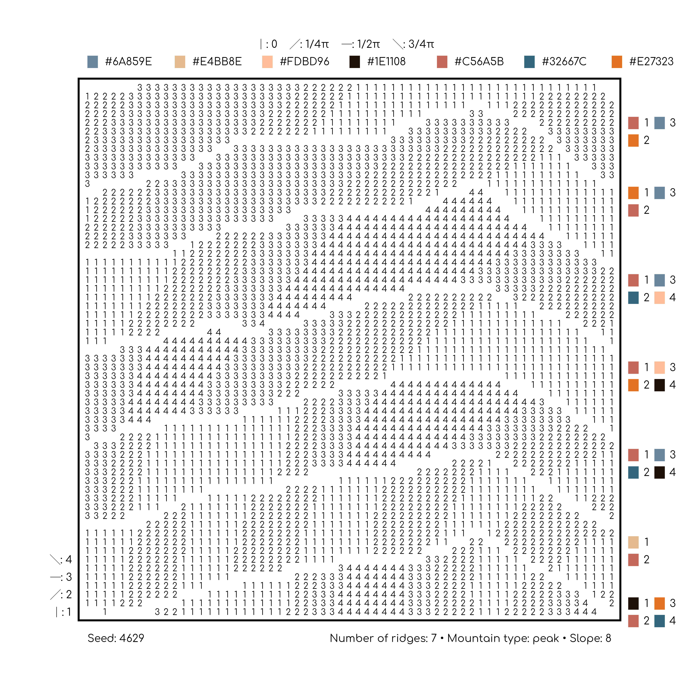



_Distilling Topographies_ is an exploration of technology and craftwork. This piece was inspired by mountainous landscapes and soil profiles and is composed of two parts. The first is a map—or a crosswalk, if you will—that reveals the inner workings of the generative art system. The system in this piece creates a data set that includes the placement, angles, and colors used. The second is the final piece: an interpretation of the map into a hand-stitched paper embroidery artwork.

When ideating, I took the prompt of “Our Environment” very literally but was simultaneously inspired by the temporary environments that exist within generative art systems. For generative art, you typically start with a programming language to code an autonomous system. This autonomous system combines a predetermined ruleset with the element of chance to generate a wide variety of outputs. The only input to the system is the seed, and the only output is the image. All of the intermediary work of creating the data for the image occurs within a temporary environment that disappears as soon as the image is returned. Thus, I wanted to explore how I could expose the intermediary steps—the temporary environment.

In this piece, my ruleset is displayed in the number of ridges, the type of mountain, the value of the slope, the input color palette, and the potential angle of the lines, alongside the data. I always start with a grid; using noise and randomness, I place numbers within the grid, and these numbers map to the various aesthetic details. In this case, the aesthetics are the angles and colors of the lines. However, my generative system had to work within the constraints of my ability to hand stitch. Instead of thinking of the paper embroidery construction as a limitation, however, it simply became another rule, determining the colors in the starting palette, the spacing of the data within the grid, and the angles of the lines. All of this came together to create the final piece, a 12x12 hand-stitched embroidery on acrylic paper.

**Bio:**

Ijeamaka Anyene Fumagalli is a healthcare data analyst and computational artist. Using code, mainly the R programming language, she creates data art and generative art systems. She loves all things grid-based, minimal, and geometric, which naturally led to her love for textile arts as well.

Figure 1:

<figure>
	
    Picture of the artist holding the hand-stitched paper embroidery piece against a wall. The piece is seven mountain ridges, with each individual mountain ridge being composed of embroidery thread stitched at various angles.
</figure>

Figure 2:

<figure>
	
    Picture of a map detailing how the final piece should be created. This map contains a grid of numbers where each number represents the embroidery thread color and the angle of the stitch. The map also contains additional details such as the number of ridges, mountain type, and slope, all of which were parameters for the generative art system.
</figure>

