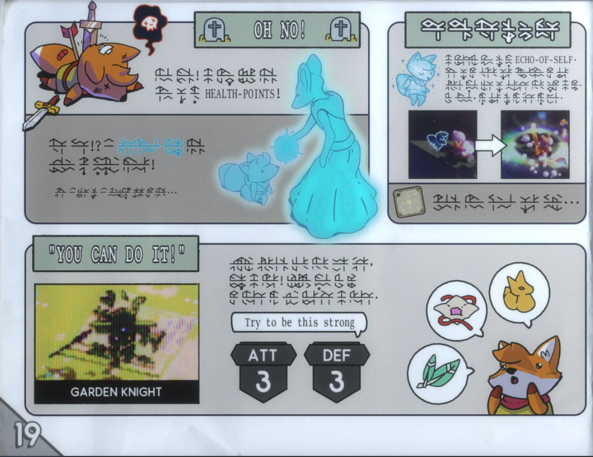
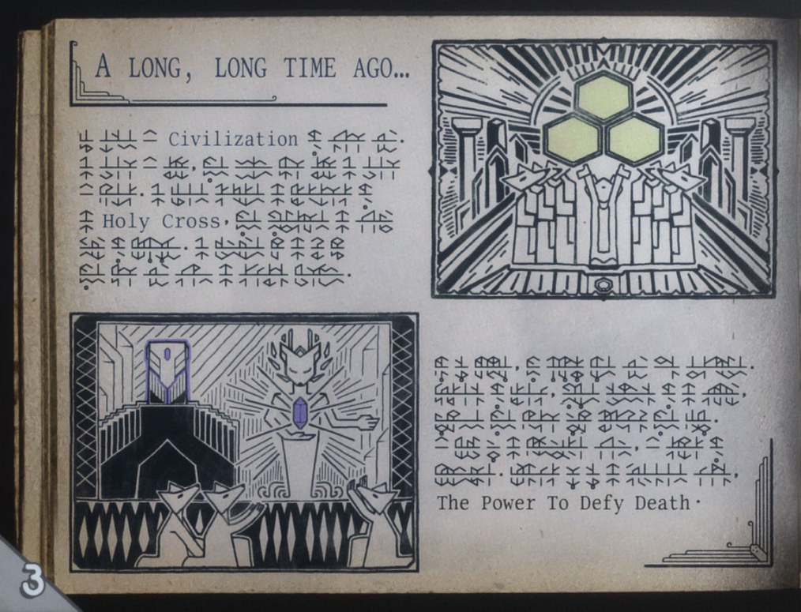



In Andrew Shouldice’s action-adventure game _Tunic_ (2022), I wake up as a bushy-tailed fox dazed on a beach and slowly make my way around a lush, isometric world drawn straight out of classic _Zelda_. No one tells me anything. When I get to an altar with a lit brazier, I’m given the option to rest. It’s a save point. I know this because I’m familiar with that game convention, and because when I’m soon killed by a paladin-esque teddy-bear-looking guard with glowing eyes, I wake up again at that altar—twenty coins poorer and with newfound respect for teddy bears. I slowly make my way around the world, unable to reach new areas until I learn enough (and gain enough upgrades) to make it past the increasingly dangerous, devastatingly adorable enemies. My favorite: an off-kilter two-legged crocodile that’s mostly just jaw running towards me with the _pat-pat-pat_ of an enormous bird while chomping aggressively, in a way that just might be friendly if it didn’t keep killing me off. But I don’t really know what any of this data means yet; I’m still just wandering.

As I explore, I gain pieces of a game manual written in an incomprehensible language. I can understand bits of it—translated pieces of English, pages of a map I recognize from my travels, lists of how-tos with enough images included to make an educated guess—but I’m often wrong. The game is a text full of lacunae, data shot through with holes that I don’t know whether or not I’ll fill by the end of my run. I study every detail I can see from each manual page I can access. Sometimes, there is a flash of insight as I realize that a previously overlooked detail has just become incredibly relevant to my current puzzle. Most of the time, though, I’m left frowning at one incomprehensible page after another, then going back out to roam the world again in the hope I’ll find another clue.

In an article in *Convergence*¹, I called this mechanic “archival adventuring”—the kind of gameplay in which “players assemble a story by piecing it together from the archival memorabilia left behind. [. . .] [These are] games composed of ludic repositories of material, carefully arranged, which the player turns into a narrative adventure by the way in which they choose to navigate the given space. When we conceive of these game worlds as archives, players become researchers and game worlds come into focus as highly organized spaces; the objects and texts one finds within them, no matter how random they seem, can be recognized as careful arrangements.”¹ An archive is also riven with holes; we see only the bits and pieces that have made it through the maelstrom of history and landed in this musty library basement. In a game, the holes in the archive are fake, designed by a team of creative professionals who make deliberate decisions about what bits of paraphernalia to create, what to make explicit, what to leave silent or implied. Almost all games rely on this mechanic for at least a little of their worldbuilding, and some, like the now-classic _Gone Home_, make it into the entire experience of play. You find it in digital games, where players are constantly tripping over a very convenient diary page left by a long-dead ghost (who may or may not now be haunting these very halls! And etc.). You also find it in site-specific theatrical games—intricately designed, architectured, and decorated stage sets in which a curious player could interpret a wealth of meaning into the intersection of several well-worn objects: a calendar stuck on a refrigerator, a pamphlet left in a desk drawer, and a phone number scribbled on a pad left on a bedroom night table, all of which might seem random until you, the player, realize the narrative implied by their combination. This is also a familiar mechanic in escape rooms, in which your team has an hour to find clues hidden within ordinary-looking decorations and furniture so that you can solve the puzzles to escape the locked room.

<figure>
	
    Screenshot of page 19 of the in-game Tunic manual. With permission from Finji and Andrew Shouldice.
</figure>

In other words, when you play games, you are often moving through game worlds to collect pieces of information, the meaning of which might (or might not) eventually be revealed to you. Well-designed gating in game worlds is an important part of what creates meaningful interactive storytelling. Sometimes the gate is literal, like a locked door for which you need to find the key; sometimes the gate appears in the form of an object or weapon you lack, or a boss you have to beat in order to access new areas. Or maybe you already have all the tools you need, but you don’t yet understand how to make use of what you have. In some rare instances, the gate can be entirely knowledge based, like in the mind-blowing _Outer Wilds_—a game in which an entire solar system, studded with deeply powerful existential mysteries, is made fully accessible to you from the beginning, were you only to know what to do with all the information available to you and how to contextualize what it is you see. The process of playing _Outer Wilds_ is one of intermittent flashes of glorious insight as a new piece of knowledge prompts the realization that a background bit of the landscape or some unremarkable phenomenon is suddenly the key piece of information you needed to make sense of one part of the story. This sort of sudden recontextualization occurs in plenty of games. In Tunic, I loved the moment I acquired a lasso-type object and could suddenly yank myself upward using any of the innocuous tuning forks dotting the landscape that I’d previously taken for set dressing. But rarely does a digital game open itself up to you so entirely from the start as _Outer Wilds_, making you dependent on nothing but your own (incomplete) understanding of the world and its history.

When people say games are “interactive,” they often mean it in the sense of “explicit” interactivity: the player can do something that affects the system. When you move a chess pawn, the game system shifts into a slightly different state. But players of a game are often doing the more subtle kind of interactivity of a storyteller as well, in that they are putting the pieces of a narrative into a shape and order that makes sense to them. They are making sense of an incoherent jumble of data, organizing it into a story in their minds. The player thereby becomes the author, the editor, and the director of the story the game is telling. Michael Kirby2 writes in Cinema Studies about “nonmatrixed representation,” the notion that the viewer doesn’t understand the meaning of a shot of a character (who is, say, crying) until the director’s edit juxtaposes that shot with others that endow it with narrative meaning (like the character’s lover riding off into the sunset a shot earlier). Given a different context with a preceding shot (maybe the character’s child getting married), the original shot of the character crying would read completely different. When the player is dropped into the game world, then, they become that director—connecting decontextualized chunks of information by wandering around a world and piecing together, in their own head, what it means and how it’s been ordered.

<figure>
	
    Screenshot of page 3 of the in-game Tunic manual. With permission from Finji and Andrew Shouldice.
</figure>

If you spend enough time wandering around a virtual space and gathering bits and pieces of a story, tying them together with your digital feet, a few things happen. For one, you feel a keen sense of belonging to a place you have so slowly and painstakingly learned about, step by step, insight by insight. It can even become the site of something profound and revelatory for you. In my new book _Wandering Games_, I talk about how big-budget open-world games can sometimes function like sites of pilgrimage, landscapes in which guilty, penitent player characters walk endless digital miles in search of redemption. The player also kills lots of enemies along the way, a phenomenon that I argue serves to hide, in plain sight, the spiritual experience of pilgrimage from a hypermasculinized player culture in which players have been conditioned to think that violence is all they want.

For another, the typically passive experience of wandering aimlessly is retroactively given a well-plotted meaning by virtue of a narrative conclusion that justifies everything we’ve done. We thought we were just roaming around, killing off chompy little crocodiles, accumulating coins—but now we see that all those wanderings have been in the service of a vast story arc we couldn’t even comprehend until we completed it. How satisfying, to learn we were not wandering in vain! How comforting! There are still holes in the data—we never learn how to read the language in the Tunic manual, for instance, or at least I didn’t have to in order to finish the game—but nevertheless you feel satisfied, because the game narrative makes a lot more sense in hindsight than regular life. Play enough of this kind of game and you’ll start to believe you can see a vast narrative arc in your own world, one that you’ll eventually discover if only you wander long enough.

**Bio:**

Melissa Kagen researches and teaches tabletop game design and critical game studies at Worcester Polytechnic Institute. She got her PhD from Stanford in 2016, and her first book, _Wandering Games_, came out in October 2022 from MIT Press, available here: https://direct.mit.edu/books/oa-monograph/5445/Wandering-Games. She likes biking, eating vegan food, and accumulating notebooks.
