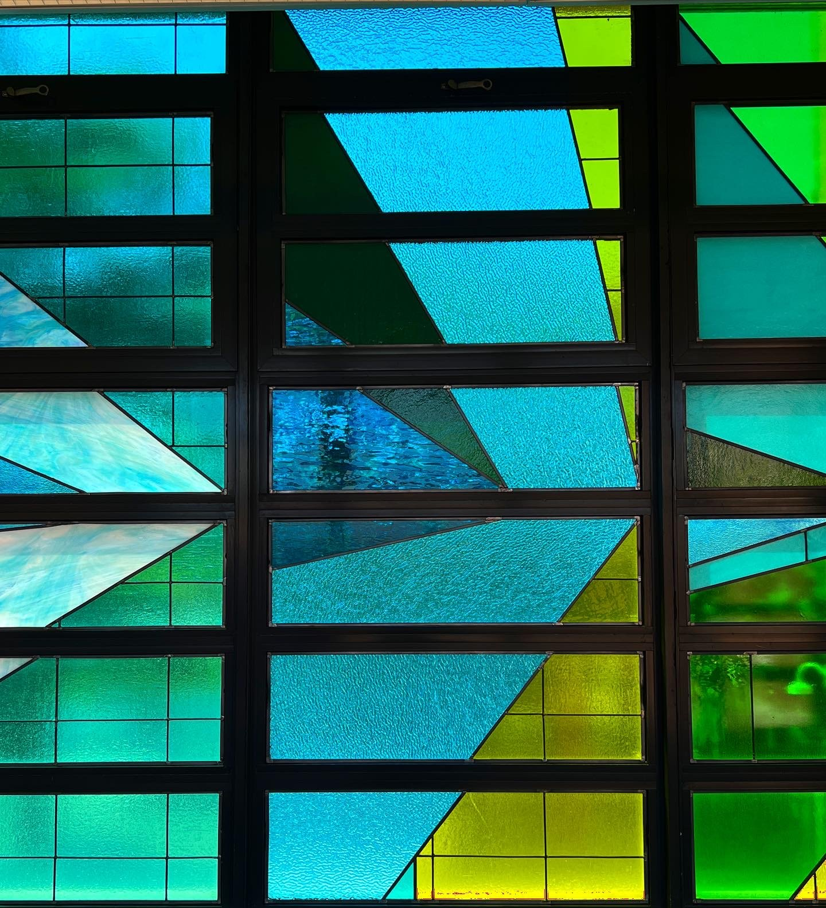



Ellie Balk has worked as a professional artist for over eighteen years. She currently lives in Brooklyn while working internationally. Her work in Visualizing Mathematics has been published nationally and internationally and has been adapted for use in elementary and high school mathematics curricula. Her public artwork can be experienced extensively throughout New York City and St. Louis, Missouri, nationally as well as internationally in Buenos Aires, Argentina; Mae Rim, Thailand; Senegal, West Africa; and Marrakech, Morocco. Ellie holds a bachelor’s of fine arts from Bowling Green State University in Ohio and a master’s of fine arts from the Pratt Institute.

<figure>
	
    Genre of Color, 2021. Spotify Headquarters, World Trade Center, New York. The artwork displays the relationships between people’s associations of colors with words or songs. When attempting to create a “chromatic definition of sound,” Balk developed a survey asking Spotifiers to match a set of words describing a range of emotion with both a color and a sound. The survey was distributed internally, with the data informing the result. Learn more: <a href="https://elliebalk.com/#/genre-of-color/">https://elliebalk.com/#/genre-of-color/</a>.
</figure>

##### Why were you drawn to create public (community or municipal) art in general, and specifically, what made you base your murals and installations on local data? Was it an idea that crystallized over time, or did a singular event precipitate your desire to move your art in this direction?

While I didn't take art classes in high school, I did have a deeply touching, pivotal experience with an art therapist when I was seventeen. After this encounter, I recognized how powerful art could be and how powerful it was for me personally. I eventually decided to enroll in an art therapy undergraduate program at Bowling Green State University. When I got there, I remember the textbook, it was pink paper with a duck on it and it was horrible, so I dropped the therapy part and focused on the art part.

I've always been an inquisitive person. I like looking at things really closely. I get yelled at all the time in museums, I wanted to rebel against that sentiment and make work that could be touched and interacted with. I had big ideas, and everything revolved around this idea of interactive art. Through my program, I got the opportunity to study in Italy for a year. Walking around I saw all these super famous paintings, but most of them were behind scaffolding, meticulously being restored. These works of restored art seemed to lack some authenticity to their history and I wondered what was worth holding onto. And that’s where I dove into taking art off the pedestal and making work that could be interactive. I started to experiment with painting, using anything I could find that wasn’t a brush! When I went back to Bowling Green, I found a truly awesome group of friends to make art with. We had this huge studio, and we would just paint without worrying about whether it meant something or not. Those were probably the best paintings I ever made, the most free I've ever felt. We would bounce around each other’s paintings if we got stuck on ours, and that’s where the collaboration aspect of my work started.
When I went to grad school, I continued in that same vein. For my thesis show, I threw a party. I had people clocking and going out so I could gather data on people as they came and went and create games. I made a lot of work where I (visually) coded so that you had to read it or so you could touch it, move it, or manipulate it in some way. I also did these big collaborative paintings where I invited all kinds of people, not just artists, to paint with me and then shared pieces of the finished work with them. I would control the color (so it wouldn't get muddy) and the brushes, but the only other parameter was not to include any recognizable symbols or words. The resultant collective imagery really spoke to me and inspired my work moving forward.
My first independent public art piece was You are here (2008). It’s an eleven-foot circular map painted on the corner of Vanderbilt and DeKalb Ave: the exact center, east and west and north and south, of where the neighborhoods of Clinton Hill and Ft. Greene meet (in Brooklyn, NY). At the time, there was this wave of gentrification coming through my neighborhood, Clinton Hill. A flea market that started at the church around the corner became famous in the area and drew all these new people to our neighborhood. It was a strange time: I saw my neighbors moving on and all these new people moving in. This phenomenon made me want to create a piece that celebrated home. So, I created a map, but I took out any street names and instead color coded it. Some people saw it as a patchwork of color, but for the people who had lived in the neighborhood a long time, they instantly recognized it as a map of their home. Next, I invited people to come put a dot on the map where they lived, but I still didn't put the street names so that they were fully reliant on people that knew the neighborhood to tell them where they were so they could add their dots. It was so interesting and gave me the chills, because somehow, just by putting a dot where you live, it broke down all these barriers and people started talking to each other: “Oh, my aunt lives over there” or “How long have you been there?” And for me, it helped me create my very first data set! It got me thinking about where people had come from to get to this spot and how the size of our community is somewhat defined by how far we travel to get to where we want to go.

<figure>
	
    Where We Are Home, 2022. Stained glass installation. Queens, New York. The countries where the students and parents were born are color coded based on the most frequently picked color selection from the question “What color do you think of when you think of Home?” The visualization is made on an x- and y-axis. The x-axis crosses all windows horizontally, breaking up the parent data at the top and the student data at the bottom. The countries are ordered by their distance from New York and are evenly spaced on the x-axis. Their placement makes the point of the triangle. The y-axis runs vertically for each column and shows the number of people from each country. The more people from a country, the larger the angle from the point on the x-axis. Behind the triangles are solid colors that represent the aggregated percentages of the seven regions representing where the students and parents were born (taking out the number of students born in the United States of America). Learn more at <a href="https://elliebalk.com/#/where-we-are-home/">https://elliebalk.com/#/where-we-are-home/</a>.

</figure>

##### It’s interesting that you say that your foray into art was through art therapy, because it feels like you’ve come full circle in some ways. Through your process of collecting data and visualizing it, you give voice to the people in a community; you make them feel seen and heard. What sort of feedback have you received from the people who've participated in your process?

I remember one time, I was starting a new project in a classroom and I had shown a slide of one of my collaborative community murals. This one girl said, “Oh, I did that!” I think that once somebody paints a wall, it becomes theirs, in a sense. Once somebody is involved in a project like this, they have ownership of it. I've seen the power that that has and the way that people can connect through this experience. For example, all the math-based work that we've been doing with high school students—it’s not so much about the math concepts. That’s pretty simple. We teach geometric transformations, we teach patterning with numbers, but what we're really making space for is an opportunity to gain confidence in mathematics. That's it—and making friends! Now these students feel a sense of connection to their work, to their peers, and they feel more compelled to show up to class, and if they show up to class, they have a much higher chance of passing the regents and ultimately graduating. I was not a good student in school myself, and it has been profoundly moving to see the difference these projects have made with regard to student engagement. That is my motivation for working with students, particularly the ones who are struggling like I once was.

<figure>
	
    Picture of the artist holding the hand-stitched paper embroidery piece against a wall. The piece is seven mountain ridges, with each individual mountain ridge being composed of embroidery thread stitched at various angles.
</figure>

##### I would love to dig a little deeper into your process here. How do you begin a project? How do you map out the story you would like to tell with your data to a physical space? In the specific instance of the mural at the Spotify headquarters, what made you decide to use both the ceiling and the walls?

I think it's a little different for every project. For me, it’s easier if I don't already have a preconceived idea of what it's going to look like. I am first and foremost inspired by all the limitations of the space (where the work will live), then I move into the data collection phase. One of my favorite—and one of the hardest—parts of the process is moving it from the spreadsheet to a visual format. I use pen and paper, Illustrator, and Procreate to sketch out my ideas. It can take a long time to create the system and then equate everything mathematically just for one idea. I often reach out to my best friend, who is a spreadsheet whiz, for help at this stage, and she helps me see the data laid out in different ways.
The Spotify mural (Genre of Color, 2021, Figure 1), for example, was really challenging because of the space. There were all these elevator banks that broke up the wall space and made it difficult to tell a data story. So, even though I never wanted to paint another ceiling mural, that was where I realized the mural needed to go, as the ceiling had the most uninterrupted space. Afterwards, I came up with the idea that the x-axis could go right down the middle, and I could show two different sets of data coming off of that one idea. In the end, it all came together really seamlessly! I was excited about working with more qualitative data as well; it was based on people's association of different colors with words and sounds. It was a magical project—I even got to work with the person who writes the algorithms for your weekly radar in Discover Weekly, which I listen to obsessively!
One of my most challenging projects was a large stained glass piece I completed recently using survey data (Where We Are Home, 2022). All the students at a school in Elmhurst, Queens, a big immigrant neighborhood, were asked where they were born, where their parents were born, where is home for them, and what color most reminds them of home. The little ones at the school were included as well, so I don’t know how accurate the data are, but that only makes the piece even more interesting to me! I got back nearly five hundred completed surveys. The design aspect for this piece was challenging in that all the windows that would house the stained glass pieces were different sizes, so it was difficult to fit a standard unit of measurement. Additionally, I didn't want it to look so uniform over such a large space. I realized that I could set the data up in columns based on the distance of these places from New York1, but when I looked at this layout, I realized these long diagonals wouldn't work with the foil stained glass technique that I knew—they would just rip apart. I had to learn how to do lead caning to bring my vision to life, which is a whole other process. From data collection to installation of this 180-square-foot glass piece was only three months, which was both crazy and awesome! I needed a lot of help and was so grateful for all the people I met in the process. Sometimes, that's the most magical and unexpected outcome of a project.

<figure>
	
    Picture of the artist holding the hand-stitched paper embroidery piece against a wall. The piece is seven mountain ridges, with each individual mountain ridge being composed of embroidery thread stitched at various angles.
</figure>

##### You have worked with wood, glass, and clay most recently! What medium/project have you most enjoyed working with or on in the recent past, and what are you most interested in exploring in the near future?

This past year has been really exciting, because everything has been a new challenge! For my most recent project (The Place Where the Sun Sets, 2022), which was an artist residency in Morocco, I thought I would just paint. I initially didn’t want to suggest anything too ambitious, too difficult. And yet, when I got there, I was still thinking about a proposal I had recently written about constructing a sundial, and I started talking to the guy who runs the residency. We really got into a deep-dive discussion about time. I was fresh off the plane, totally jet-lagged, and when I went outside I remember it was noon and it was so bright. My shadow was really tiny, and as I looked at my watch, that’s when it hit me: “I gotta make a sundial!” So, I started studying how the Earth moves and running tests fifteen hours a day. At the residency, there is a full-time ceramicist and a huge kiln, so it soon became clear that I had to work in clay. I had never worked with clay before, but I ended up creating a clay sundial over five meters in diameter! I was lucky to have so much support and help. It’s designed such that the shadow cast by the gnomon (the middle piece) at noon during the summer and winter solstice and spring and fall equinox will line up with the color-coded design in the central part of the sundial. It’s made to work in Marrakech, of course, but also in Brooklyn (where I’m from) and in Verbier, Switzerland (a favorite place of the couple who runs the residency). I'm really proud of myself for building this! And I think it's almost funny in a way—“Okay, I've never done something like this before, so let’s go big!” I've also really been enjoying working with stained glass. In fact, I just finished a proposal for a giant stained glass sundial where every piece is made out of glass, because I love this idea of transformation and watching how the colors gradually overlap and change. I’m looking through a stained glass window right now and it looks so different depending on what is behind it and how the light is filtering through it. I really want to play with that idea!
I just finished a painting out in Tennessee, and I was telling my friend helping me that I hadn’t painted a formal mural project in so long but it was nice to get back to it. It’s second nature to me. At the end of the day, I'm a maker at heart. I'm not a mathematician; I'm not a data scientist. I'm not any of these things except a maker. That’s the part that comes naturally to me.

**Interviewer Bio:**

Sujata Bhattacharyya is a researcher, formerly in the field of developmental biology, for whom drawing has been an enjoyable hobby as well as an indispensable tool for observation, learning, thinking, and communication throughout her years in academia. More recently, she has been exploring impactful ways in which drawing out thoughts and ideas can aid in synthesizing information, surfacing novel insights, and exposing knowledge gaps, thereby enabling more effective problem-solving. She is currently fully invested in participating in processes and communities (like this one!) that encourage multidisciplinary and intersectional thinking as a means to grapple with the increasing complexity of the world in which we live and co-create.

References / Side Column Text:

1. On Ellie’s website ([elliebalk.com](https://elliebalk.com)), she notes that she found inspiration for her design for this piece in a manuscript timeline for Olaf Stapledon’s classic 1930 science fiction novel Last and First: A Story of the Near and Far Future.
