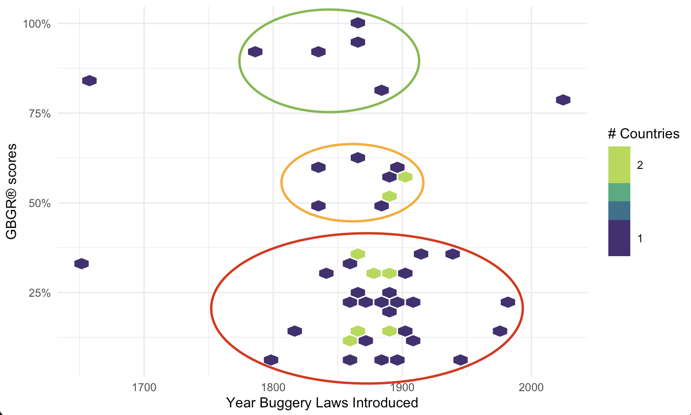



Like in the US, British colonialism has cast a long shadow of colonial violence on queerness across the world. As someone interested in the comparative rights of queer people globally, considering this historical context made me wonder about the relationship between LGBTQ+ rights today and the legacy of British colonialism.
Before going deeper, I want to first acknowledge that colonization started by destroying indigenous cultures, and colonization should end with uplifting them. As a descendant of colonizers, I feel it is important for me to be in service to indigenous leaders—to try and repair what is broken. The future of queer liberation should be centered on indigenous queer movements across the globe.
In 2009, when Uganda (a member of the British Commonwealth) introduced a bill that prohibited any form of gay sex and the “promotion of sexual relations,” the global outcry was swift. UK Prime Minister at the time David Cameron stated that all countries that received aid from the UK must “adhere to human rights,” suggesting that there would be some impact on future aid as a result of Uganda’s decision.
While I am not discounting Uganda’s state-sanctioned homophobia, the stark judgment coming from past colonial powers that originated these laws is laughable, given their histories of direct and indirect power over their laws and practices. I want to push back against the narrative of the supposed “moral inferiority” of these countries by using data to emphasize the historical root cause: European colonialism and the British penal code.

<figure>
	
</figure>

## Beginning to Build a Dataset

To understand the history of global homophobia and transphobia, I searched for a measure of queer rights by country as well as a measure to approximate the influence of colonialism today.
I researched the history of buggery laws—laws against sexual acts determined to be “unnatural or immoral”—and the use of the British penal code. I then built a dataset of when those laws were introduced for each of the fifty-five British Commonwealth countries and added the dates that those Commonwealth countries were formally colonized.

I started with a dataset from the Franklin & Marshall Global Barometer of Gay Rights (GBGR®) and Global Barometer of Transgender Rights (GBTR™). Franklin and Marshall used twenty-seven factors for their GBGR and fifteen factors for their GBTR to determine a country’s gay or a trans score, ranging from 0 to 1. Some of these factors include protection under law, civil protection, LGBT rights advocacy, socioeconomic rights, and societal persecution. In addition, I searched through research papers, Encyclopedia Britannica, International Lesbian and Gay Association (ILGA) State-Sanctioned Homophobia reports, and sometimes Wikipedia as a last resort when I couldn’t find the information anywhere else.

## Understanding the Data Warrants an Iterative Approach

Initially, I used the “year of independence” as a measure of time away from British influence. This information was easy to find, as countries have holidays surrounding these dates, but as I thought about it more, I realized the independence year alone cannot address the history of the laws targeting queer people. So, I switched gears. I chose instead to research the dates of penal code introductions as well as the original dates of official colonization to better capture countries’ histories.

Finding the date of official colonization was a messy business, as each country has a different past. For example, countries like Kenya and India were colonized by companies first, not official governments, and thus I had to decide what “formal” colonization looks like. I decided to choose the dates when the colonial power set up some sort of official government within those countries. Aside from that, some countries have colonial histories wherein they switched from power to power. This was the case of South Africa, for instance, which oscillated between British and Dutch colonialism. In this situation, I generally chose the oldest established colonial government. Lastly, I also let the date of penal code introductions guide the date of colonization, as an official government ratification was usually followed by a penal code introduction.

## Initial Data Exploration Leads to More Questions

I created some initial plots with ggplot2 in R (Figure 1) to explore the relationship between the dates that buggery laws were introduced and the dates of colonization. My initial hypothesis was not necessarily supported by preliminary data, but in visualizing the data I noticed other trends.

For example, a scatterplot of GBGR® scores shows three groupings: low-, medium-, and high-scoring countries. While I had initially only considered the relationship between gay rights and the amount of time since colonization, these clusters can guide further questions and research. What are the histories that distinguish these groups, and what might they tell us about impacts today? How do trans rights and gay rights differ among these countries? How might those rights be influenced in the future with increased trans visibility? What about other colonial powers? This dataset could also grow to include countries colonized by other European countries. How are their legacies of colonialism similar, and how are they different? There is clearly far more work to do in this space. The dataset is shared on Github¹, and I invite others to bring their own approaches and questions to the matter. Acknowledgment to AT Craig for the initial idea that started this project.

**Bio:**

EB Dickinson is a Policy and Advocacy AmeriCorps VISTA Service Member with the Illinois Safe Schools Alliance. She holds a bachelor’s of science in ecology with minors in studio art and music from the University of Georgia. She is interested in the intersection between data viz, mapping, and LGBTQ+ rights around the world. In her free time, she enjoys playing bass and hopes to one day produce a funk album about muskoxen. She can be reached at ebaydickinson@gmail.com.

In side Margin / References

1. DSxD Vol II Book. Github. Accessed February 1, 2023. [https://github.com/ebaydickinson/Our-History-Global-Queer-Rights-Through-a-Historical-Colonial-Lens](https://github.com/ebaydickinson/Our-History-Global-Queer-Rights-Through-a-Historical-Colonial-Lens).
