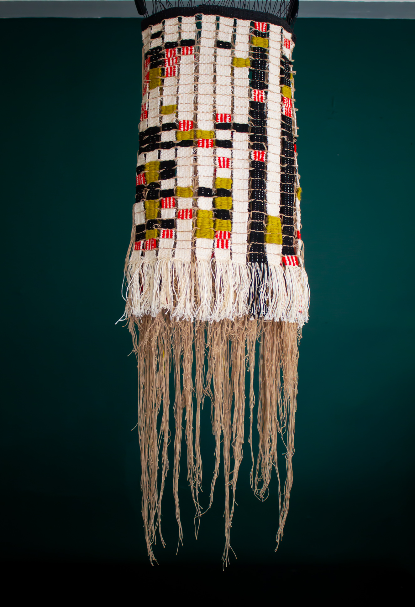
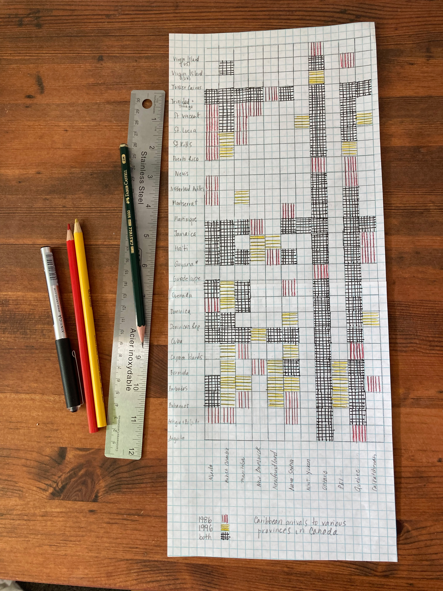



Orbiting data entered my practice as an artist when I began to consider how weavings, similar to coding, could become an embedded language for talking about my cultural identity and ancestral migrational journey. While I was living abroad, I continued to think about the idea of the Black global diaspora. Each new country—Belgium, Germany, and Thailand—placed me in a new categorization. Depending on my geographical location and social environment, I was “Étrangère,” “Buitenlander,” “Ausländer,” or “Farang.” Sometimes, the groupings were merely ways of statistically classifying my place of birth to push paperwork along within a bureaucratic system. Other times, it felt as if a hostile identification process was imposed on my body to render unwelcoming sentiments while I attempted to navigate new and unfamiliar territories for both education and work.

Wherever I resided, I listened. Through my observations and extended conversations with others while occupying varying spectrums of space on the same soil, I witnessed and became aware of countless stories of migratory passages. In each place, I questioned: _How do I locate myself in these places of unfamiliarity? What does it mean to be born in a land where you have no ancestral lineage? Why do people leave the only place they’ve ever known for something new? I also began to ask, What in our stories is shared? What is foreign? And how much of this is (un)known to ourselves?_

When I returned to Canada, my questions remained. I began to re-examine my extended family’s migration overseas from Haiti to Canada, and this inquiry eventually expanded to include an entire Caribbean population in close proximity to my parents' ancestral land, Haiti. I wondered, _How many Caribbeans came to Canada over time? What kind of boxes did they have to check off on their applications?_ The task, I thought, would be simple enough: find the migration data, sift through it, then figure out how I could use it to tell their migration story. Inspired by W. E. B. Du Bois’s Visualizing Black America,¹ I wanted to use textiles to create a woven historical record of Black Caribbean existence in Canada. My aim was to uncover archival ledgers and numerical data that would unveil truths about the lives that Caribbean migrants lived, starting from their arrival in Canadian cities. Records pertaining to education, finances, employment, and numerical movements were large themes in the work I initially wanted to explore. In my attempt to weave stories, however, I found many problems looped in the process.

<figure>
	
    Paper and pencil sketch mapping Caribbean arrivals (rows) to different Canadian provinces (columns) with each color representing a specific time period. 
</figure>

On its own, data is informative, but it can also be limited. From my point of view, the records I observed seemed to be permeated with bias. The institutional barriers to accessing the data, combined with the absences and reductions the data itself contained, created enormous challenges during this initial research process. Fortunately, this situation allowed for me and my collaborator, data scientist Tim Schoof, to formulate new ways of thinking about the methodology and praxis guiding this project.

The limitations I observed during the data collection process are conceptually related to materiality³. A lack of information can be defined as either invisibility or opacity—both terms that refer to that which is hidden, blocking what I am able to see. How does the insufficiency in data, then, obscure access to knowledge ?

This unintelligible layer in my research obfuscates understanding. Visually, this can be imagined as sunlight not being able to pass through a window due to drawn blinds. We know that there is something else behind those blinds, but we’re unable to see what it is. In my analysis, this hidden layer manifested not as an inability to find data on a specific country (e.g., Haiti or Jamaica), but instead only being able to access findings on a grouping of countries (e.g., “West Indies”). I thought, I know that Jamaica is within this defined parameter, but I just can’t pinpoint it specifically.

So, I began to ask different questions: How can I understand a migration crossing of a few if those few are grouped as many? How can I track transient patterns when singular countries are not identifiable? The lack of specificity in revealing individual presence through mass grouping and misannotations created a lack of visibility, both for me as a researcher and for migrants and their stories. I began to realize some of the data I was collecting did not acknowledge certain people (or countries) as existing at all, rendering them unaccounted for in statistical records.

This absence of specific information in data canvasses posed a problem for my project. If the data that would otherwise quilt together the different temporalities that exist in relation to place and time were not there, how would I be able to tell a cohesive story? For example, it became challenging to trace “employment” categorically, as numerical figures increased, but the given labels for sectors seemed to change at random. In a span of five years, I saw an occupational label change from “domestic worker” to “servant,” “child caregiver,” “personal services,” and finally back again to “domestic worker” in the following years. To add to the confusion, the overarching category was titled “intended occupations,” leaving doubts about the actual tasks these workers performed. This made me wonder if this system of classification and the primacy of these ledgers were able to hold the many variations of truths that might exist.

The confusion emerging from these data sets diminished my confidence in finding future relationships that would align all these shifting details. Only after some time passed did I begin to realize that this lack of data was equally, if not more, important than the data being presented.

At some point during the process, I was reminded of a quote from Toni Morrison—that there is “truth in myth.” Dealing with realms of both the folkloric and supernatural world, I often reflect on how these tales have shaped so much of how we have come to understand the world around us. Fiction has a function; it is an abstraction that simplifies complex social information into digestible, cohesive stories that let us understand the world and, by extension, our place within it. The “Big Bad Wolf,” for instance, fictional in character, still manages to warn us of the real existence of evil through the imaginary beast portrayed.

<figure>
	
    The paper and pencil grid come to life as a hanging textile. Artist Stina Baudin created this work in collaboration with data scientists Matt Broerman and Tim Schoof.
</figure>

Myth is often defined as “an ancient story explaining the early history of a group of people or about natural events and facts.” If storytellers shape how we see the world, what happens when their chronicles don’t value specific people's truths? How do we end up perceiving those stories ultimately as the truth? And when do fiction and myth become reality?

I began to wonder about the data I encountered in records. Whose truth is this? Who collected it? Who defined its authenticity, with all its missing pieces?

Since my youth, I have heard and collected firsthand stories of migration that gave way to a much deeper knowledge not found in these ledgers. Are these stories not also truths? What if the data had been skewed in the service of a myth and only showed one side of the story? What would happen if the truth was found in the multiplicity of collection methods beyond the existing archived records? How could I expand and display the hidden layers of the story itself?

Somehow, this complexity of not knowing and indeed not being able to know became a driving force in questioning why I continued to look to institutional data for this information. There are things I know I will never be able to find in these records, and yet for the longest time, I was preoccupied with looking for these missing categories within. These missing categories registered to me as disruptions, holes, and gaps. Eventually, I began to see how these absences are part of the pattern—that just as silence functions in music, these disruptions are what add a greater level of complexity and richness to the patterns I am trying to create.

Since this revelation, my methodology has changed. I still want to situate those hidden stories in time and in the work, but instead of searching through statistical records for the answers, I have begun looking inward and toward members of these communities to learn locally. There is a wealth of power in the individual story. This project is allowing me to listen to and collect untold stories under a wholly new methodology—a methodology that is expansive and open to the full range of possibilities for weaving an otherwise unknown version of these untold stories.

I now have new spinning thoughts that sprung from a statement spoken by Angela Davis overheard during the Racial Justice Summit² panel this year. Angela Davis spoke of how she could recall a time when she owned every single book that had ever been written on Black women in America. Of course, today, the Black female archive spills over. The lesson in the making is, as Davis states, “Not having information should never be seen as a barrier.”

**Bio:**

Stina Baudin is an emerging Canadian-Haitian interdisciplinary artist presently residing in
Tiohtià:ke / Montreal, Canada. She has received multiple recognized grants and residencies both nationally and internationally including Banff Center for the Arts and Creativity, Pocoapoco in Mexico, and Wildseed Center for Art & Activism, a project birthed by Black Lives Matter activists who hope to build an enduring space that could cultivate the most transformative and radical ideas. She explores and researches aspects of architecture, Black geographies, and mythology as a way of investigating and weaving ancestral relationships between fiber and form. As a data enthusiast, her more recent research is exploring Caribbean migrations using both found and newly created data to tell woven stories. www.stinabaudin.com or @ssteenaa

References:

1.  The W.E.B. Du Bois Center at the University of Massachusetts Amherst. W. E. B. Du Bois’s Data Portraits: Visualizing Black America. (Princeton Architectural Press, 2018).
2.  2022 speakers. YWCA Madison [https://www.ywcamadison.org/what-were-doing/race-gender-equity/racial-justice-summit/2022-speakers/](https://www.ywcamadison.org/what-were-doing/race-gender-equity/racial-justice-summit/2022-speakers/) (2021).
3.          Glissant, Edouard. 1990. Poetics of relations: For Opacity
