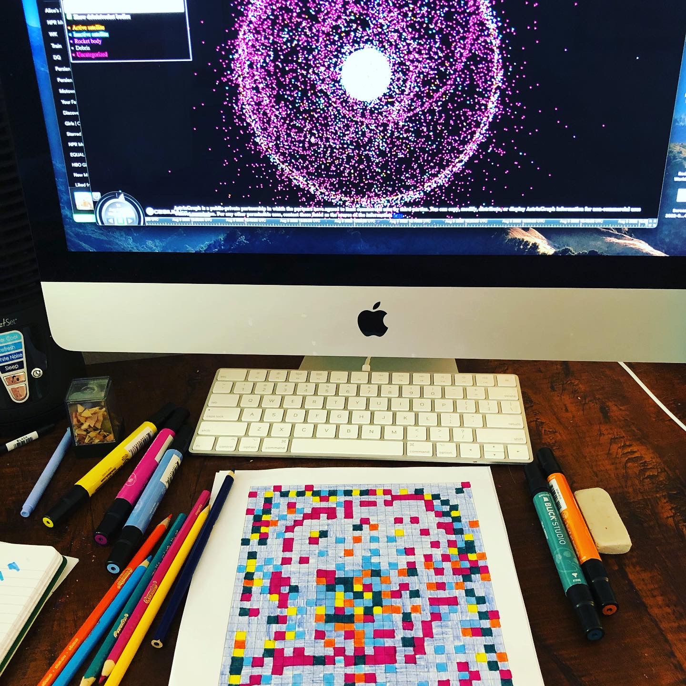



In her explorations of data physicalization on fabric, artist India Johnson asks the question: What happens if we can both see and touch data?¹ This is a question that has guided my own work with data quilts. As a professor and researcher of both sustainable design and information design, I often find myself wading through graphs, charts, and various representations of environmental data. These are typically computer- or paper-based projects that offer up a sleek, tidy, and efficient way of thinking about environmental issues. These kinds of data visualizations are an important part of understanding the climate crisis and making scientific research more accessible to a broader audience; however, they often lack an emotional dimension. The climate crisis is something we feel and experience (some more than others) every day, and yet emotive elements don’t feel palpable in most computational data visualizations. So, can we engage with climate data in a different way? If we could touch data, how might it tug at our emotions? To explore these questions, I connected environmental data to quilting, a passion of mine that I have always found to be a deeply emotional and very human form of expression. In writing about data humanism, Georgia Lupi expresses this idea, suggesting that “we are ready to question the impersonality of a merely technical approach to data and to begin designing ways to connect numbers to what they really stand for: knowledge, behaviors, people.”²

What can fabric do with data that other mediums (digital or print) cannot? How do people relate to and understand quilts and fabric more broadly? Obvious things, such as form and scale, are important, but there are also significant underlying assumptions around what is considered to be science or art, the gendered spheres of professional vs. domestic output, and the very notion of interaction itself, all of which are at the heart of how we respond to these kinds of representations. A quilt exists between and across different dimensions and has the capacity to break binary conceptions altogether. Fabric itself is a kind of technology, and quilting relies on specialized machines, labor practices, and histories. At the same time, a quilt can be much more than a data visualization. Quilts carry with them memories and traditions, often passed down through the years within a family or among friends. A quilt can be a piece of art to hang on a wall or, more functionally, something to wrap up in to keep warm.

A number of recent projects utilize fabric, thread, yarn, and other textiles to create tangible data visualizations. For example, the Runaway Quilt Project, an exploration of quilting during slavery, preserves data in the form of a quilt;³ a climate change data scarf vividly shows increasing temperatures throughout the length of the scarf;⁴ in the Bellum Civile quilt, the artist pulled all the color references in the epic poem to inform the design of a data quilt;⁵ and there is an infinity scarf based on the data of worldwide maternal deaths.⁶ These are just a few recent projects, among many others, that play with new forms of physical data visualization. These techniques—sewing, quilting, knitting, embroidery, and other textiles arts—are complex crafts that have been with us throughout history, and the use of these techniques to represent data collectively points to a need to reconsider contemporary data visualization, its limits, and its purpose.

<figure>
	
    Translating a data set, which has been collected and visualized online by AstriaGraph, into the form of a quilt pattern.
</figure>

##### The Slow Interpretation of Space Junk

The quilt highlighted here utilizes data from NASA⁷ that tracks over twenty-five thousand pieces of space junk (larger than 10 cm) circulating around our planet. Space junk strikes me as the ultimate representation of just how much humans have trashed the universe, yet it’s not something we can see or touch. We don’t really “experience” space junk; it’s just out there, circulating around us. I am interested in the seemingly abstract nature of space junk and what it might mean to bring this data into a tangible, vivid form. This quilt color-codes the various pieces of junk as follows: active satellite = yellow; inactive satellite = green; rocket body = purple; debris = light blue; uncategorized = orange. The dark blue is the sky. These different objects are proportionally represented by the number of individual pieces in the quilt, and the placement within the quilt corresponds to where these pieces exist in space (e.g., some are closer to the center/Earth). The specific fabrics used were chosen to represent a range of styles from the past sixty years of the American Space Program, the largest producer of space junk. The quilting consists of a pattern of stitching that extends from the center toward the edges, representing the ever-expanding universe.

Upon encountering the quilt, it is not immediately evident that it is a data visualization. This ambiguity is intentional. Lupi writes that unconventional data visualizations can “promote slowness—a particularly poignant goal to set in our era of ever-shortening attention spans. If we can create visuals that encourage careful reading and personal engagement, people will find more and more real value in data and what it represents.”¹ The question of speed is critical in how we approach a data quilt. Most traditional data visualizations are fast and efficient, created to condense information and make it quickly accessible, while a data quilt functions at a fundamentally different level. Although there can be some intuitive understanding of this quilt at first glance, a detailed understanding would require reading or talking about the piece, which adds a layer of time and effort on top of what is already a complex interpretive interaction.

Tim Schoof highlights the need for slow data science, which “may be particularly well suited to help us reflect on everyday events that happen all around us.”⁶ If we think of a data quilt as a kind of slow data science, this upends the nature of what we might think data science is even for, or what it can offer as a way of knowing the world. I am intrigued by the possibility of data becoming something that isn’t readily clear, concise, or singular in its meaning, because this opens possibilities for data visualization to become a more interpretive art form. A quilt, and textile art more broadly, is something that already exists and is readily understood across all cultures. If we bring environmental data into this form, we are also complicating the role a quilt plays and what kinds of information it can carry.

Data is often conceived of as a perfect kind of truth, but it has always been imperfect. A quilt embraces and amplifies this notion of imperfection. The quilt contains mistakes and misalignments, stitches that are too long or too short; the space junk, in both number and placement, is only an approximation. Precision isn’t necessary in this context because it doesn’t matter exactly where or how many pieces of trash are circulating around the planet. For those working on the International Space Station, of course, precision matters. The station needs to move about once per year, in fact, to avoid being hit by a piece of space junk. But for those of us who simply want to think about our environmental impact, putting the data into a quilt changes not only the way we interact with it, but also the kinds of interpretations that are even possible. It’s not only textile visualizations that are playing with this idea, either. Many computer-based and hand-drawn projects also blur the line between science and art and use data as a way of encouraging interpretation, though more tangible, soft, and even wearable pieces give us access to data in a different way than those that are purely visual.

<figure>
	
    Sewing the one-inch square pieces together to make the quilt top.
</figure>

##### Embodiment and the Externalization of Data

A new lexicon for how we might describe a data quilt has emerged in tandem with this kind of work. Concepts that have been proposed include: externalization of design, data visceralization, data physicalization, data materialization, and embodied data. These concepts, which are not necessarily synonymous, have come to represent a range of data visualization that typically takes place off-screen and exist in more tangible contexts, such as clothing, embroidery, knitted scarves, quilts, and other kinds of textile art.

Alan Dix and Layda Gongora, in their exploration of design and externalization, suggest that designers have always used different modes of externalization to think through concepts. Things such as blueprints, sketches, and prototypes have consistently helped us to offload ideas and imagine multiple approaches to a particular design concept. They write, “Being human means interacting with the impingements and resistances of the outside world from stones to people to computers.”⁸ As a designer, this resonates with me; however, as quilter, I have never made a quilt as an “object to think with,” but rather as an object that carries with it many things. For me, this might include memories, beauty, comfort, or a connection to my mom, not to mention the very practical value of keeping warm. Is a data quilt fundamentally different from any other kind of quilt? This question doesn’t have a clear answer; however, the material form takes on a new meaning because it is connected to a set of data that would otherwise not be seen in this kind of representation. Will we look at space junk differently if we see it reflected in a quilt? Will we understand the environmental implications differently if we wrap ourselves in it? My hope is that this piece catches viewers’ attention in a way that is different, though no more or less important, than the typical computer-based climate data visualizations that we are surrounded by every day.

Most data visualizations prioritize the visual. Quilts, too, are very visual, but they are also inherently meant to be touched. Luke Stark defines data visceralizations as “representations of information that don’t rely solely and primarily on sight or sound, but on multiple senses including touch, smell, and even taste, working together to stimulate our feelings as well as our thoughts.” Stark adds, “Interfaces that make data sets viscerally engaging could result in a more holistic process of individual decision-making, grounded in both our thoughts and our feelings. While visceral design in material products is often intended to produce feelings or desires that overcome our reasoned second thoughts, visceral data has the potential to level out our reactions the opposite way: as well as appreciating a problem or issue rationally, users prompted to engage viscerally will have a well-rounded sense of their own intellectual, emotional, and physical stance on the matter at hand.”⁹

<figure>
	
    After the top of the quilt has been pieced, it needs to be pinned to the batting and back fabric, and a multicolored thread is chosen for quilting the pattern. 
</figure>

##### Art (not vs.) and Science

In her essay “‘Danger, Jane Roe!’ Material Data Visualization as Feminist Praxis,” Kim Brilliante Knight writes, “An artistic data visualization, in its refusal of understanding, calls into question the very notion of an objective and efficient transmission of information. [ . . . ] It aspires toward [Andrés Ramirez] Gaviria’s suggestion that artistic data visualization does not employ clarity or transmissibility as a mode but rather provokes a visceral or emotive response from the viewer, foregrounding subjectivity in contrast to the aims of science.”¹0 Data visualization, as it is used in scientific contexts, generally helps to clarify an issue or condense a large amount of information into something more easily understood. The climate crisis is a scientific issue, one that computational models have helped us to define and understand more deeply. Even so, climate art and climate science are not necessarily at odds with one another. Part of the aim of my work is to break down that opposition and bring science and art into conversation with one another.

Textile arts have a longstanding connection to science, and specifically to the history of computing. Binary code was invented to automate weaving during the Industrial Revolution, and this not only made the process of creating patterned cloth more efficient, but it also gave us a wider range of patterns that have continued to grow in the age of computing.¹¹ The Jacquard Loom is an early computing object—using the very same punch cards that informed early computers—to create patterns (effectively, algorithms) in a range of woven styles.¹² Johnson notes, “Core memory, the first viable and widely adopted re-writeable computer memory, was a conducive fabric, which coded ones and zeros in magnetic beads as positive or negative charges. Core memory was woven by hand, and its fabrication resembled a combination of bead looming and pin loom weaving.”¹

Interestingly, in relation to my own project, there are profound connections between fabric and space exploration. Apollo spacesuits, for example, were incredibly technical objects handmade by highly precise seamstresses. Even a tiny stitching error would mean the difference between life and death. Andrew Chaikin writes, “Cocooned within twenty-one layers of synthetics, neoprene, rubber and metalized polyester films, Armstrong was protected from the airless Moon’s extremes of heat and cold, deadly solar ultraviolet radiation and even the potential hazard of micrometeorites hurtling through the void at ten miles per second.”¹³ Spacesuits were effectively human-sized individual spacecrafts created with various kinds of fabrics.

Quilts are not typically thought of as technical objects, despite the fact that they are made with complex machines and require an intricate set of human skills. In our culture they are relegated, sometimes dismissively, to the realm of domestic craft. Typically gendered as feminine, quilts might be defined almost in opposition to digital technologies and computational data visualization. What a data quilt suggests, then, is that there are ways to humanize data, and these socially constructed binaries limit our ability to engage with scientific topics in an emotional way. Johnson writes, “Artistic data physicalizations are laborious, and they’re not immediate enough for many of the ways we use data. Still, I am drawn to the ways textiles can make associative leaps and humanize data: as if by giving data a body, we glimpse its soul.” Embedding scientific data into a quilt can give us new ways to think about the environment, and this form has the power to connect to a wider range of people who may be inspired to take up the challenges associated with the climate crisis as a result. For me, the process of making this quilt was an experiment that helped me to think differently about all that space junk—something I will never truly be able to see or touch—and now, when I run my hands along this quilt, I can feel the data stitched into these bright, tiny blocks.

<figure>
	
    After the quilt has been pinned, it is ready for quilting. My cat, Alice, is a curious helper who has taken a liking to the quilt.
</figure>

**Bio:**

Nancy Smith is an assistant professor in the School of Information at Pratt Institute, where she teaches in the Information Experience Design program. Her research is focused on understanding the relationship between digital technologies and the environment, which includes work in sustainability, animal-computer interaction, and speculative design. Her work has been exhibited at the Venice Biennale, Tallinn Biennale, NYC Data X Design, and elsewhere. She is interested in developing experimental forms of data visualization that inspire conversations about the environment.

References:

1. Johnson, India. “The Soul of Data: Data Physicalizations on Fabric” in Nightingale, March 2022. [https://nightingaledvs.com/the-soul-of-data-data-physicalizations-on-fabric](https://nightingaledvs.com/the-soul-of-data-data-physicalizations-on-fabric)
2. Lupi, Georgia, “Data Humanism, The Revolution will be Visualized” in Medium, Feb 2017. [https://medium.com/@giorgialupi/data-humanism-the-revolution-will-be-visualized-31486a30dbfb](https://medium.com/@giorgialupi/data-humanism-the-revolution-will-be-visualized-31486a30dbfb)
3. Webber-Bey, Deimosa. “Runaway Quilt Project: Digital Humanities Exploration of Quilting During the Era of Slavery” in The Journal of Interactive Technology and Pedagogy, no. 6, 2014.
4. Daher, Nadine. “How Knitting Enthusiasts Are Using Their Craft to Visualize Climate Change” in Smithsonian, February 2020.
5. Berger, Claudia. “‘Embodied Data Visualizations’ at DH Unbound 2022.” Claudia Berger (blog), May 31, 2022. [https://claudiaeberger.com/2022/05/31/embodied-data-visualizations-at-dh-unbound-2022](https://claudiaeberger.com/2022/05/31/embodied-data-visualizations-at-dh-unbound-2022)
6. Schoof, Tim. “The Future of Data Science Includes Slow Data Science” in Data Science by Design Blog, July 2022. [https://datasciencebydesign.org/blog/the-future-of-data-science-includes-slow-data-science](https://datasciencebydesign.org/blog/the-future-of-data-science-includes-slow-data-science)
7. Two public data sets were utilized in this project: 1) NASA: [https://www.nasa.gov/mission_pages/station/news/orbital_debris.html] 2) AstriaGraph: [http://astria.tacc.utexas.edu/AstriaGraph/](http://astria.tacc.utexas.edu/AstriaGraph/)
8. Dix, Alan, and Layda Gongora. “Externalisation and Design” in Proceedings of the Second Conference on Creativity and Innovation in Design, pp. 31-42. 2011.
9. Stark, Luke. “Come on Feel the Data (and Smell It)” in The Atlantic, May 2014. [https://www.theatlantic.com/technology/archive/2014/05/data-visceralization/370899](https://www.theatlantic.com/technology/archive/2014/05/data-visceralization/370899)
10. Knight, Kim Brillante. "Danger, Jane Roe!." Material Data Visualization as Feminist Practice” in Bodies of Information: Intersectional Feminism and the Digital Humanities, edited by Elizabeth Losh and Jacqueline Wernimont, University of Minnesota Press, 2018.
11. Finlay, Victoria. Fabric: The Hidden History of the Material World. Profile Books, 2021.
12. Elliot, Francesca, “Weaving Numbers,” in Science and Industry Museum Blog, October 2017. [https://blog.scienceandindustrymuseum.org.uk/weaving-numbers-jacquard-loom-early-computing](https://blog.scienceandindustrymuseum.org.uk/weaving-numbers-jacquard-loom-early-computing)
