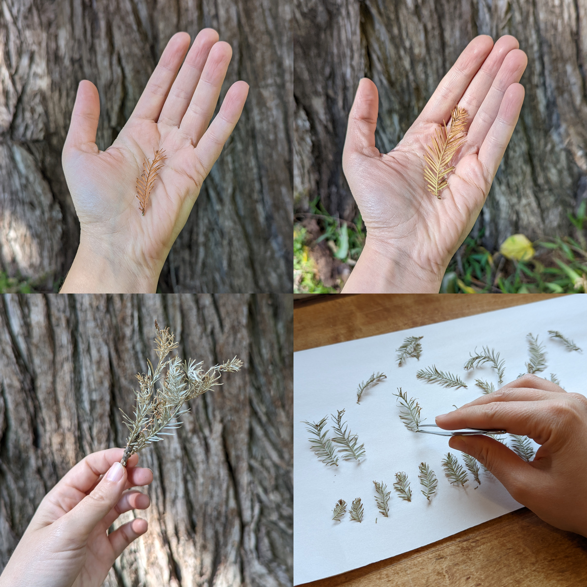

In an era of civilizational and climatic turmoil, our task of cultivating livability is bound up in both making meaning out of unbelievable loss and making kin with our surrounding communities and ecologies. As a powerful sensemaking tool, what is data visualization’s role? How can it connect us to our loved ones lost and our local ecosystems?

We explore these questions in the creation of experimental data visualization wreaths—woven with bald cypress leaves—depicting the lives lost in one year due to anti-transgender violence. This project is ongoing and done in partnership with the organization Gayta Science.

Feral data viz guides our project, a posture and method for embracing feminist, queer, and embodied theories of data and visual sensemaking.1 We trace our process of working through a feral data viz posture: purpose, situate, attunement, relationship, and manifest.2

##### Purpose

Feral data viz asks: "What worlds should we bring to life through data visualization?"

We embrace a history of LGTBQ+ grief rituals in making a data visualization of lives lost due to anti-trans violence. Aimed toward folks outside of transgender and gender-diverse communities, the purpose of our data visualization is to enable this audience to bear witness to, grieve, and make meaning out of the losses suffered from anti-transgender violence and discrimination.

Transgender and gender-diverse people around the world face unbelievable violence and oppression in the form of societal hostility, lack of legal protections, and increasing political scapegoating, conditions that especially impact Black and trans women of color, sex workers, migrants, and refugees. These daily realities are well-known within the transgender community.

In the face of this extreme violence and discrimination, the transgender community shows great resilience, with activists and nonprofits working to fill in gaps left by state apathy. One of these long-standing efforts is the nearly impossible task of monitoring the murders and deaths of trans individuals locally and worldwide. Transgender Europe (TGEU)3 and UK software engineer Anna-Jayne Metcalfe4 are two entities that work with local organizations around the world to identify and document deaths of trans people. This work is extremely difficult; in addition to its gruesome nature, trans folks are often intentionally misgendered in subsequent reporting and rarely get justice. Community relationships are crucial in identifying as well as respectfully recognizing and honoring these victims.

As you read these reports, you are immediately confronted with the undeniable and horrific reality of anti-trans violence. Over and over, it is sickeningly clear that the victim was targeted because of their transgender status. Those outside of the trans community must face this targeted violence in order to understand the urgency for trans rights.

At the heart of these records is a call to bring awareness and visibility to trans lives taken too soon. Because Metcalfe and TGEU compile these reports, we are afforded an opportunity to more bear witness the magnitude of anti-trans violence and their often suppressed stories. That is the spirit in which we also humbly visualize their data.

For trans audiences who are already aware of (or facing) this violence, efforts to honor and memorialize the known lives of those who were lost take place in yearly vigils held for Transgender Day of Remembrance (TDoR). These events make space for feelings of solidarity, community, grief, and validation and serve folks in trans communities relatively well.

But what of folks not within these spaces but who are sympathetic? As with the Black Lives Matter movement or our current global pandemic, folks outside of the lived experience of injustices must still bear witness to them and take action. Our project takes up the task of speaking to cisgender audiences for whom it is vital to viscerally feel the legitimacy and inherent value of trans identities and life in order to act meaningfully as allies.

In climbing into the world this data tells us of, we internalize its purpose, which serves as a North Star for this project. In asking why the data was collected and what practices and feelings the data enables, we found the need to memorialize, honor, and recognize trans victims and their stories.

<figure>
	A data visualization wreath displaying each life lost due to
anti-trans violence during a one-year time period. Each leaf is unique in its
shape and color and labeled with a person’s name.
</figure>

##### Situate

Feral data viz asks: "What place do you hold as a designer through the lens of power?”

Every visual we create comes from our own situatedness—cultural, geographic, experience, etc. The team working on this visualization is white, middle-class, and raised in so-called America. We place ourselves there, drawing upon visual grief practices from our own lived experiences instead of usurping others'.

Thus, we cannot hope to offer an all-encompassing grief visualization solution. A multitude of visual grief cultures will produce a diversity of unique and valuable visualizations.

Our team has one designer (Kelsey) within the trans and gender diverse communities, and one outside (Cathryn). Cat's unfamiliarity with the embodied experience of anti-trans violence makes the partnership with Kelsey and Gayta Science (and their experiences) fundamental to the viability of the project.

Data viz folks are often in a place where they must clamber into the world of someone else's data and make sense of it from a wholly different perspective. With this in mind, Cat, as a cisgender person, did their best to understand the realities this data must tell us of its purpose as told by those within that world.

Feral data viz asks: "What place do you hold as a designer through the lens of ecology?”

Feral data viz embraces ecological metaphor because botanical life can tangibly display heterogeneity and diversity, defying rigid categories. Thus, Cat sought plant kin in her local ecoregions: Blackland Prairies and Cross Timbers5.

Cat became familiar with the bald cypresses of her region in her everyday life, some reaching more than a thousand years old as their massive root networks cover ever-changing riverbanks. Cypress trees, through their stability in the midst of change, make their ecoregion livable.

Across the globe and throughout history, trees are closely entangled with certain groups of human beings, both materially and spiritually. As a visual metaphor, trees provide a sense of symbolic presence and preciousness to the dead that they represent.5 In particular, cypress trees (Cupressus sempervirens, or “Italian Cypress”) are central to Victorian visual mourning culture in America, connecting to both Cat and Kelsey’s (white) European backgrounds 6

Cat visited bald cypress trees in her everyday life often, exploring the uniqueness in each leaf.

However, bald cypress (Taxodium distichum) are more resilient in the hot and dry Cross Timbers ecoregion. They tangibly and metaphorically bear witness to the constant flow of both water and time with massive root structures that enable them to survive hurricanes and floods, slowing their damage to riverbanks.7 Their heartwood resists decay. The resilience of the bald cypress resonates with the spirit of the transgender community.

<figure>
	
    Cathryn frequently visited this bald cypress tree along one of her everyday routes.
</figure>

##### Attunement

Feral data viz asks: "What modes of thinking, seeing, and feeling are required for bodies to make meaning out of data?"

In her essay "Love as the Practice of Freedom," scholar bell hooks emphasizes how the processing of grief is essential for life-giving political change. In “Melancholy Natures, Queer Ecologies,” Catriona Mortimer-Sandilands argues that public displays of grief, particularly in the unfolding of the AIDS epidemic, are a historically prominent and important companion to organizing.8 Furthermore, turning to intimate local landscapes is another potent aspect of this queer melancholia.

In the wake of loss, a path to healing, justice, and action is well-trodden by community organizers and activists. We began with TDoR's origin as a physical vigil to figure out what kind of feeling and action is necessary to grieve properly.

Based on Metcalfe's guide of principles for hosting one’s own Trans Day of Remembrance, we centered on four aspects of feeling our visualization aims to enhance: gratitude, pain, relationship, and action.

A data visualization that actually helps us understand our losses should not only logically show us that "x number of losses" is a lot; it should also give us a visceral feeling from the weight of that significant human loss. In the wake of the grief that inevitably pushes to the surface, a good data viz might frame a path in making meaning of the loss, and perhaps even taking action.

##### Relationship

Feral data viz asks: "What power dynamics emerge from your role in telling the story of the data?”

In handling each record of trans life lost, we ground ourselves in the idea that handling data is indeed holding space for each person's life. Each of these reports are painstakingly researched by the local community, the TGEU team, and Metcalfe to compile as much information as possible about the circumstances of their death and who that person was in life.

We make a point to keep our limited perspective and massive privileges in mind as we continue this manual approach to curation in our humble usage of this data. The stakes are too high for automation. Thus, we manually touch each piece of information we intend to display to ensure it is both accurate and respectful.

Feral data viz asks: “In what ways can we learn of both your bioregion and the data?”

We wholeheartedly embrace the imperative to visually convey the precious and unique presence of each life lost. In the absence of living people to define how they are visually presented in death, bald cypress trees provide a metaphorical presence. The unique and individual character of feathery bald cypress leaves visually conveys not only the category-defying nature of the trans identity, but the multitudes of the human spirit. No leaf is the same, and all are precious.

<figure>
	
    As Cathryn visited the bald cypress, she observed the uniqueness found in each leaf over time (top right, top left, and bottom right). Cathryn collected some leaves to appreciate and explore their visual patterns (bottom right). The leaves will be returned to the base of the cypress.
</figure>

##### Manifest

Feral data viz asks: "What tools and visuals speak to the purpose, situatedness, attunement, and relationship of your project?"

In sharp contrast to the placeless, disembodying geometries of commonplace data visualizations, we visualize our data using a generative system that produces wreaths of bald cypress leaves. Data visualizations are part of a rich visual history of activists, having been wielded by folks such as W. E. B. Du Bois9 and Florence Nightingale10 who used data visualization politically, making particular kinds of living and loss evident and ensuring it was acted upon. Indeed, data visualization is powerful as a visual sensemaking tool. They help us make sense of realities distributed over time and space that might be nearly impossible to discern otherwise.

However, practices for visualizing data about death often fall short of making sense of losses or of honoring the loss of those who have passed. Why do many feel numb in the wake of such sophisticated data visualizations of loss? It begins with the body.

Philosopher Samuel Todes asserts that our own human body is the underlying metaphor through which we make sense and meaning of the world, and thus, as Stephen Neely asserts, the "designer has to offer a primary interaction or secondary metaphor to foster meaning 11.11 Metaphors closer to the feeling of the body—such as plant and human forms, animations, 3D shapes, etc.—create more visceral and profound meaning for us than those that rely on many layers of abstraction, such as geometric primitives or the English language.

What metaphors, then, do commonplace data viz tools offer? Still and crisp lines and circles are a far cry from the multitudes of the humans abstracted within, metaphorically essentializing and in turn obscuring bodies in the tick of a vector 12. In this paralysis, humanity is scrubbed away, a disembodiment that is a prominent critique of data viz.

##### Wreaths

To visualize the transgender lives lost, we created a wreath using a phyllotactic spiral of bald cypress leaves. In this arrangement, each leaf gets an equitable nonhierarchical placement in space, reorienting our attention away from a mode of analysis, counting, and comparison and toward a feeling of individual presence.

Beyond being a common feature at American funerals from Mexican American families in the twentieth century13 (part of Cat’s background) to white Americans in the Victorian era to traditional Appalachian funerals14, wreath making also is an ancient practice in many cultures.

In making a wreath, the act of braiding is a show of attention and beauty. Kimmerer, in “Braiding Sweetgrass,” speaks of the connection of "kindness and something more" that flows "between the braider and the braided, the two connected by the cord of the plait."15. In making a mourning wreath, we are attending to the stories of those who were lost with care.

Additionally, wreaths are a tangible memento mori—a visual reminder of our relationship to the stories woven into the wreath as we take up the task of responding to the violence behind the losses.

**Bios:**

Cathryn Ploehn (she/they) is an interaction designer interested in embodied, feminist, and ecological modes of creating – and (re)enchanting – data visualizations. She holds an MDes from Carnegie Mellon University and is an Assistant Professor of Practice at The University of Texas at Austin.

Kelsey Campbell (they/she) is a data scientist and founder of Gayta Science, a site devoted to highlighting the LGBTQ+ experience using data science and analytics. Gayta Science is devoted to investigating a variety of LGBTQ+ issues using data-driven techniques and open-source technology. They hold a M.S. in Analytics from the Institute for Advanced Analytics at NC State University.

REFERENCES

1. Feral data vizualization. [https://www.cathrynploehn.com/feraldataviz/](https://www.cathrynploehn.com/feraldataviz/).
2. Ploehn, C., Steenson, M. & Byrne, D. Feral data visualization: A manifesto for cultivating livable worlds with visual sensemaking practices. in 2021 IEEE Workshop on Visualization for Social Good (VIS4Good) 16–19 (2021). doi:10.1109/VIS4Good54225.2021.00009.
3. Trans Murder Monitoring. TvT [https://transrespect.org/en/research/tmm/](https://transrespect.org/en/research/tmm/) (2022).
4. Metcalfe, A.-J. TDoR: Learning more about those we have lost. Medium [https://annajayne.medium.com/tdor-learning-more-about-those-we-have-lost-8043146f402c](https://annajayne.medium.com/tdor-learning-more-about-those-we-have-lost-8043146f402c) (2018).
5. Laskow, S. One of America’s largest collections of memento Mori is for sale. Atlas Obscura [https://www.atlasobscura.com/articles/memento-mori-largest-collection-museum-of-mourning-art](https://www.atlasobscura.com/articles/memento-mori-largest-collection-museum-of-mourning-art) (2017).
6. Art of Mourning. Know your trees: Symbolism, the cypress. Art of Mourning [https://artofmourning.com/know-your-trees-symbolism-the-cypress/](https://artofmourning.com/know-your-trees-symbolism-the-cypress/) (2011).
7. United States. Division of Timber Management Research & United States. Forest Service. Division of Timber Management. Silvics of Forest Trees of the United States. (U.S. Department of Agriculture, Forest Service, 1965).
8. Anderson, D. R. Book Review: Mortimer-Sandilands, C., & Erickson, B. (Eds.). (2010). Queer Ecologies: Sex, Nature, Politics, Desire. Bloomington: Indiana University Press. Organ. Environ. 24, 219–222 (2011).
9. The W.E.B. Du Bois Center at the University of Massachusetts Amherst. W. E. B. Du Bois’s Data Portraits: Visualizing Black America. (Princeton Architectural Press, 2018).
10. Andrews, R. J. How Florence Nightingale Changed Data Visualization Forever. Scientific American doi:10.1038/scientificamerican0822-78.
11. Neely, S. SOMA LITERATE DESIGN – Recentering the Interstitiality of Experience. (Carnegie Mellon University, 2021). doi:10.1184/R1/17144111.v1.
12. Kennedy, H., Hill, R. L., Aiello, G. & Allen, W. The work that visualisation conventions do. Information, Communication & Society vol. 19 715–735 Preprint at [https://doi.org/10.1080/1369118x.2016.1153126](https://doi.org/10.1080/1369118x.2016.1153126) (2016).
13. Williams, N. The Mexican American family: Tradition and change. Rowman & Littlefield [https://rowman.com/ISBN/9780930390259/The-Mexican-American-Family-Tradition-and-Change](https://rowman.com/ISBN/9780930390259/The-Mexican-American-Family-Tradition-and-Change).
14. Phipps, W. E. Traditional Appalachian Funerals. Appalachian Heritage 8, 48–53 (1980).
15. Kimmerer, R. Braiding Sweetgrass: Indigenous Wisdom, Scientific Knowledge and the Teachings of Plants. (Milkweed Editions, 2013).
